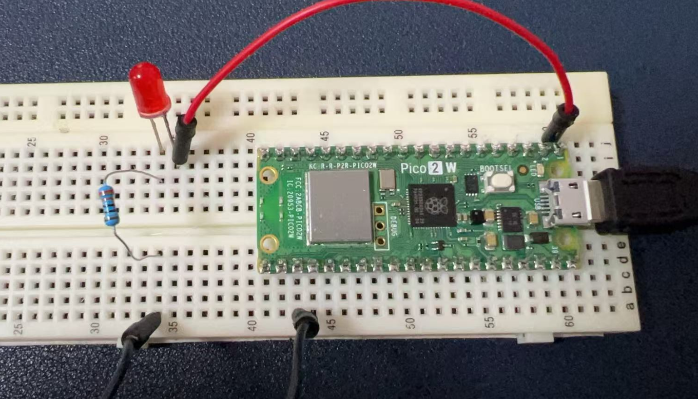
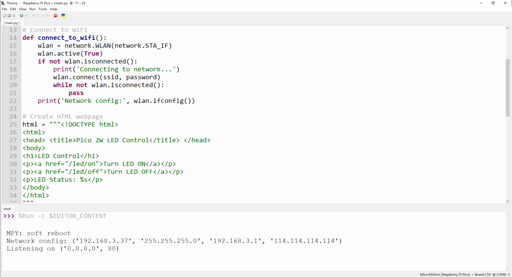
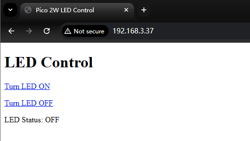
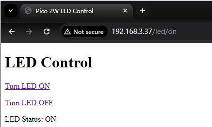
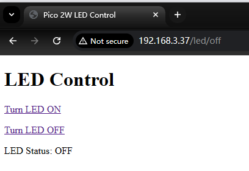

# Project 7: Network

## Pico 2W Network Introduction
The Raspberry Pi Pico 2W incorporates robust wireless capabilities, making it an excellent choice for IoT and network-connected projects. Here's a detailed explanation of its WiFi features:

### Technical Specifications
- **Wireless Chip**: The Pico 2W uses the Infineon CYW43439 wireless chip, which provides 2.4GHz 802.11n WiFi connectivity.
- **WiFi Standards**: It supports WiFi 4 (802.11n) with WPA3 security, ensuring both performance and modern security standards.
- **Soft Access Point**: The board can function as a Soft Access Point (SoftAP), allowing up to 4 clients to connect directly to it without requiring an external router.
- **Antenna**: An on-board antenna licensed from Abracon (formerly ProAnt) is included, eliminating the need for external antenna components.

### Implementation Details
- **Interface Connection**: The wireless interface connects to the RP2350 microcontroller via SPI, operating typically at 33MHz.
- **Pin Sharing**: Due to pin limitations, some wireless interface pins are shared:
  - The SPI CLK is shared with the VSYS monitor, meaning VSYS can only be read via ADC when no SPI transaction is in progress.
  - The Infineon CYW43439 SPI DIN/DOUT and IRQ share one pin on the RP2040, so IRQs should only be checked when no SPI transaction is occurring.

### Practical Considerations
- **Antenna Placement**: For optimal wireless performance, ensure the antenna has clear space around it. Metal objects near the antenna can reduce its effectiveness in terms of both gain and bandwidth.
- **Power Efficiency**: The Pico 2W is designed with improved power efficiency, making it suitable for battery-powered applications where wireless connectivity is required.
- **Security Features**: Beyond WiFi security, the Pico 2W includes comprehensive security features like Arm TrustZone, secure boot, and hardware accelerators for cryptographic operations, which enhance the overall security of wireless communications.

The combination of these WiFi capabilities with the Pico 2W's powerful microcontroller makes it a versatile platform for developing wireless-enabled projects, from simple IoT devices to more complex embedded systems requiring secure network connectivity.

## Hardware Requirements
To connect your Raspberry Pi Pico 2W to a network and control an LED via the internet, you'll need the following hardware:
- 1 x Raspberry Pi Pico 2W: This is the microcontroller board with built-in WiFi and Bluetooth capabilities.
- 1 x LED: A standard LED (e.g., red, green, or blue) to be controlled via the network.
- 1 x Resistor (220-ohms): To limit the current through the LED and prevent it from burning out.
- 1 x Breadboard
- 2 x Jumper wires: For connecting the components together.

## Wiring Diagram
Here's how to wire the components:
1. **Connect the LED**: Insert the longer leg (anode) of the LED into one of the breadboard holes. Connect the shorter leg (cathode) to another hole.
2. **Add the resistor**: Connect one end of the resistor to the cathode of the LED. Connect the other end of the resistor to the ground (GND) on the Pico 2W.
3. **Connect to GPIO**: Connect the anode of the LED to one of the GPIO pins on the Pico 2W (e.g., GPIO0).



## Demo Code
Below is a Python script that connects the Pico 2W to a WiFi network and sets up a simple HTTP server to control the LED via a web browser.

> NOTE: DO remember replace the `ssid` and `password` according to your own
> Wi-Fi settings.


```python
import network
import socket
from machine import Pin
import time

# Set up the LED pin
led = Pin(0, Pin.OUT)

# WiFi credentials
ssid = 'your_SSID'
password = 'your_PASSWORD'

# Connect to WiFi
def connect_to_wifi():
    wlan = network.WLAN(network.STA_IF)
    wlan.active(True)
    if not wlan.isconnected():
        print('Connecting to network...')
        wlan.connect(ssid, password)
        while not wlan.isconnected():
            pass
    print('Network config:', wlan.ifconfig())

# Create HTML webpage
html = """<!DOCTYPE html>
<html>
<head> <title>Pico 2W LED Control</title> </head>
<body>
<h1>LED Control</h1>
<p><a href="/led/on">Turn LED ON</a></p>
<p><a href="/led/off">Turn LED OFF</a></p>
<p>LED Status: %s</p>
</body>
</html>
"""

# Set up the web server
def serve_webpage():
    addr = socket.getaddrinfo('0.0.0.0', 80)[0][-1]
    s = socket.socket()
    s.bind(addr)
    s.listen(1)
    print('Listening on', addr)
    
    while True:
        try:
            cl, addr = s.accept()
            print('Client connected from', addr)
            request = cl.recv(1024)
            request = str(request)
            
            # Check for LED control requests
            if '/led/on' in request:
                led.value(1)
            elif '/led/off' in request:
                led.value(0)
            
            # Send response
            response = html % ('ON' if led.value() else 'OFF')
            cl.send('HTTP/1.0 200 OK\r\nContent-type: text/html\r\n\r\n')
            cl.send(response)
            cl.close()
        except OSError as e:
            cl.close()
            print('Connection closed')

# Main program
connect_to_wifi()
serve_webpage()

```

## Code Explanations

### Hardware Setup
- The LED is connected to GPIO0 and ground via a resistor.
- The resistor limits the current to protect the LED.

### Software Setup
- **Network Connection**: The script uses the `network` module to connect to a WiFi network. Replace `'your_SSID'` and `'your_PASSWORD'` with your actual WiFi credentials.
- **HTTP Server**: The script sets up a simple HTTP server using the `socket` module. The server listens for incoming connections on port 80 (the default HTTP port).
- **Webpage**: The HTML page provides links to turn the LED on and off. When a request is received, the server checks if it contains `/led/on` or `/led/off` and sets the LED state accordingly.
- **Details of `response = html % ('ON' if led.value() else 'OFF')`**:
  - This line of code dynamically inserts the state of the LED (on or off) into the HTML page to display the current status of the LED on the webpage.

### Code Breakdown

```python
response = html % ('ON' if led.value() else 'OFF')
```

1. **`led.value()`**:
   - This is a method call to get the current state of the LED.
   - If the LED is on (high level), `led.value()` returns `1`.
   - If the LED is off (low level), `led.value()` returns `0`.

2. **`'ON' if led.value() else 'OFF'`**:
   - This is a conditional expression (also known as a ternary operator).
   - If `led.value()` returns `1`, the result of the expression is `'ON'`.
   - If `led.value()` returns `0`, the result of the expression is `'OFF'`.

3. **`html % (...)`**:
   - `html` is a string that contains a placeholder `%s`.
   - The `%` operator is used to replace the placeholder in the string with a specified value.
   - In this case, `%s` is replaced with `'ON'` or `'OFF'`, depending on the state of the LED.

### Complete HTML String

```html
<!DOCTYPE html>
<html>
<head> <title>Pico 2W LED Control</title> </head>
<body>
<h1>LED Control</h1>
<p><a href="/led/on">Turn LED ON</a></p>
<p><a href="/led/off">Turn LED OFF</a></p>
<p>LED Status: %s</p>
</body>
</html>
```

When `response = html % ('ON' if led.value() else 'OFF')` is executed, `%s` is replaced with `'ON'` or `'OFF'`, and the resulting HTML page will display the current state of the LED.

### Example

- If the LED is on (`led.value()` returns `1`), the final HTML page will be:

```html
<!DOCTYPE html>
<html>
<head> <title>Pico 2W LED Control</title> </head>
<body>
<h1>LED Control</h1>
<p><a href="/led/on">Turn LED ON</a></p>
<p><a href="/led/off">Turn LED OFF</a></p>
<p>LED Status: ON</p>
</body>
</html>
```

- If the LED is off (`led.value()` returns `0`), the final HTML page will be:

```html
<!DOCTYPE html>
<html>
<head> <title>Pico 2W LED Control</title> </head>
<body>
<h1>LED Control</h1>
<p><a href="/led/on">Turn LED ON</a></p>
<p><a href="/led/off">Turn LED OFF</a></p>
<p>LED Status: OFF</p>
</body>
</html>
```

In this way, when a user accesses the webpage via a browser, they can see the current state of the LED and control it by clicking the links.

## Running the Code
1. Upload the script to your Pico 2W using Thonny IDE or another MicroPython-compatible editor.



2. Open a web browser and navigate to the IP address assigned to your Pico 2W (displayed in the Thonny console after connecting).



3. Use the links on the webpage to control the LED.




This example demonstrates basic network connectivity and web server functionality on the Raspberry Pi Pico 2W. You can expand upon this by adding more features like authentication, additional controls, or integrating with IoT platforms.

