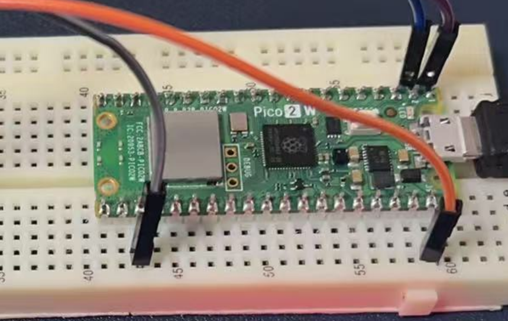
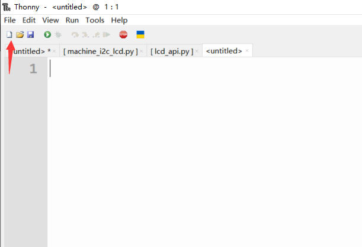
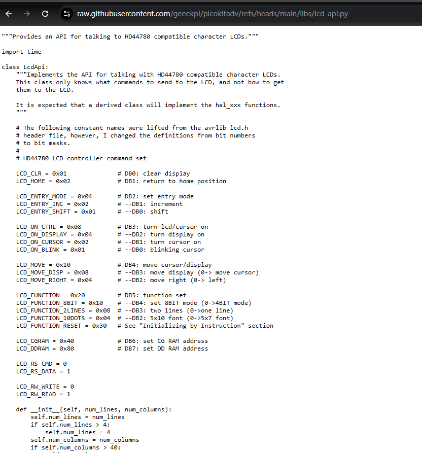
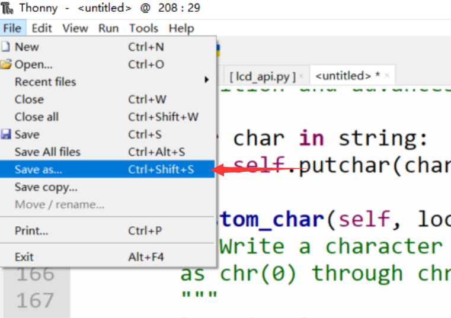
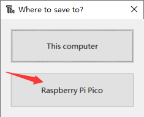
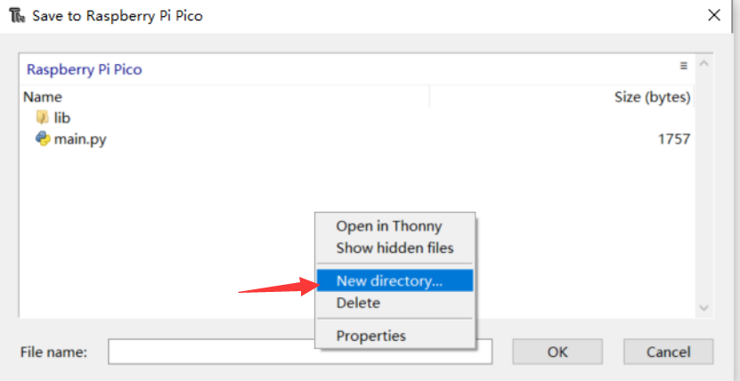
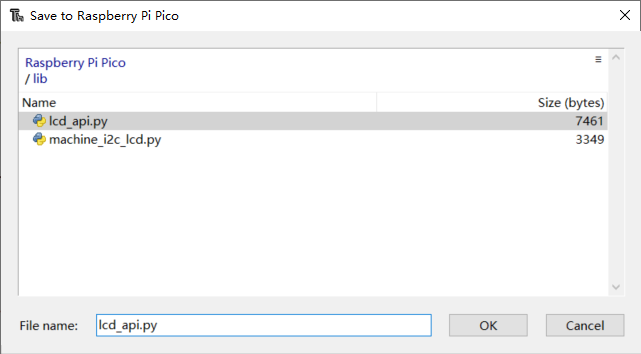
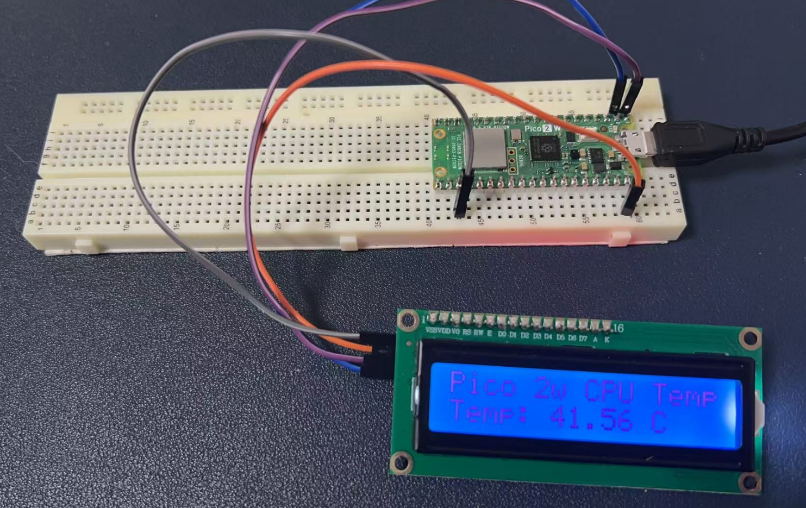

# Project 8: LCD1602 Display Module

## Introduction

### What is LCD1602?

The LCD1602 is a common 16×2 character-based liquid crystal display module that can display two lines of text, with up to 16 characters per line. It is typically based on the HD44780 controller or a compatible controller, which manages the display of characters and the backlight. The working principle of the LCD1602 involves the optical properties of liquid crystal materials under the influence of an electric field. When an electric current passes through the liquid crystals, the molecules align and block the backlight, forming characters on the screen.

## Hardware Requirements

- 1 x Raspberry Pi Pico 2W
- 1 x LCD1602 I2C module
- 4 x Several jumper wires
- 1 x Breadboard
- 1 x MicroUSB programming cable

## Wiring Diagram

The connections are as follows:

| LCD1602 I2C Module Pin | Raspberry Pi Pico 2W Pin |
|------------------------|--------------------------|
| VCC                    | VSYS                     |
| GND                    | GND                      |
| SDA                    | GP0 (SDA)                |
| SCL                    | GP1 (SCL)                |

----

* Please note the pinout of Pico 2w. 



## Demo Code

### Preparation

Before programming the LCD1602, follow these steps:

1. **Copy and paste the libraries to your Pico 2W**:
   - Click `new file` on the menu.
   


   - Download the libraries from the following URLs:
     - [lcd_api.py](https://raw.githubusercontent.com/geeekpi/picokitadv/refs/heads/main/libs/lcd_api.py)
     - [machine_i2c_lcd.py](https://raw.githubusercontent.com/geeekpi/picokitadv/refs/heads/main/libs/machine_i2c_lcd.py)
   - Save the files as `lcd_api.py` and `machine_i2c_lcd.py` respectively.



   - Create a new directory named `lib` on the Pico 2W and save the files into it.

* Please refer to following figures: 









### Example Code

Here is an example code using MicroPython to control the LCD1602 I2C module:

```python
from machine import Pin, I2C, ADC
from machine_i2c_lcd import I2cLcd
from utime import sleep

# LCD1602 I2C
lcd_bus = I2C(0, scl=Pin(1), sda=Pin(0), freq=200000)

# Scan LCD's I2C address
addr = lcd_bus.scan()[0]

# Initializing an instance of LCD1602
lcd = I2cLcd(lcd_bus, addr, 2, 16)

# Display string
lcd.move_to(0, 0)
lcd.putstr("WELCOME TO PICO")
lcd.move_to(18, 0)
lcd.putstr(" 2W Starter Kit")
sleep(3)
lcd.clear()

# Initialize ADC to connect to internal CPU temperature sensor
adc = ADC(4)  # Connect to internal CPU temperature sensor on ADC(4)

# Convert ADC value from voltage to constant factor value
conversion_factor = 3.3 / (65535)

while True:
    # Read value from ADC
    reading = adc.read_u16() * conversion_factor
    temperature = 27 - (reading - 0.706) / 0.001721  # Calculate temperature
    lcd.move_to(0, 0)  # Put cursor to x:0, y:0 position
    lcd.putstr("Pico 2w CPU Temp")
    lcd.move_to(18, 0)  # Put cursor to x:18, y:0 position
    lcd.putstr(f" Temp: {temperature:.2f} C")
    sleep(2)
    lcd.clear()
```



## Code Explanation

This code combines the I2C LCD1602 display and the internal temperature sensor of the Raspberry Pi Pico 2W to display the CPU temperature in real-time. Here is a detailed explanation of the code:

### 1. Import Necessary Modules

```python
from machine import Pin, I2C, ADC
from machine_i2c_lcd import I2cLcd
from utime import sleep
```

- **machine Module**: This is a built-in MicroPython module for accessing and controlling hardware resources such as GPIO pins, I2C, and ADC.
  - `Pin`: For controlling GPIO pins.
  - `I2C`: For initializing and controlling the I2C bus.
  - `ADC`: For accessing the Analog-to-Digital Converter.
- **machine_i2c_lcd Module**: This is a third-party library for controlling HD44780-based I2C LCD displays. `I2cLcd` is a class in this library for operating the LCD.
- **utime Module**: For time-related operations. The `sleep()` function is used for delays.

### 2. Initialize the I2C Bus and LCD1602

```python
lcd_bus = I2C(0, scl=Pin(1), sda=Pin(0), freq=200000)
```

- `I2C(0, scl=Pin(1), sda=Pin(0), freq=200000)`:
  - Initializes the I2C bus using the GPIO pins on the Pico 2W:
    - `scl=Pin(1)`: The clock line is connected to GPIO1.
    - `sda=Pin(0)`: The data line is connected to GPIO0.
    - `freq=200000`: Sets the I2C communication frequency to 200kHz (standard rate).

### 3. Scan for I2C Device Address

```python
addr = lcd_bus.scan()[0]
```

- `lcd_bus.scan()`: Scans the I2C bus for connected devices and returns a list of device addresses.
- `[0]`: Retrieves the address of the first device. Assuming the LCD1602 is the only I2C device connected, its address is typically `0x27` or `0x3F`.

### 4. Initialize the LCD1602

```python
lcd = I2cLcd(lcd_bus, addr, 2, 16)
```

- `I2cLcd(lcd_bus, addr, 2, 16)`:
  - Creates an LCD object.
  - Parameters:
    - `lcd_bus`: The I2C bus object.
    - `addr`: The I2C address of the LCD.
    - `2`: The number of rows on the LCD.
    - `16`: The number of characters per row.

### 5. Display a Welcome Message on the LCD

```python
lcd.move_to(0, 0)
lcd.putstr("WELCOME TO PICO")
lcd.move_to(18, 0)
lcd.putstr(" 2W Starter Kit")
sleep(3)
lcd.clear()
```

- `lcd.move_to(x, y)`: Moves the cursor to the specified position, where `x` is the column and `y` is the row.
- `lcd.move_to(0, 0)`: Moves the cursor to the first column of the first row.
- `lcd.move_to(18, 0)`: Moves the cursor to the 18th column of the first row.
- `lcd.putstr("string")`: Displays a string at the current cursor position.
- `sleep(3)`: Delays for 3 seconds.
- `lcd.clear()`: Clears the content displayed on the LCD.

### 6. Initialize the Internal Temperature Sensor

```python
adc = ADC(4)  # Connects to the internal CPU temperature sensor
conversion_factor = 3.3 / (65535)
```

- `ADC(4)`: Initializes the ADC and connects it to the internal temperature sensor (fixed at ADC channel 4).
- `conversion_factor`: Converts the 16-bit value from the ADC (range 0-65535) to a voltage value (0-3.3V).

### 7. Main Loop: Read Temperature and Display

```python
while True:
    reading = adc.read_u16() * conversion_factor
    temperature = 27 - (reading - 0.706) / 0.001721
    lcd.move_to(0, 0)
    lcd.putstr("Pico 2w CPU Temp")
    lcd.move_to(18, 0)
    lcd.putstr(f" Temp: {temperature:.2f} C")
    sleep(2)
    lcd.clear()
```

- `adc.read_u16()`: Reads the raw value from the ADC (16-bit).
- `reading = adc.read_u16() * conversion_factor`: Converts the ADC value to a voltage value.
- `temperature = 27 - (reading - 0.706) / 0.001721`: Calculates the temperature using the formula:
  - `0.706`: The reference voltage at 27°C.
  - `0.001721`: The voltage change per degree of temperature.
- `lcd.move_to(0, 0)`: Moves the cursor to the first column of the first row.
- `lcd.putstr("Pico 2w CPU Temp")`: Displays static text.
- `lcd.move_to(18, 0)`: Moves the cursor to the 18th column of the first row.
- `lcd.putstr(f" Temp: {temperature:.2f} C")`: Displays the dynamic temperature value with two decimal places.
- `sleep(2)`: Delays for 2 seconds.
- `lcd.clear()`: Clears the content on the LCD in preparation for the next display.

## Summary

This code controls an I2C LCD1602 display and uses the internal temperature sensor of the Pico 2W to read the CPU temperature, displaying it in real-time on the LCD. The code is logically clear and combines hardware initialization, data reading, and display operations, making it suitable for both learning and practical applications.

