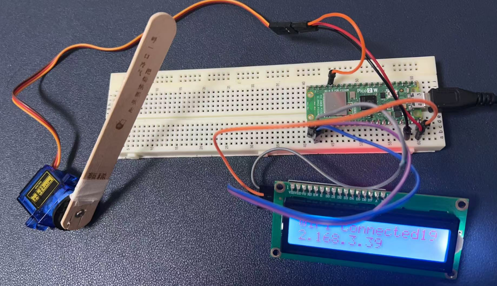
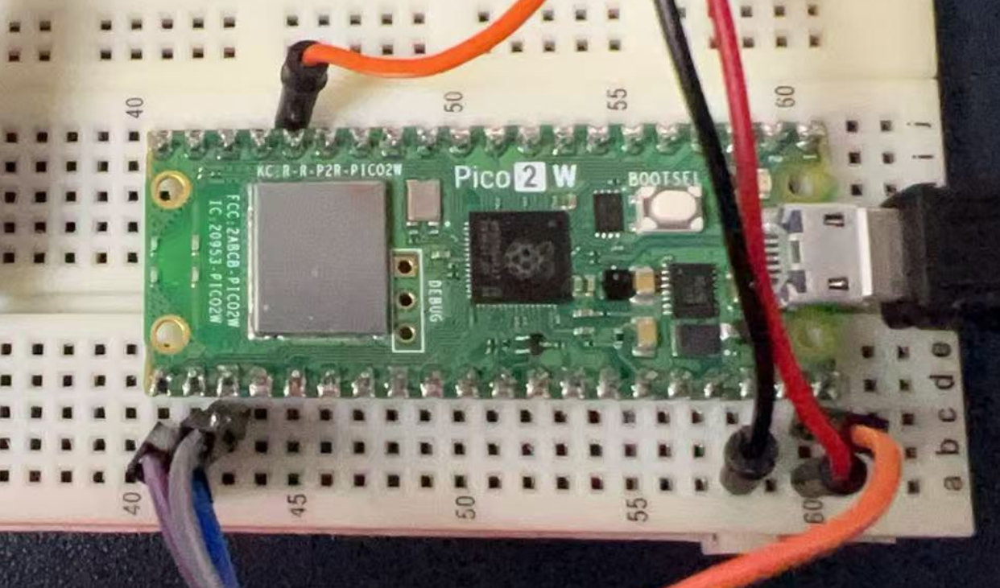
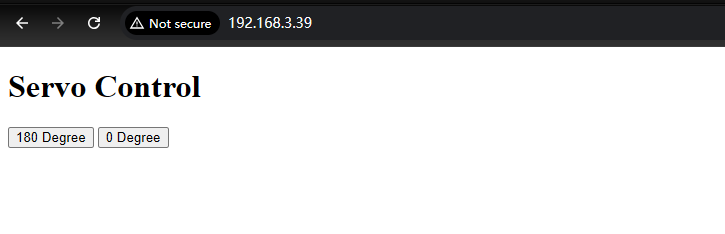
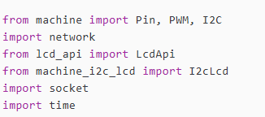
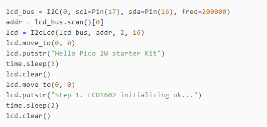
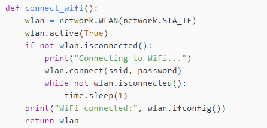
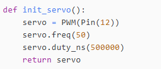
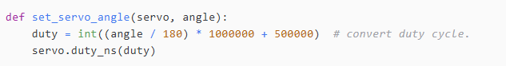
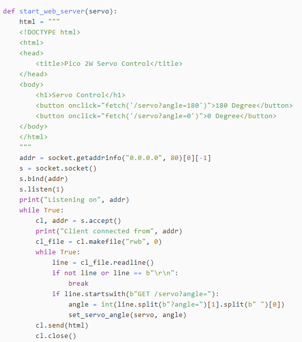
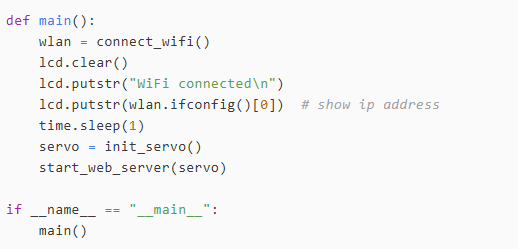

# Project 9: Raspberry Pi Pico 2W Comprehensive Experiment with Network Operation

## Introduction
This experiment integrates various components with the Raspberry Pi Pico 2W, allowing control and monitoring over a network. It demonstrates the capabilities of the Pico 2W in handling multiple peripherals and network communications.

## Hardware Requirements
- 1 x Raspberry Pi Pico 2W
- 1 x LCD1602 (I2C interface)
- 1 x Servo motor
- 1 x Breadboard
- Several jumper wires
- 1 x MicroUSB Programming cable

## Wiring Diagram

| Components          | Raspberry Pi Pico 2W |
|---------------------|----------------------|
| LCD1602 SCL         | GP17                 |
| LCD1602 SDA         | GP16                 |
| LCD1602 VCC         | VSYS                 |
| LCD1602 GND         | GND                  |
| Servo Signal (yellow/orange color) | GP12 |
| Servo VCC (red color)       | VSYS                 |
| Servo GND (Brown color)     | GND                  |

----

* Wiring status:





## Demo Code

```python
from machine import Pin, PWM, I2C
import network
from lcd_api import LcdApi
from machine_i2c_lcd import I2cLcd
import socket
import time

# Hardware setup
ssid = 'YOUR_WIFI_SSID'
password = 'YOUR_WIFI_PASSWORD'

# LCD1602 
lcd_bus = I2C(0, scl=Pin(17), sda=Pin(16), freq=200000)
addr = lcd_bus.scan()[0]
lcd = I2cLcd(lcd_bus, addr, 2, 16)
lcd.move_to(0, 0)
lcd.putstr("Hello Pico 2W starter Kit")
time.sleep(3)
lcd.clear()
lcd.move_to(0, 0)
lcd.putstr("Step 1. LCD1602 initializing ok...")
time.sleep(2)
lcd.clear()


def connect_wifi():
    wlan = network.WLAN(network.STA_IF)
    wlan.active(True)
    if not wlan.isconnected():
        print("Connecting to WiFi...")
        wlan.connect(ssid, password)
        while not wlan.isconnected():
            time.sleep(1)
    print("WiFi connected:", wlan.ifconfig())
    return wlan

# init servo 
def init_servo():
    servo = PWM(Pin(12))
    servo.freq(50)
    servo.duty_ns(500000)
    return servo

# set servo's angle 
def set_servo_angle(servo, angle):
    duty = int((angle / 180) * 1000000 + 500000)  # convert duty cycle.
    servo.duty_ns(duty)

# create web server 
def start_web_server(servo):
    html = """
    <!DOCTYPE html>
    <html>
    <head>
        <title>Pico 2W Servo Control</title>
    </head>
    <body>
        <h1>Servo Control</h1>
        <button onclick="fetch('/servo?angle=180')">180 Degree</button>
        <button onclick="fetch('/servo?angle=0')">0 Degree</button>
    </body>
    </html>
    """
    addr = socket.getaddrinfo("0.0.0.0", 80)[0][-1]
    s = socket.socket()
    s.bind(addr)
    s.listen(1)
    print("Listening on", addr)
    while True:
        cl, addr = s.accept()
        print("Client connected from", addr)
        cl_file = cl.makefile("rwb", 0)
        while True:
            line = cl_file.readline()
            if not line or line == b"\r\n":
                break
            if line.startswith(b"GET /servo?angle="):
                angle = int(line.split(b"?angle=")[1].split(b" ")[0])
                set_servo_angle(servo, angle)
        cl.send(html)
        cl.close()

# main function
def main():
    wlan = connect_wifi()
    lcd.clear()
    lcd.putstr("WiFi connected\n")
    lcd.putstr(wlan.ifconfig()[0])  # show ip address 
    time.sleep(1)
    servo = init_servo()
    start_web_server(servo)

if __name__ == "__main__":
    main()
```

## Instructions
1. Open a web browser on your PC and input the address of your Pico 2W.
   - It will look like this: `http://<IP_ADDRESS>`.



2. Click the buttons on the web browser to see if the servo is rotating.

## Code Explanations



### Modules Used
- **machine**: Provides access to hardware-related functions, such as controlling GPIO pins, PWM, and I2C communication.
- **network**: Allows the Pico W to connect to a Wi-Fi network.
- **lcd_api and machine_i2c_lcd**: Provide functionality for interacting with an I2C-based LCD display.
- **socket**: Used to create a web server for controlling the servo via HTTP requests.
- **time**: Provides functions for timing-related operations, such as delays.

### Key Variables
- `ssid = 'Your_2.4GHz_wifi_SSID'`  
- `password = 'Your_2.4GHz_wifi_password'`  
  These variables store the Wi-Fi network's SSID (name) and password, which the Pico W will use to connect to the network.

### I2C Initialization



- `I2C(0, scl=Pin(17), sda=Pin(16), freq=200000)`  
  Initializes the I2C bus on the Pico W, using GPIO pins 17 and 16 for the clock (SCL) and data (SDA) lines, respectively. The I2C frequency is set to 200 kHz.
- `lcd_bus.scan()`  
  Scans for I2C devices connected to the bus and retrieves the address of the LCD display.
- `I2cLcd(lcd_bus, addr, 2, 16)`  
  Initializes the LCD display, specifying that it has 2 rows and 16 columns.
- `lcd.move_to(0, 0)`  
  Moves the cursor to the top-left position of the LCD.
- `lcd.putstr()`  
  Displays text on the LCD.
- `lcd.clear()`  
  Clears the LCD display.

### Wi-Fi Connection
  


- `network.WLAN(network.STA_IF)`  
  Initializes the Wi-Fi interface in station mode (STA), allowing the Pico W to connect to a Wi-Fi network.
- `wlan.active(True)`  
  Activates the Wi-Fi interface.
- `wlan.connect(ssid, password)`  
  Connects to the specified Wi-Fi network using the provided SSID and password.
- `wlan.isconnected()`  
  Checks if the Pico W is connected to the Wi-Fi network.
- `wlan.ifconfig()`  
  Retrieves the IP address, subnet mask, gateway, and DNS server assigned to the Pico W after connecting to the network.

### Servo Control



- `PWM(Pin(12))`  
  Initializes a PWM object on GPIO pin 12, which will be used to control the servo.
- `servo.freq(50)`  
  Sets the PWM frequency to 50 Hz, which is the standard frequency for most servos.
- `servo.duty_ns(500000)`  
  Sets the initial PWM duty cycle to 500,000 nanoseconds (500 microseconds), which corresponds to a neutral position (0 degrees) for the servo.




### Servo Angle Calculation
- This function calculates the PWM duty cycle required to move the servo to a specific angle.
- The duty cycle is calculated using the formula: `duty = (angle / 180) * 1000000 + 500000`.
- The `servo.duty_ns(duty)` function sets the PWM duty cycle to the calculated value, moving the servo to the desired angle.

### Web Server



- **HTML Page**: Defines a simple web page with two buttons to control the servo angle to 0 degrees or 180 degrees.
- **Socket Setup**: Creates a socket server on port 80 to listen for incoming HTTP requests.
- **Request Handling**: When a client (e.g., a web browser) connects, the server reads the HTTP request. If the request contains a URL like `/servo?angle=180`, it extracts the angle value and calls the `set_servo_angle` function to move the servo.
- **Response**: Sends the HTML page back to the client, allowing them to control the servo via the web interface.

### Functions



- `connect_wifi()`: Connects to the Wi-Fi network and displays the assigned IP address on the LCD.
- `init_servo()`: Initializes the servo.
- `start_web_server(servo)`: Starts the web server, allowing remote control of the servo via HTTP requests.

## Summary
This code sets up a Raspberry Pi Pico W to:
1. Connect to a Wi-Fi network and display the IP address on an LCD1602 display.
2. Initialize a servo motor connected to GPIO pin 12.
3. Create a web server that allows users to control the servo angle via a web interface, with buttons for 0 and 180 degrees.

The code demonstrates basic hardware interfacing, network connectivity, and web server functionality using MicroPython.

## Conclusion
Congratulations on completing this introductory challenge! You've successfully navigated through the basics of hardware interfacing, network connectivity, and web-based control using the Raspberry Pi Pico W. This accomplishment marks a solid foundation for your journey into embedded systems and IoT development. As you continue to explore and experiment, remember that each challenge you overcome brings you one step closer to mastering this exciting field. Keep pushing the boundaries, and enjoy the endless possibilities that lie ahead!

---
