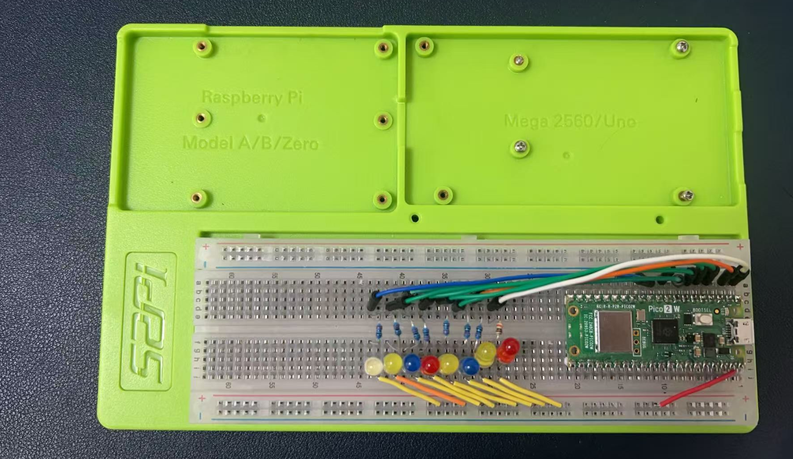

# Project 1 

## Project Description  

This project demonstrates a simple LED chaser effect using the Raspberry Pi Pico 2 W, utilizing GPIO pins 0 to 7. The goal is to light up the LEDs in sequence, creating a visually appealing chaser pattern that loops continuously.

## Wiring diagram 

| GPIO Pin | LED Connection | Resistor | VBUS Pin |
|----------|---------------|----------|----------|
| GP0      | Cathode       | 220Ω     | Anode    |
| GP1      | Cathode       | 220Ω     | Anode    |
| GP2      | Cathode       | 220Ω     | Anode    |
| GP3      | Cathode       | 220Ω     | Anode    |
| GP4      | Cathode       | 220Ω     | Anode    |
| GP5      | Cathode       | 220Ω     | Anode    |
| GP6      | Cathode       | 220Ω     | Anode    |
| GP7      | Cathode       | 220Ω     | Anode    |

----




----

In this project, the cathode of each LED is connected to the corresponding GPIO pin through a 220-ohm resistor, and the anode is connected to the VBUS pin. This connection ensures that when the GPIO pin outputs a low signal, the LED is off, and when the GPIO pin outputs a high signal, the LED is on. By controlling the high and low signals on the GPIO pins through the program, the LED chaser effect can be achieved.

## Demo code 

```c
#include "pico/stdlib.h"

#define interval 200

// Function to initialize GPIO pins
void init_gpio() {
    for(int i=0; i<8; i++) {
    gpio_init(i);
    gpio_set_dir(i, GPIO_OUT);
    gpio_put(i, 0);
    sleep_ms(2);
    }
}


// Function to create the chaser effect
void chaser_effect() {
    for (int i = 0; i < 8; i++) {
        gpio_put(i, 0); // Turn off LED
        sleep_ms(interval);  // Delay for 200ms
        gpio_put(i, 1); // Turn on LED
    }
}

int main() {
    stdio_init_all(); // Initialize stdio for UART
    init_gpio();      // Initialize GPIO pins

    while (true) {
        chaser_effect(); // Run the chaser effect
    }
}
```
* CMakeLists.txt file content as following:

```cmake 
cmake_minimum_required(VERSION 3.25)

include($ENV{PICO_SDK_PATH}/external/pico_sdk_import.cmake)

project(project1 C CXX)

set(CMAKE_C_STANDARD 11) 
set(CMAKE_CXX_STANDARD 17) 

pico_sdk_init()

add_executable(project1 main.c)

pico_add_extra_outputs(project1)

# enable USB and UART 
pico_enable_stdio_usb(project1 1)
pico_enable_stdio_uart(project1 1)
```

## Code Explaination

1. **Include Libraries**:
   - `#include "pico/stdlib.h"`: This includes the necessary library for the Raspberry Pi Pico to use its standard functions.

2. **Initialize GPIO Pins**:
   - `init_gpio()` function initializes all GPIO pins from 0 to 7 as outputs and sets their initial state to low (off). This function sets up the hardware for the LED chaser effect.

3. **Create the Chaser Effect**:
   - `chaser_effect()` function iterates through each GPIO pin, turning it on and off with a delay of 200 milliseconds between each transition. This creates the chaser effect where each LED lights up in sequence.

4. **Main Function**:
   - `main()` function initializes the UART for serial communication and calls `init_gpio()` to set up the GPIO pins. It then enters an infinite loop where it continuously calls `chaser_effect()` to run the LED chaser pattern.

This demo code provides a basic implementation of an LED chaser effect on the Raspberry Pi Pico 2 W using C language, utilizing GPIO pins 0 to 7 to create a visually appealing sequence of lighting effects.

## Compile and upload to Pico 2W

* Hold the `BOOTSEL` button on the Pico 2W while connecting it to the Raspberry Pi via USB. The Pico 2W should appear as a USB mass storage device named `RP2350`.
* Release the `BOOTSEL` button once the Pico 2W is recognized.
* Execute following commands:
```bash 
mkdir build 
cd build/
cmake -DPICO_BOARD=pico2_w ../ 
make -j4 
```

* The command `cmake -DPICO_BOARD=pico2_w ../` is used in the context of building projects for the Raspberry Pi Pico microcontroller. Here's what it does:

- `cmake`: This is the command-line tool used to run the CMake build system. CMake is a cross-platform build system generator that is used to compile source code into executable programs.

- `-DPICO_BOARD=pico2_w`: This is a CMake option that sets a variable named `PICO_BOARD` to the value `pico2_w`. In the context of the Raspberry Pi Pico SDK, this variable is likely used to specify the target board for the build process. The `pico2_w` refers to the Raspberry Pi Pico 2 W, which is a specific model of the Pico microcontroller.

- `../`: This is a relative path indicating that the CMake configuration should be run in the parent directory of the current directory from where the command is executed. The `..` represents the parent directory.

In summary, the command is setting up the build environment for a project that is intended to run on the Raspberry Pi Pico 2 W board, and it initiates the CMake configuration process in the parent directory.

* Copy the generated .uf2 file to the Pico 2W storage device.

```bash 
cp project1.uf2 /media/pi/RP2350/ 
```

## Demostration 


* Try reversing the order of the `0` and `1` in the `gpio_put(i, 0);` statement can indeed produce a completely different effect in the LED chaser pattern. This is because the `gpio_put()` function sets the specified GPIO pin to either a high (1) or low (0) state, which corresponds to turning the LED on or off, respectively.

Here's what happens with the original order:

```c
gpio_put(i, 1); // Turn on LED
sleep_ms(200);  // Delay for 200ms
gpio_put(i, 0); // Turn off LED
```

In this sequence, each LED is turned on for 200 milliseconds and then turned off. This creates a chaser effect where the LEDs light up one after another.

If you reverse the order:

```c
gpio_put(i, 0); // Turn off LED
sleep_ms(200);  // Delay for 200ms
gpio_put(i, 1); // Turn on LED
```

Now, each LED is turned off for 200 milliseconds and then turned on. This will create a chaser effect where the LEDs light up in reverse order, starting from the last LED and moving backwards to the first.

This simple change in the order of operations can be used to create different visual effects with the same hardware setup. It's a great way to experiment with the behavior of your LED chaser without changing any other part of the code or the hardware connections.


### Experiment in C/C++ 

* [Project 1](./project1.md)
* [Project 2](./project2.md)
* [Project 3](./project3.md)
* [Project 4](./project4.md)
* [Project 5](./project5.md)
* [Project 6](./project6.md)
* [Project 7](./project7.md)
* [Project 8](./project8.md)
* [Project 9](./project9.md)
* [Project 10](./project10.md)
* [Project 11](./project11.md)
* [Project 12](./project12.md)
