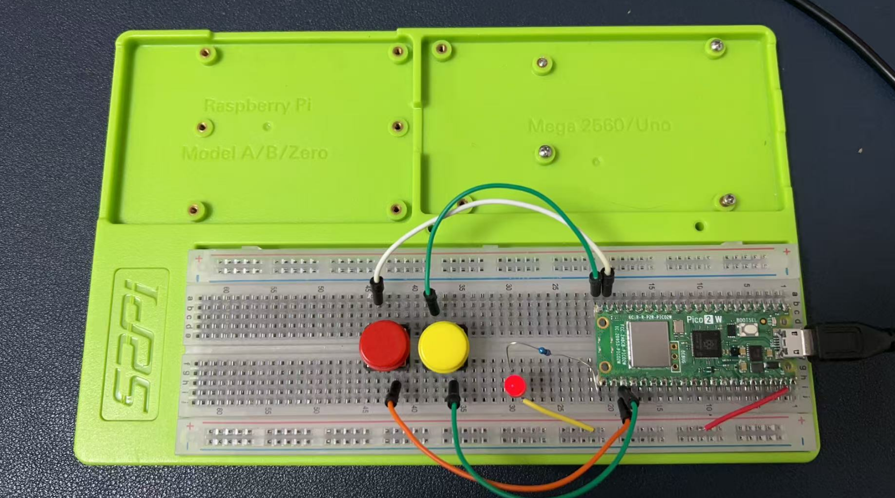
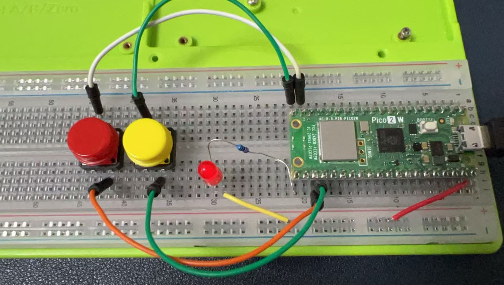

# Project 2 

## Project Description  

This project aims to control an LED using two buttons (red and yellow) connected to a Raspberry Pi Pico W. When the red button is pressed, the LED will turn on, and when the yellow button is pressed, the LED will turn off. Additionally, the serial port will print messages "led on" and "led off" accordingly. The project uses C++ and the Pico SDK.

### Circuit Diagram

1. Connect the red button to GPIO pin 14.
2. Connect the yellow button to GPIO pin 15.
3. Connect the LED's anode to GPIO pin 16 through a 220Ω resistor.
4. Connect the LED's cathode to the ground.
5. Connect the buttons' other ends to the ground.

Below is a table that outlines the wiring connections between the components and the Raspberry Pi Pico W:

| **Component**       | **Pin on Component** | **Pin on Raspberry Pi Pico W** | **Description**                             |
|---------------------|----------------------|--------------------------------|---------------------------------------------|
| Red Button          | One Terminal         | GPIO 14                        | Connect one terminal of the red button to GPIO 14. |
|                     | Other Terminal       | Ground                         | Connect the other terminal to the ground.   |
| Yellow Button       | One Terminal         | GPIO 15                        | Connect one terminal of the yellow button to GPIO 15. |
|                     | Other Terminal       | Ground                         | Connect the other terminal to the ground.   |
| LED                 | Anode (+)            | GPIO 16                        | Connect the anode of the LED to GPIO 16 through a 220Ω resistor. |
|                     | Cathode (-)          | Ground                         | Connect the cathode of the LED to the ground. |
| 220Ω Resistor       | One Terminal         | Anode of LED                   | Connect one terminal of the resistor to the anode of the LED. |
|                     | Other Terminal       | GPIO 16                        | Connect the other terminal to GPIO 16.      |
| Pico W Ground       | Ground               | Ground                         | Connect the ground of the Pico W to the ground of the circuit. |

----



### Notes:
- The **GPIO pins** on the Raspberry Pi Pico W are used for digital input and output.
- The **220Ω resistor** is used to limit the current flowing through the LED to prevent it from burning out.
- The **internal pull-up resistors** on the GPIO pins are enabled in the code to ensure a stable input signal from the buttons.
- Ensure all connections are secure and double-check the wiring before powering the circuit to avoid any short circuits or damage to the components.




### Code Explanation

#### CMakeLists.txt
The `CMakeLists.txt` file is used to configure the build environment for the Pico SDK. It sets up the project, includes the Pico SDK, and specifies the source files and executable name.

```cmake
cmake_minimum_required(VERSION 3.25)

include($ENV{PICO_SDK_PATH}/pico_sdk_init.cmake)

pico_sdk_init()

project(project2)

set(PICO_BOARD pico2_w)

add_executable(project2 main.c)

target_link_libraries(project2 pico_stdlib)

pico_add_extra_outputs(project2) 

pico_enable_stdio_usb(project2 1)
pico_enable_stdio_uart(project2 1)

```

#### main.c
This file contains the main logic for controlling the LED with buttons and printing messages to the serial port.

```c
#include "pico/stdlib.h"

// Define GPIO pins
const int RED_BUTTON_PIN = 14;
const int YELLOW_BUTTON_PIN = 15;
const int LED_PIN = 16;

// Function to initialize GPIO pins
void init_pins() {
    gpio_init(RED_BUTTON_PIN);
    gpio_set_dir(RED_BUTTON_PIN, GPIO_IN);
    gpio_pull_up(RED_BUTTON_PIN); // Enable internal pull-up resistor

    gpio_init(YELLOW_BUTTON_PIN);
    gpio_set_dir(YELLOW_BUTTON_PIN, GPIO_IN);
    gpio_pull_up(YELLOW_BUTTON_PIN); // Enable internal pull-up resistor

    gpio_init(LED_PIN);
    gpio_set_dir(LED_PIN, GPIO_OUT);
}

// Function to check if a button is pressed
bool is_button_pressed(int pin) {
    return gpio_get(pin) == 0; // Button is pressed if pin is LOW
}

int main() {
    stdio_init_all(); // Initialize serial communication
    init_pins();      // Initialize GPIO pins

    bool led_state = false; // LED is initially off

    while (true) {
        if (is_button_pressed(RED_BUTTON_PIN)) { // Check if red button is pressed
            if (!led_state) { // If LED is off
                gpio_put(LED_PIN, 0); // Turn on LED
                printf("led on\n");   // Print message
                led_state = true;     // Update LED state
            }
        } else if (is_button_pressed(YELLOW_BUTTON_PIN)) { // Check if yellow button is pressed
            if (led_state) { // If LED is on
                gpio_put(LED_PIN, 1); // Turn off LED
                printf("led off\n");  // Print message
                led_state = false;    // Update LED state
            }
        }

        sleep_ms(200); // Debounce delay
    }

    return 0;
}
```

### Code Breakdown

1. **GPIO Initialization**:
   - The `init_pins()` function initializes the GPIO pins for the buttons and LED. It sets the button pins as input with internal pull-up resistors and the LED pin as output.

2. **Button Press Detection**:
   - The `is_button_pressed()` function checks if a button is pressed by reading the GPIO pin state. If the pin is LOW, the button is considered pressed.

3. **Main Loop**:
   - The `main()` function initializes serial communication and GPIO pins.
   - It continuously checks the state of the buttons. If the red button is pressed and the LED is off, it turns on the LED and prints "led on".
   - If the yellow button is pressed and the LED is on, it turns off the LED and prints "led off".
   - A debounce delay of 200ms is added to prevent multiple detections from a single button press.

### Compilation and Execution
To compile and run the project:
1. Place the `CMakeLists.txt` and `main.cpp` files in a project directory.
2. Open a terminal and navigate to the project directory.
3. Run the following commands:
   ```bash
   mkdir build
   cd build
   cmake -DPICO_BOARD=pico2_w ../
   make -j4
   ```
4. Upload *.uf2 file to pico2w. 

```bash
cp project2.uf2 /media/pi/RP2350/
```

This project demonstrates basic GPIO control and serial communication on the Raspberry Pi Pico W, suitable for embedded systems and IoT applications.


### Experiment in C/C++ 

* [Project 1](./project1.md)
* [Project 2](./project2.md)
* [Project 3](./project3.md)
* [Project 4](./project4.md)
* [Project 5](./project5.md)
* [Project 6](./project6.md)
* [Project 7](./project7.md)
* [Project 8](./project8.md)
* [Project 9](./project9.md)
* [Project 10](./project10.md)
* [Project 11](./project11.md)
* [Project 12](./project12.md)
