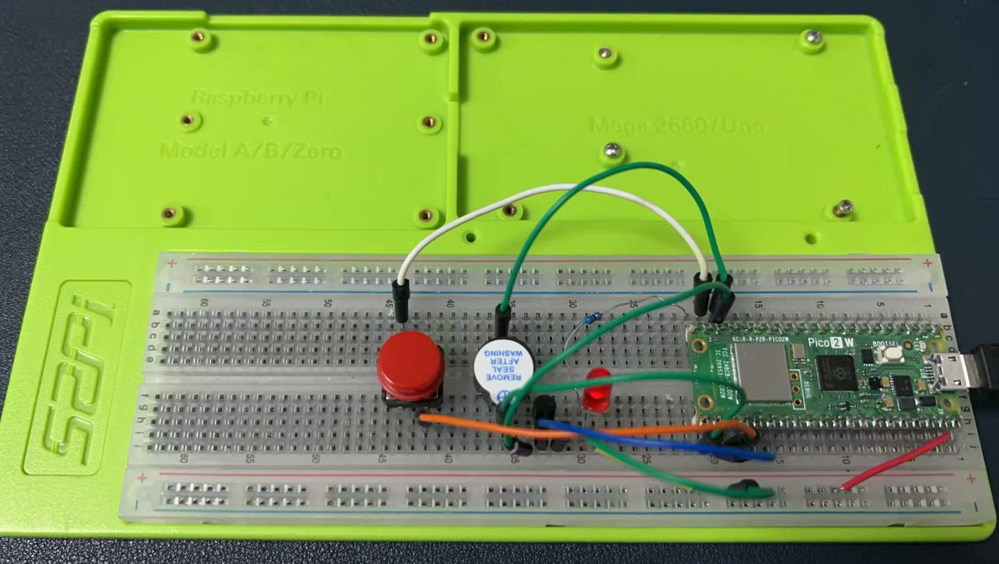
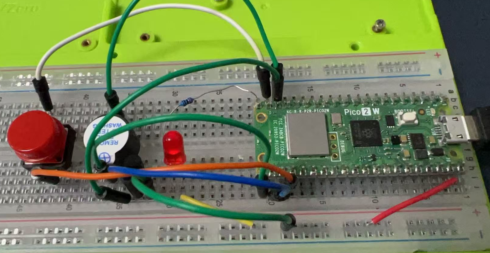
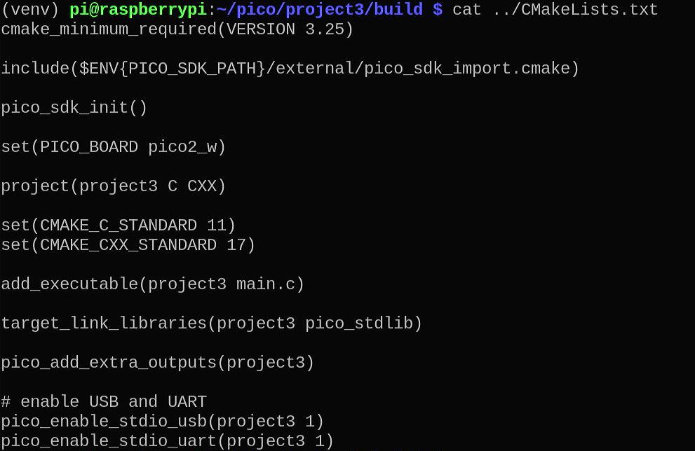

# Project 3 

## Project Description

This project uses a Raspberry Pi Pico W, an LED, a buzzer, a button, an S8050 transistor, and a 220Ω resistor to create a simple interactive circuit. When the button is pressed, the LED will turn on and the buzzer will make a sound. The LED will also blink continuously when the button is not pressed.

## Wiring Diagram

| **Component**       | **Pin on Component** | **Pin on Raspberry Pi Pico W** | **Description**                             |
|---------------------|----------------------|--------------------------------|---------------------------------------------|
| Button              | One Terminal         | GPIO 14                        | Connect one terminal of the button to GPIO 14. |
|                     | Other Terminal       | Ground                         | Connect the other terminal to the ground.   |
| LED                 | Anode (+)            | GPIO 15                        | Connect the anode of the LED to GPIO 15 through a 220Ω resistor. |
|                     | Cathode (-)          | Ground                         | Connect the cathode of the LED to the ground. |
| 220Ω Resistor       | One Terminal         | Anode of LED                   | Connect one terminal of the resistor to the anode of the LED. |
|                     | Other Terminal       | GPIO 15                        | Connect the other terminal to GPIO 15.      |
| Buzzer              | Positive Terminal    | GPIO 16                        | Connect the positive terminal of the buzzer to GPIO 16 through the S8050 transistor. |
|                     | Negative Terminal    | Ground                         | Connect the negative terminal to the ground. |
| S8050 Transistor    | Base                 | GPIO 17                        | Connect the base of the transistor to GPIO 17. |
|                     | Emitter              | Ground                         | Connect the emitter to the ground.          |
|                     | Collector            | Positive Terminal of Buzzer    | Connect the collector to the positive terminal of the buzzer. |

----





## Demo Code

```c
#include "pico/stdlib.h"

// Define GPIO pins
const int BUTTON_PIN = 14;
const int LED_PIN = 15;
const int BUZZER_PIN = 16;
const int TRANSISTOR_PIN = 17;

// Function to initialize GPIO pins
void init_pins() {
    gpio_init(BUTTON_PIN);
    gpio_set_dir(BUTTON_PIN, GPIO_IN);
    gpio_pull_up(BUTTON_PIN); // Enable internal pull-up resistor

    gpio_init(LED_PIN);
    gpio_set_dir(LED_PIN, GPIO_OUT);

    gpio_init(BUZZER_PIN);
    gpio_set_dir(BUZZER_PIN, GPIO_OUT);

    gpio_init(TRANSISTOR_PIN);
    gpio_set_dir(TRANSISTOR_PIN, GPIO_OUT);
}

// Function to check if the button is pressed
bool is_button_pressed() {
    return gpio_get(BUTTON_PIN) == 0; // Button is pressed if pin is LOW
}

int main() {
    stdio_init_all(); // Initialize serial communication
    init_pins();      // Initialize GPIO pins

    while (true) {
        if (is_button_pressed()) { // Check if the button is pressed
            gpio_put(LED_PIN, 1); // Turn on LED
            gpio_put(TRANSISTOR_PIN, 1); // Turn on transistor to activate buzzer
            gpio_put(BUZZER_PIN, 1); // Turn on buzzer
            sleep_ms(500); // Wait for 500ms
            gpio_put(LED_PIN, 0); // Turn off LED
            gpio_put(TRANSISTOR_PIN, 0); // Turn off transistor
            gpio_put(BUZZER_PIN, 0); // Turn off buzzer
            sleep_ms(500); // Wait for 500ms
        } else { // If the button is not pressed, blink the LED
            gpio_put(LED_PIN, 1); // Turn on LED
            sleep_ms(500); // Wait for 500ms
            gpio_put(LED_PIN, 0); // Turn off LED
            sleep_ms(500); // Wait for 500ms
        }
    }

    return 0;
}
```

* CMakeLists.txt file content:
```cmake 
cmake_minimum_required(VERSION 3.25)

include($ENV{PICO_SDK_PATH}/external/pico_sdk_import.cmake)

pico_sdk_init()

set(PICO_BOARD pico2_w)

project(project3 C CXX)

set(CMAKE_C_STANDARD 11)
set(CMAKE_CXX_STANDARD 17)

add_executable(project3 main.c)

target_link_libraries(project3 pico_stdlib)

pico_add_extra_outputs(project3)

# enable USB and UART
pico_enable_stdio_usb(project3 1)
pico_enable_stdio_uart(project3 1)

```



## Code Explanation

1. **GPIO Initialization**:
   - The `init_pins()` function initializes the GPIO pins for the button, LED, buzzer, and transistor.
   - The button pin is set as an input with an internal pull-up resistor to ensure a stable signal.
   - The LED, buzzer, and transistor pins are set as outputs.

2. **Button Press Detection**:
   - The `is_button_pressed()` function checks if the button is pressed by reading the state of the button pin. If the pin is LOW, the button is considered pressed.

3. **Main Loop**:
   - When the button is pressed, the LED is turned on, the transistor is activated to turn on the buzzer, and both are turned off after 500ms. This sequence repeats.
   - When the button is not pressed, the LED blinks continuously with a 500ms interval.

4. **Transistor Control**:
   - The S8050 transistor is used to control the buzzer. When the transistor is activated (HIGH signal on the base), it allows current to flow through the buzzer, making it sound.

This project demonstrates how to use a transistor to control a buzzer and how to manage GPIO pins for button presses and LED control on the Raspberry Pi Pico W.

### Compile and upload 

```bash 
mkdir build 
cd build
cmake -DPICO_BOARD=pico2_w ../ 
make -j4 
```

* upload `*.uf2` to pico 2w as project1. 

```bash
cp project3.uf2 /media/pi/RP2350/ 
```
### Demostration 


### Experiment in C/C++ 

* [Project 1](./project1.md)
* [Project 2](./project2.md)
* [Project 3](./project3.md)
* [Project 4](./project4.md)
* [Project 5](./project5.md)
* [Project 6](./project6.md)
* [Project 7](./project7.md)
* [Project 8](./project8.md)
* [Project 9](./project9.md)
* [Project 10](./project10.md)
* [Project 11](./project11.md)
* [Project 12](./project12.md)
