# Ultimate Starter Kit for Raspberry Pi Pico 2 WH 

## Development on Language C/C++

The Raspberry Pi Pico-SDK has both advantages and disadvantages in the development process, which are as follows:

### Advantages
- **Comprehensive and Well-Integrated**
  The Pico-SDK is specifically designed for the Raspberry Pi Pico and its RP2040 microcontroller. It provides a comprehensive set of tools and libraries that are tightly integrated with the hardware, making it easier for developers to access and control various features of the Pico, such as GPIO pins, peripherals like SPI, I2C, UART, and DMA. This integration ensures efficient and reliable communication between the software and hardware components.
- **Performance Optimization**
  The SDK is optimized for the Pico's hardware architecture, allowing developers to fully leverage the capabilities of the RP2040's dual-core Cortex-M0+ processor. This can result in better performance and more efficient use of system resources, which is particularly important for applications that require real-time processing or high-speed data handling.
- **Active Community and Support**
  As part of the Raspberry Pi ecosystem, the Pico-SDK benefits from a large and active community of developers. This means that there are plenty of resources available, including tutorials, forums, and example projects, which can help developers quickly get started and troubleshoot any issues they encounter. Additionally, the community-driven nature ensures that the SDK is regularly updated and improved based on user feedback.
- **Cross-Platform Compatibility**
  The Pico-SDK can be used on various operating systems, including Windows, macOS, and Linux. This flexibility allows developers to work in their preferred environment and ensures that the SDK can be easily integrated into different development workflows.

### Disadvantages
- **Learning Curve**
  For beginners or developers who are not familiar with embedded systems or C/C++ programming, the Pico-SDK may have a steep learning curve. Understanding the intricacies of the SDK, as well as the underlying hardware architecture of the Pico, requires a significant amount of time and effort. This can be a barrier to entry for those who are new to this type of development.
- **Complexity in Setup and Configuration**
  Setting up the development environment for the Pico-SDK can be complex. It involves installing multiple tools and dependencies, such as the GNU ARM toolchain, and configuring the build system. Any issues or errors during this process can be difficult to diagnose and resolve, especially for inexperienced developers.
- **Limited Documentation**
  While there are resources available from the community, the official documentation for the Pico-SDK may not always be as comprehensive or detailed as some developers would like. This can make it challenging to fully understand certain aspects of the SDK or to find specific information needed for a particular project. As a result, developers may need to spend additional time searching for answers or experimenting with different approaches.
- **Resource Constraints**
  The Raspberry Pi Pico has limited system resources, such as memory and storage. This can be a limitation when working with the Pico-SDK, as developers need to carefully manage resources to ensure that their applications run efficiently without running out of memory or storage space. This may require optimizing code and using techniques such as memory pooling or data compression to make the most of the available resources.

## Getting Start with Pico-SDK 

In this tutorial, we will use a Raspberry Pi as a Linux host. We will set up the Pico-SDK environment under the Linux environment of the Raspberry Pi and proceed with programming. We will build a simple circuit with each module of the kit one by one and write code to implement applications such as data acquisition and distribution.

Sure, here is a detailed guide on setting up the Pico-SDK environment for the Raspberry Pi Pico 2W on a Raspberry Pi without any VS Code content:

---

### Prerequisites
1. **Hardware**:
   - Raspberry Pi (any model with sufficient resources to run a Linux OS).
   - Raspberry Pi Pico 2W.
   - USB cable for connecting the Pico 2W to the Raspberry Pi.
2. **Software**:
   - Raspberry Pi OS (or any other Linux distribution) installed on the Raspberry Pi.
   - Basic familiarity with Linux commands and terminal operations.

### Step-by-Step Guide

#### Step 1: Update Your Raspberry Pi

Open a terminal on your Raspberry Pi and run the following commands to update your system:

```bash
sudo apt update
sudo apt upgrade -y
```

#### Step 2: Install Required Tools and Libraries

Install the necessary tools and libraries for compiling and flashing code to the Pico 2W:

```bash
wget
https://raw.githubusercontent.com/raspberrypi/pico-setup/refs/heads/master/pico_setup.sh
chmod +x pico_setup.sh 
./pico_setup.sh 
```
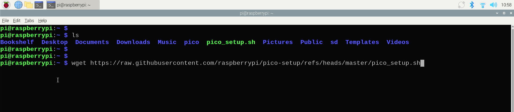

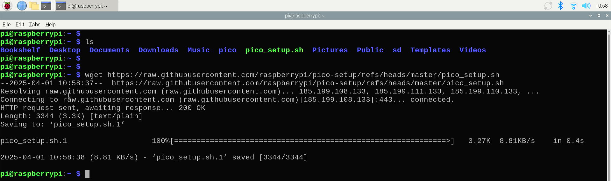

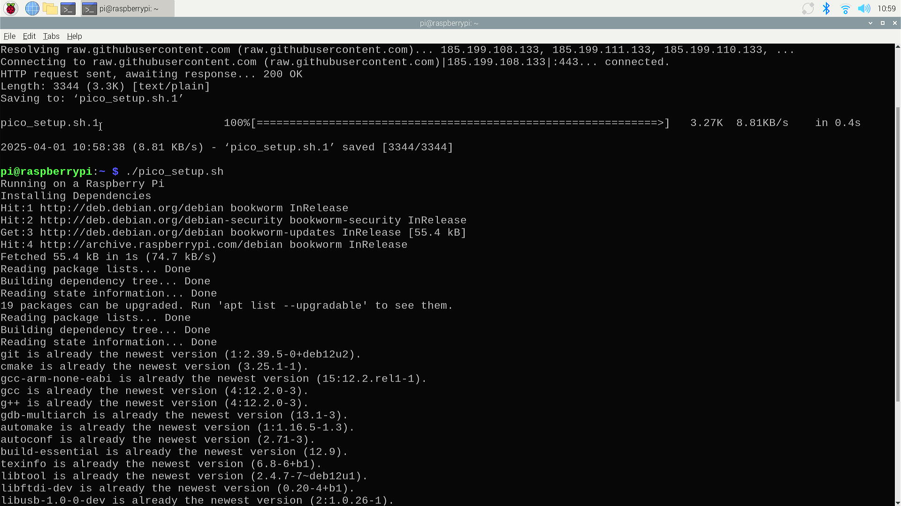

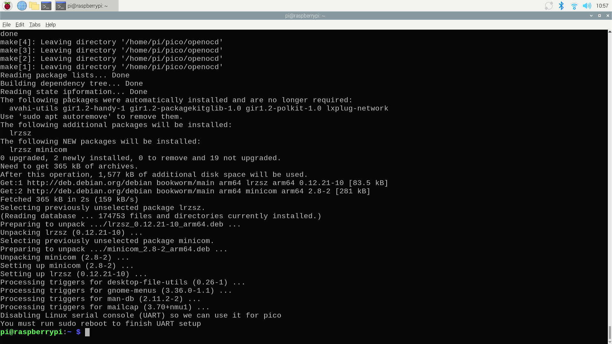

#### Step 3: Build a test project

Create a directory to store the project files:

```bash
mkdir -pv ~/pico/blink
cd ~/pico/blink
```
#### Step 4: Create `CMakeLists.txt` and `main.c` 

* CMakeLists

```cmake 
cmake_minimum_required(VERSION 3.25) 

include($ENV{PICO_SDK_PATH}/external/pico_sdk_import.cmake)

pico_sdk_init()

project(blink C CXX) 

set(CMAKE_C_STANDARD 11)
set(CMAKE_CXX_STANDARD 17)

add_executable(blink main.c)

target_link_libraries(blink pico_stdlib) 

if (PICO_CYW43_SUPPORTED)
    target_link_libraries(blink pico_cyw43_arch_none)
endif()

# create map/bin/hex file etc.
pico_add_extra_outputs(blink)

```
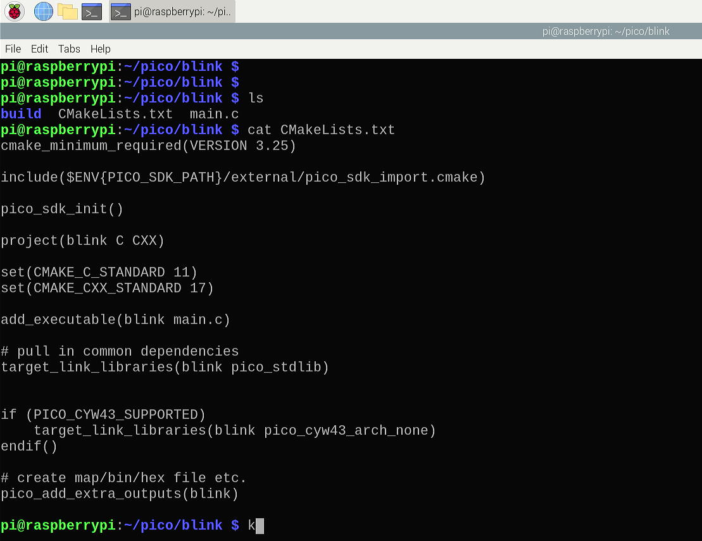

#### Step 5. Create `main.c`

```c
#include "pico/stdlib.h"

#ifdef CYW43_WL_GPIO_LED_PIN
#include "pico/cyw43_arch.h"
#endif

#ifndef LED_DELAY_MS
#define LED_DELAY_MS 250
#endif 

int pico_led_init(void){
#if defined(PICO_DEFAULT_LED_PIN)
    gpio_init(PICO_DEFAULT_LED_PIN);
    gpio_set_dir(PICO_DEFAULT_LED_PIN, GPIO_OUT);
    return PICO_OK;
#elif defined(CYW43_WL_GPIO_LED_PIN)
    return cyw43_arch_init();
#endif 

// Turn the led on or off 
void pico_set_led(bool led_on){
#if defined(PICO_DEFAULT_LED_PIN)
    gpio_put(PICO_DEFAULT_LED_PIN, led_on);
#elif defined(CYW43_WL_GPIO_LED_PIN)
    cyw43_arch_gpio_put(CYW43_WL_GPIO_LED_PIN, led_on);
#endif
}

int main() {
    int rc = pico_led_init();
    hard_assert(rc = PICO_OK);
    while(true) {
        pico_set_led(true);
        sleep_ms(LED_DELAY_MS);
        pico_set_led(false);
        sleep_ms(LED_DELAY_MS);
    }
}

```

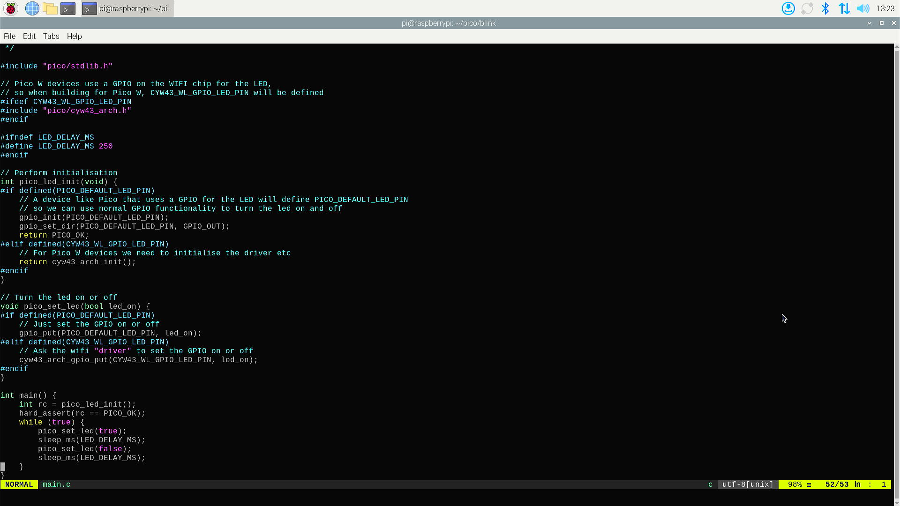

Configure the build system using CMake, specifying the Pico 2W board:

```bash
mkdir build 
cd build/
cmake -DPICO_BOARD=pico2_w ../
```

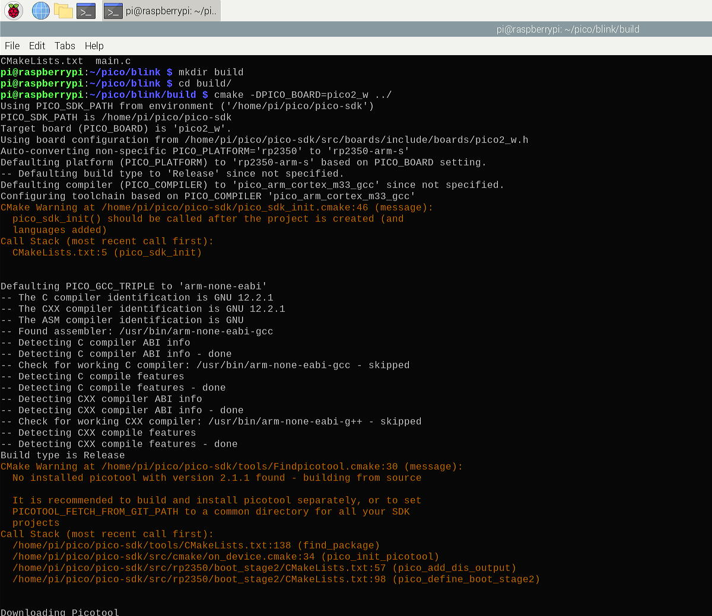

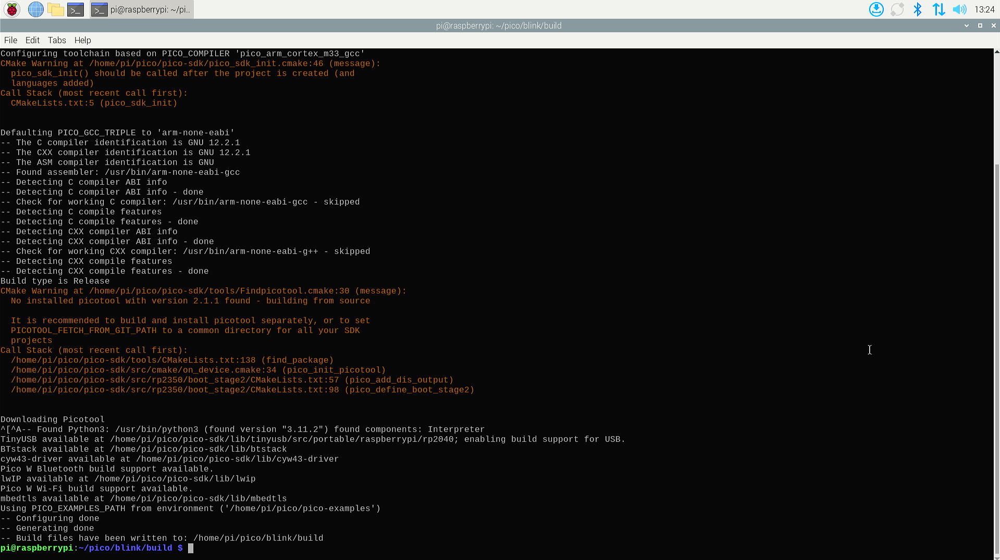

Build the project:

```bash
make -j4
```

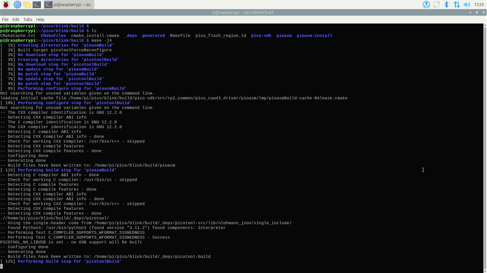

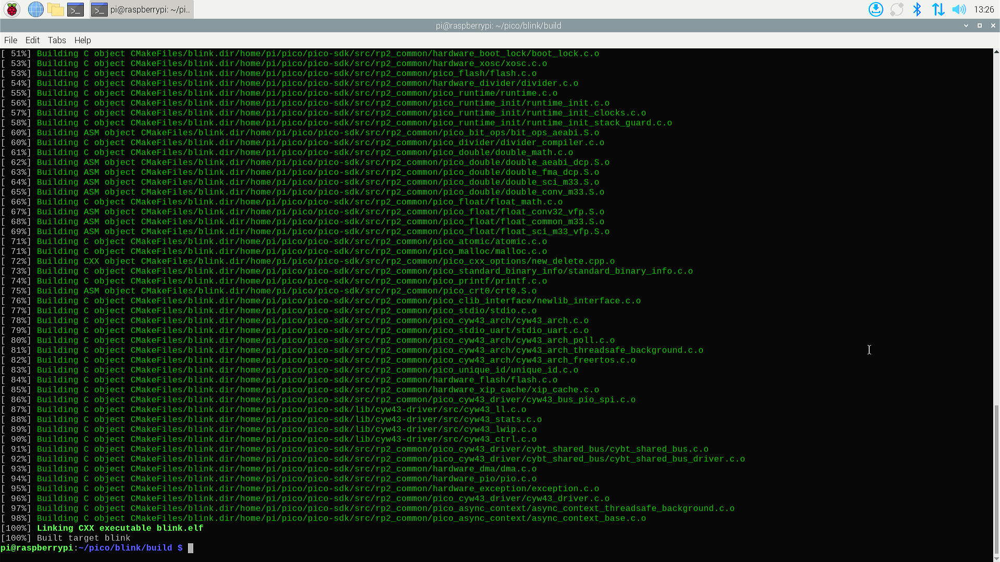

#### Step 6: Flash an project to the Pico 2W

To flash an project (e.g., the blink ) to the Pico 2W, follow these steps:

1. **Prepare the Pico 2W for Flashing**:
   - Hold the **BOOTSEL** button on the Pico 2W while connecting it to the Raspberry Pi via USB. The Pico 2W should appear as a USB mass storage device named `RPI-RP2`.
   - Release the **BOOTSEL** button once the Pico 2W is recognized.

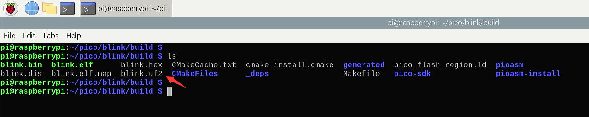

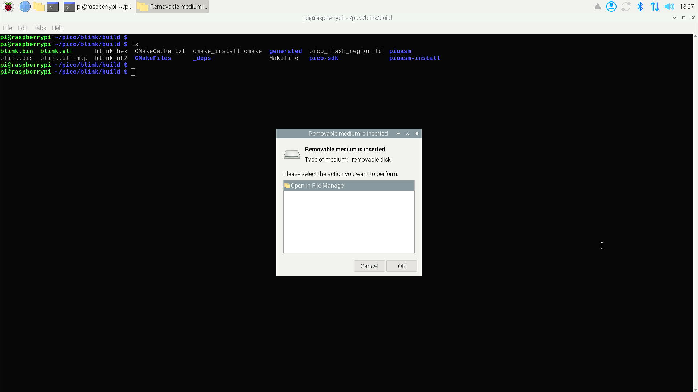

2. **Copy the UF2 File to the Pico 2W**:
   - Copy the generated `.uf2` file to the Pico 2W storage device:
     ```bash
     cp blink.uf2 /media/pi/RP2350/
     ```

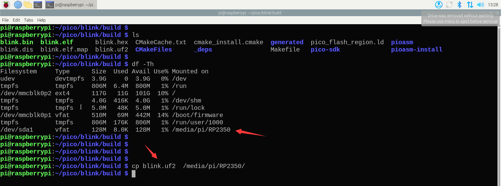

   - The Pico 2W will automatically reboot and run the blink code.

#### Step 7: Create and Build Your Own Project

To create your own project, follow these steps:

1. **Create a New Project Directory**:

   ```bash
   mkdir ~/pico/my_project
   cd ~/pico/my_project
   ```

2. **Initialize the Project**:

   - Create a `CMakeLists.txt` file to configure the build system. Here’s a basic example:
     ```cmake
     cmake_minimum_required(VERSION 3.13.1)

     include($ENV{PICO_SDK_PATH}/external/pico_sdk_import.cmake)

     project(my_project C CXX)
     
     set(CMAKE_C_STANDARD 11)
     set(CMAKE_CXX_STANDARD 17)

     pico_sdk_init()

     add_executable(my_project main.c)

     pico_add_extra_outputs(my_project)

     # enable USB and Uart Output 
     pico_enable_stdio_usb(my_project 1)
     pico_enable_stdio_uart(my_project 1)

     ```
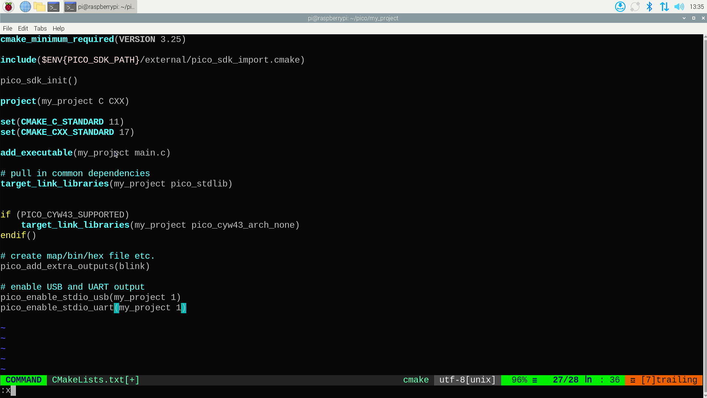

   - Create a `main.c` file with your code. For example:

     ```c
     #include "pico/stdlib.h"

     int main() {

         int count = 0;

         stdio_init_all();

         while (true) {

             printf("Hello, Pico 2W %d times!\n", count);
             sleep_ms(1000);
             count += 1;
         }
         return 0;
     }
     ```

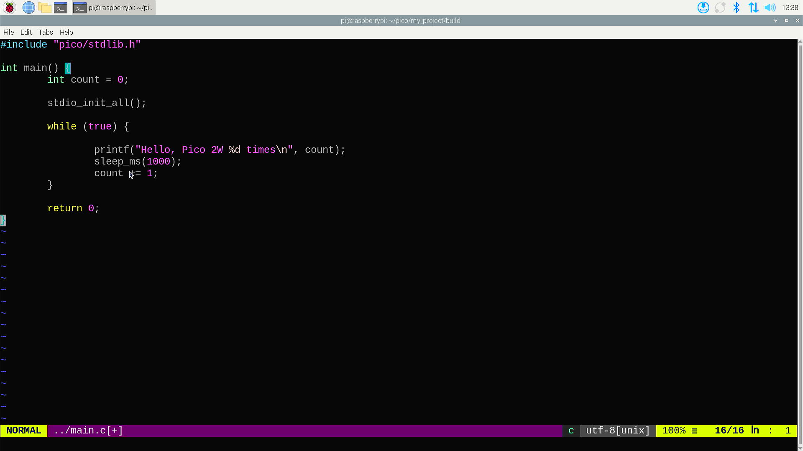

3. **Build the Project**:
   - Create a build directory and configure the project:
     ```bash
     mkdir build
     cd build
     cmake -DPICO_BOARD=pico2_w ../
     make -j4
     ```
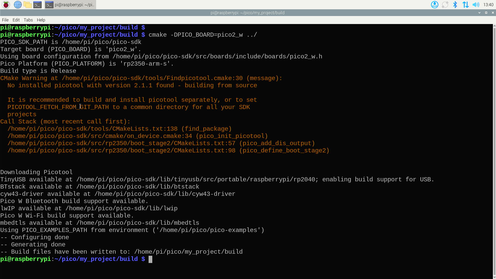

4. **Flash the Project to the Pico 2W**:
   - Follow the same steps as in Step 6 to flash the `.uf2` file to the Pico 2W.

5. **Build Virtualenv environment and test the serial port**:
   - Create a virtualenv and install `pyserial` library:
   ```bash 
   sudo apt update 
   sudo apt -y install virtualenv 
   virtualenv -p python3 venv 
   cd venv/
   source bin/activate 
   pip install pyserial
   ```
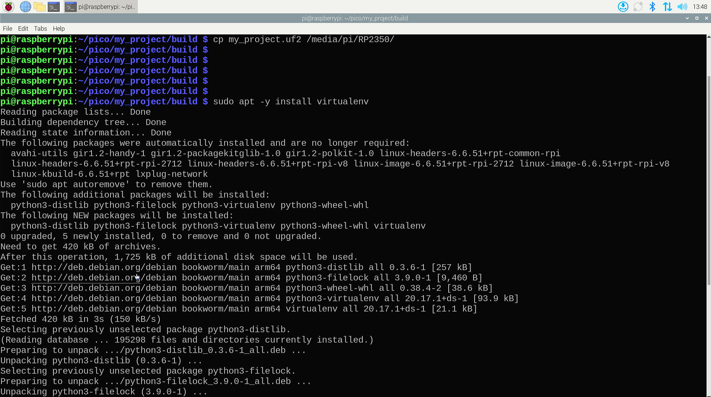

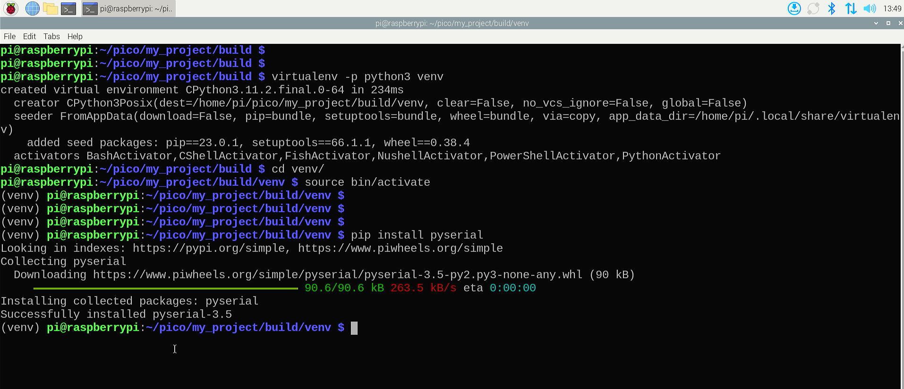

6. ** Write a python script to test `UART`:
   - Create a file named `monitor.py`:
   ```bash
   vim monitor.py
   ```
   - Copy and paste following code:
   ```python3
   import serial 
   import time 


   ser = serial.Serial("/dev/ttyACM0", baudrate=9600, timeout=30)
   while True:
       if ser.isOpen():
           data = ser.readline()
           print(data.decode('utf-8')
   ```

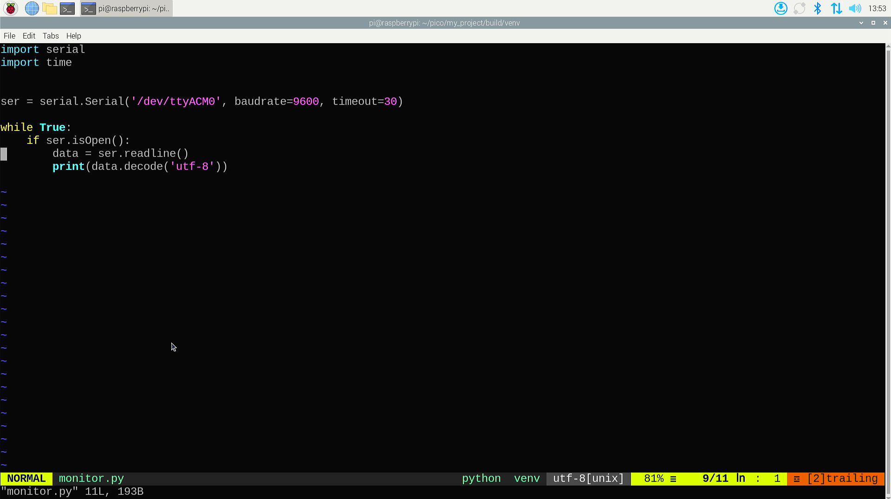

7. Execute the python code and check if the output information is as the same as
   the pico's project code. 

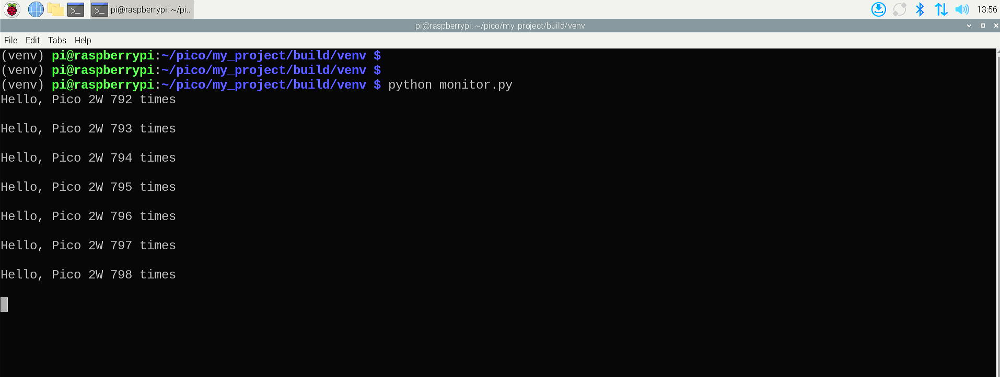

### Experiment in C/C++ 

* [Project 1](./project1.md)
* [Project 2](./project2.md)
* [Project 3](./project3.md)
* [Project 4](./project4.md)
* [Project 5](./project5.md)
* [Project 6](./project6.md)
* [Project 7](./project7.md)
* [Project 8](./project8.md)
* [Project 9](./project9.md)
* [Project 10](./project10.md)
* [Project 11](./project11.md)
* [Project 12](./project12.md)
