# DIY Beginner Kit Compatible with Arduino Nano R4(Headers) 

Product SKU: KZ-0086

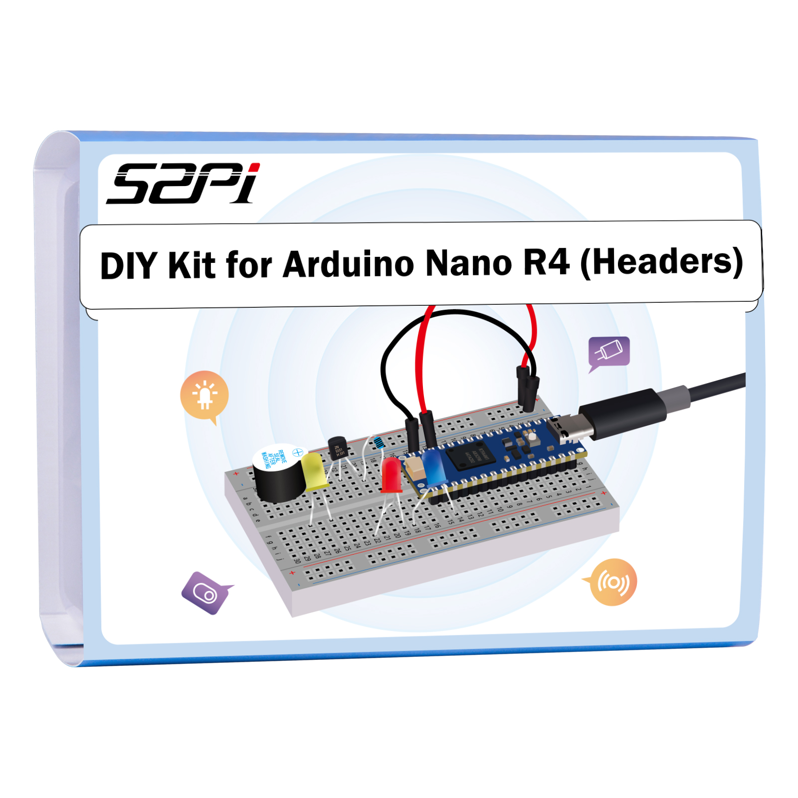

## Beginner's Learning Guide

Welcome to your DIY Beginner Kit Compatible with Arduino Nano R4! 
This comprehensive guide will take you from complete beginner to confident maker through hands-on projects using all the components in your kit.
 
## Table of Contents

- [Getting Started](#getting-started)
- [Basic Projects](#basic-projects)
- [Intermediate Projects](#intermediate-projects)
- [Advanced Projects](#advanced-projects)
- [Understanding Electronics Basics](#understanding-electronics-basics)
- [Troubleshooting Guide](#troubleshooting-guide)
- [Next Steps](#next-steps)
- [Additional Resources](#additional-resources)
- [Full Pinout](#full-pinout)
- [Download Sketches](#download-music-demo-sketches)

---

## Getting Started

* what you have in the kit?

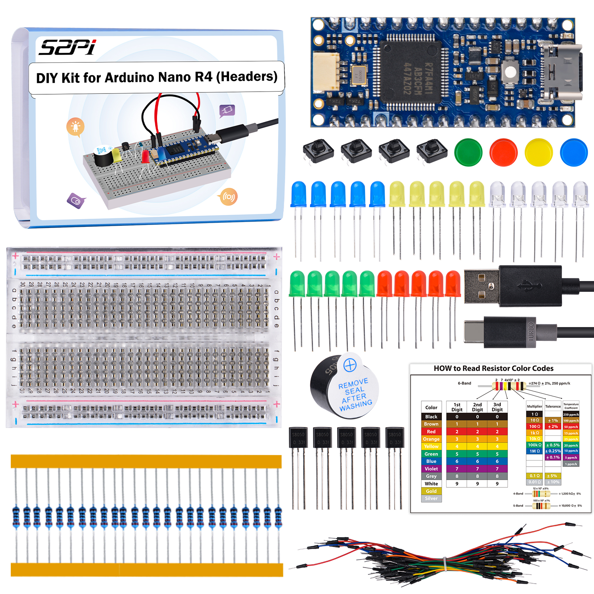

### What is Arduino?

Arduino is an open-source electronics platform that makes building interactive projects simple and fun. Think of it as the brain of your project - it can read inputs (like pressing a button) and turn them into outputs (like turning on an LED).

### Nano R4 Architecture Overview

* Features 

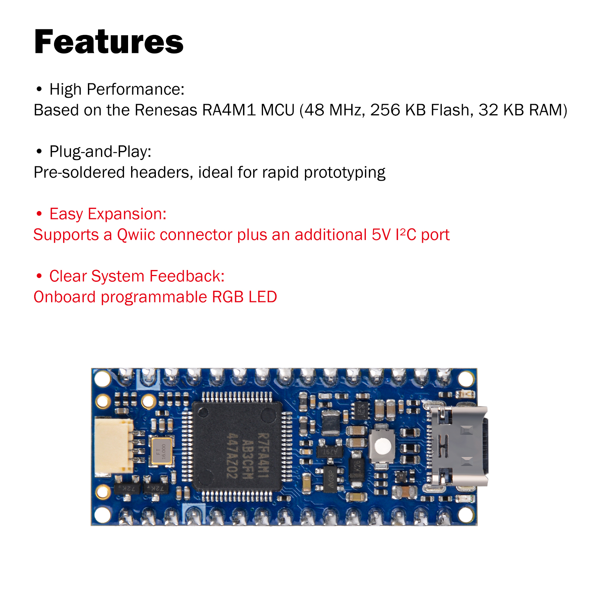

* Interfaces 

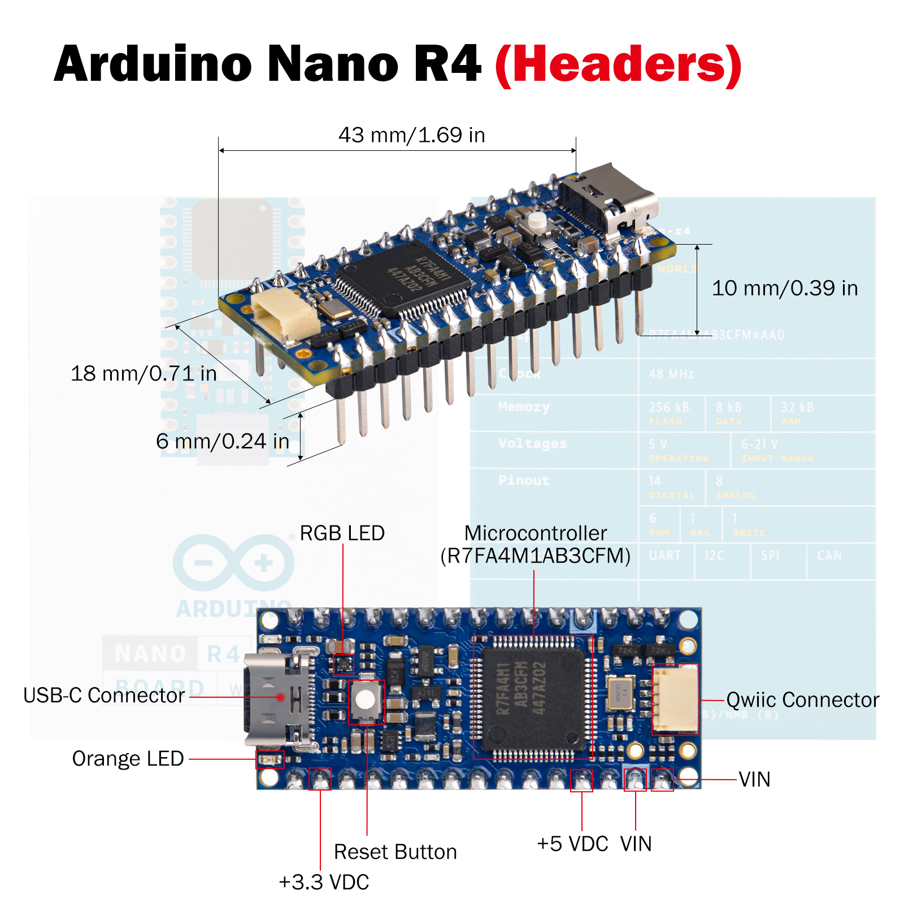

* Pinout 

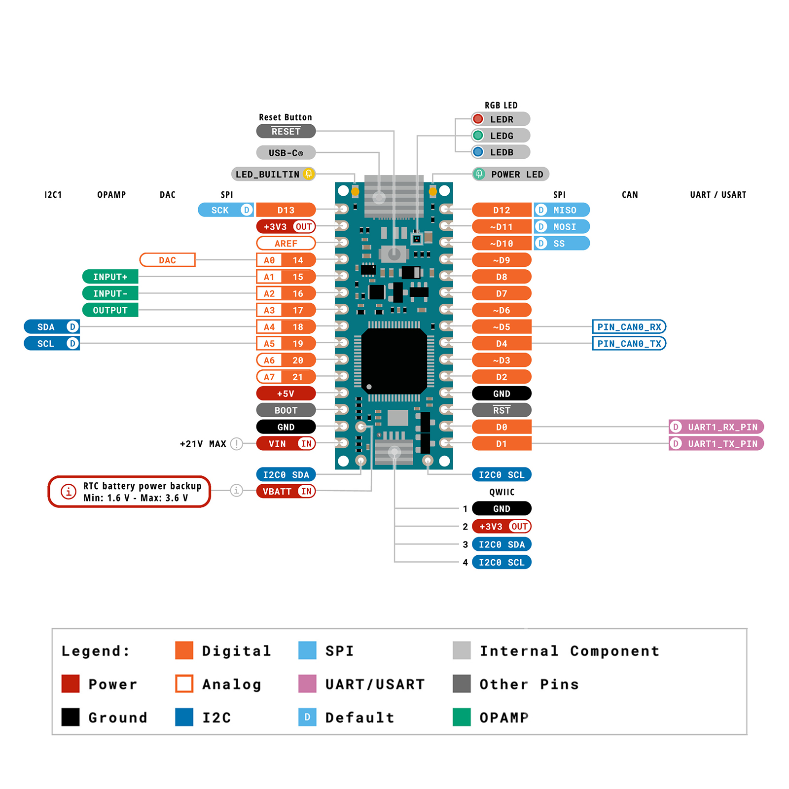

Here is an overview of the board's main components shown in the images above:

- **Microcontroller**: At the heart of the Nano R4 board there is a Renesas RA4M1 family microcontroller (R7FA4M1AB3CFM). This single-chip microcontroller, recognized as one of the industry's most energy-efficient microcontroller, is based on a 48 MHz Arm® Cortex®-M4 core with up to 256 KB of flash memory and 32 KB of SRAM memory.
- **USB-C connector**: The Nano R4 board features a modern USB-C connector for programming, power supply and serial communication with the external world.
- **Qwiic connector**: The Nano R4 board also includes an onboard Qwiic connector to expand the board's communication capabilities via I²C, facilitating connection with a wide range of boards, sensors, actuators and different peripherals.
- **Programmable RGB LED**: The Nano R4 board has an onboard user-programmable RGB LED to provide visual feedback about different operating states.
- **User LED**: In addition to the onboard user-programmable RGB LED, the board also includes an additional onboard user-programmable orange LED for basic status indications.
- **Castellated pins**: The board's castellated pins allow surface mounting as a module, facilitating integration into custom hardware designs.
- **Advanced microcontroller features**: The R7FA4M1AB3CFM microcontroller has integrated peripherals such as a 12-bit Digital-to-Analog Converter (DAC), CAN bus for industrial communications, integrated Operational Amplifiers (OpAmp) and HID emulation capabilities (keyboard/mouse).

### Board Core and Libraries

The **Arduino UNO R4 Boards** core contains the libraries and examples to work with the Arduino Nano R4's peripherals and onboard components, such as its RA4M1 microcontroller, advanced peripherals (DAC, CAN and OpAmp), Qwiic connector and the onboard RGB LED. 
To install the core for the Nano R4 board, navigate to **Tools > Board > Boards Manager** or click the **Boards Manager** icon in the left tab of the IDE. 
In the Boards Manager tab, search for UNO R4 and install the latest Arduino UNO R4 Boards version.

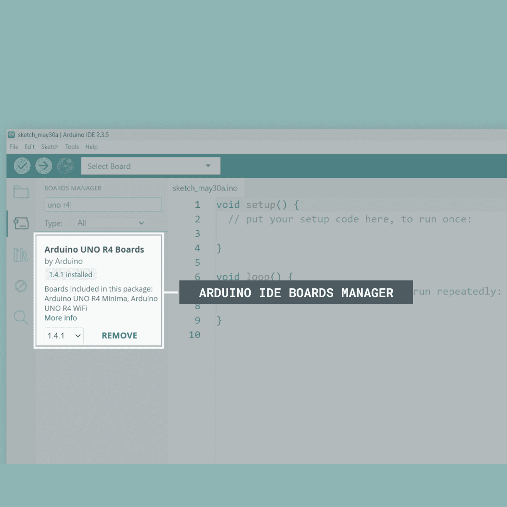

### Setting Up Your Arduino Nano R4

1. **Download Arduino IDE**: Visit [Arduino.cc](https://www.arduino.cc/en/software) and download the free Arduino IDE.
2. **Install Board Support**: In Arduino IDE, go to `Tools` → `Board` → `Boards Manager`, search for "Nano R4" and install the Arduino Nano R4 Boards package.
3. **Select Your Board**: Tools → Board → Arduino Nano R4 (or UNO R4 minima, Nano R4 uses the same core).

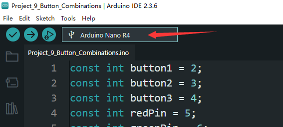

4. **Connect Your Board**: Use the USB-C cable to connect your Nano R4 to your computer.
5. **Select Port**: Tools → Port → Select the port that shows "Arduino UNO R4 Minima".

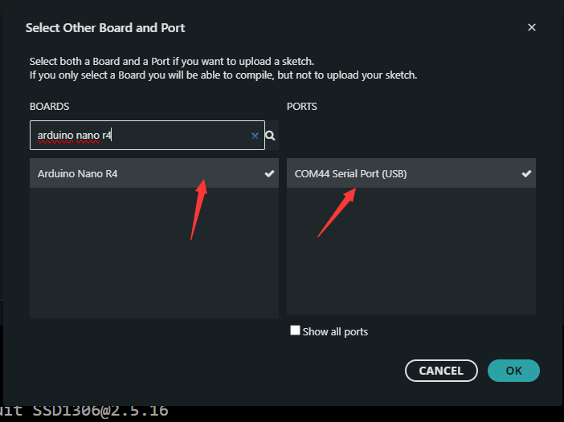

### Your Components

Let's get familiar with everything in your kit:

| **Component**                     | **Quantity** | **What It Does**                                                                 |
|-----------------------------------|--------------|----------------------------------------------------------------------------------|
| Arduino Nano R4                   | 1            | The brain of your projects                                                      |
| 400-hole Breadboard               | 1            | Prototyping board for building circuits                                         |
| Jumper Wires (65 pieces)          | 1 set        | Connect components together                                                     |
| LEDs (Red, Yellow, Blue, Green)   | 20 total (5 each) | Lights that show output                                                        |
| 220Ω Resistors                    | 20           | Protect LEDs from too much current                                              |
| NPN Transistors                   | 5            | Electronic switches                                                             |
| Tactile Buttons                   | 5            | Input devices you can press                                                     |
| Button Caps                       | 5            | Colored covers for buttons                                                      |
| USB-C Cable                       | 1            | Powers and programs your board                                                  |
| Resistor Color Code Card          | 1            | Helps identify resistor values                                                  |

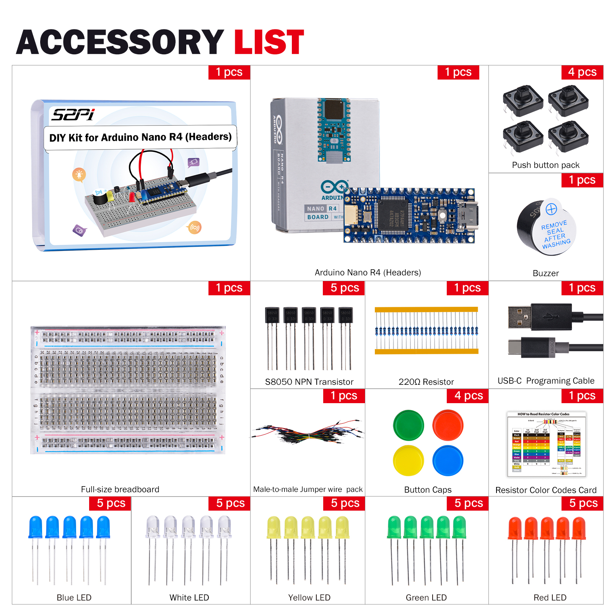

### Understanding Your Breadboard

The breadboard is your circuit building platform. It has:

- **Terminal Strips**: Rows of 5 connected holes for components.
- **Power Rails**: Long rows on the sides for +5V and GND connections.
- **Central Groove**: Separates the two sides (perfect for ICs).

---

## Basic Projects

### Project 1: Your First LED Blink

**What you'll learn**: Basic Arduino programming and LED control

#### Components needed:

- Arduino Nano R4
- 1 LED (any color)
- 1 × 220Ω resistor
- 2 jumper wires
- Breadboard

#### Circuit Setup:

1. Place the LED on the breadboard (longer leg = positive).
2. Connect the LED positive leg to Arduino pin 13.
3. Connect the LED negative leg to one end of the 220Ω resistor.
4. Connect the other end of the resistor to GND.
5. Connect Arduino to your computer with USB-C.

#### The Code:

```cpp
void setup() {
    pinMode(13, OUTPUT); // Set pin 13 as output
}

void loop() {
    digitalWrite(13, HIGH); // Turn LED on
    delay(1000); // Wait 1 second
    digitalWrite(13, LOW); // Turn LED off
    delay(1000); // Wait 1 second
}
```

* Demo sketch

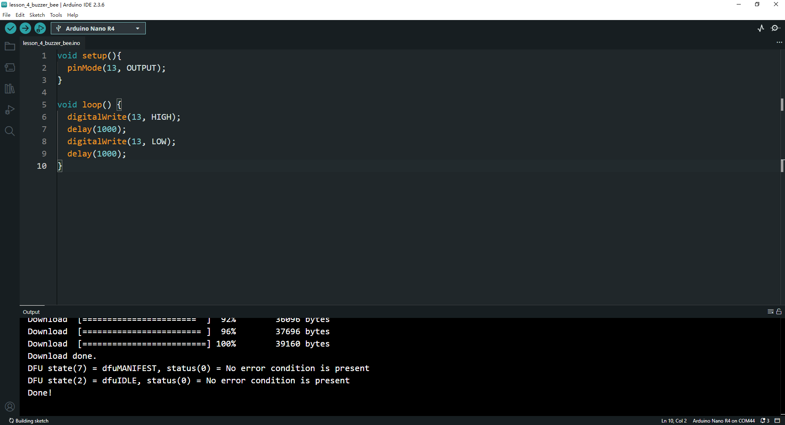

**Upload and Test**: Click the upload button. Your LED should blink!

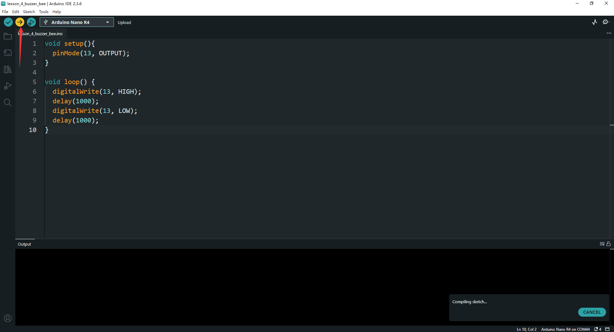

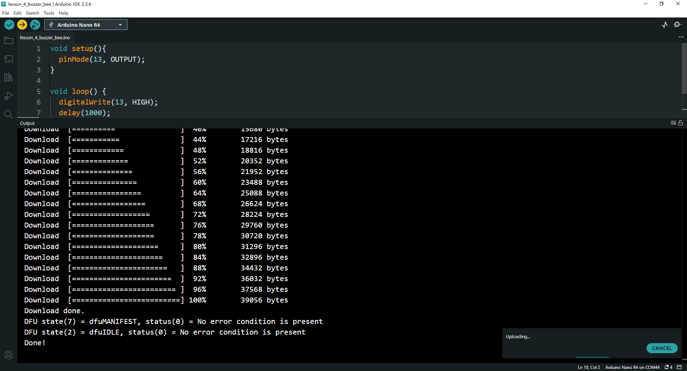

**What happened?** The Arduino sends electricity to pin 13, lighting the LED, then stops, creating a blinking effect.

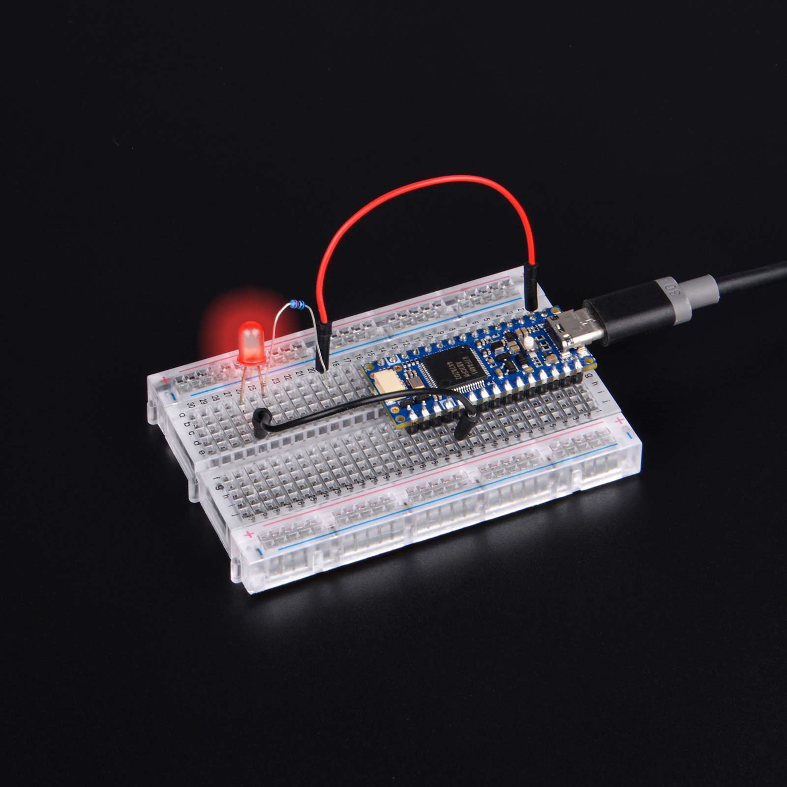

### Project 2: Multiple LEDs - Traffic Light

**What you'll learn**: Controlling multiple outputs

#### Components needed:

- Arduino Nano R4
- 3 LEDs (Red, Yellow, Green)
- 3 × 220Ω resistors
- Jumper wires
- Breadboard

#### Circuit Setup:

1. Place LEDs in a row on the breadboard.
2. Connect Red LED to pin 8, Yellow to pin 9, Green to pin 10.
3. Connect each LED's negative leg through a 220Ω resistor to GND.

#### The Code:

```cpp
void setup() {
    pinMode(8, OUTPUT); // Red LED
    pinMode(9, OUTPUT); // Yellow LED
    pinMode(10, OUTPUT); // Green LED
}

void loop() {
    // Green light
    digitalWrite(10, HIGH);
    delay(5000); // 5 seconds
    digitalWrite(10, LOW);

    // Yellow light
    digitalWrite(9, HIGH);
    delay(2000); // 2 seconds
    digitalWrite(9, LOW);

    // Red light
    digitalWrite(8, HIGH);
    delay(5000); // 5 seconds
    digitalWrite(8, LOW);
}
```

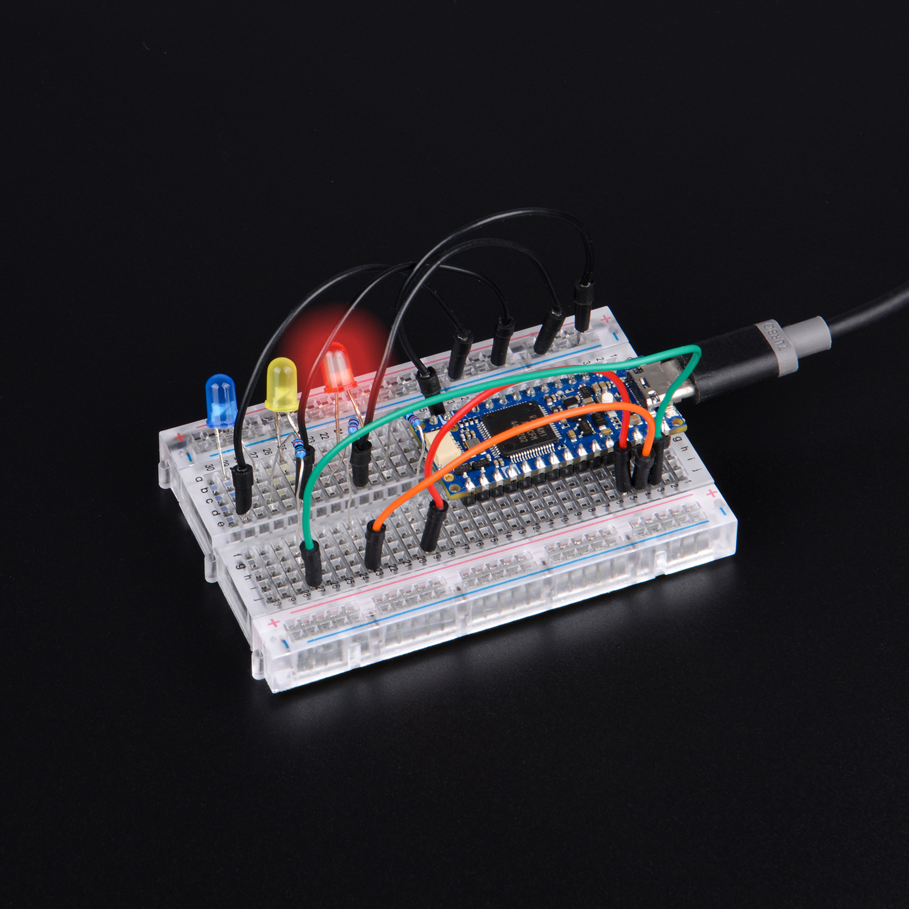

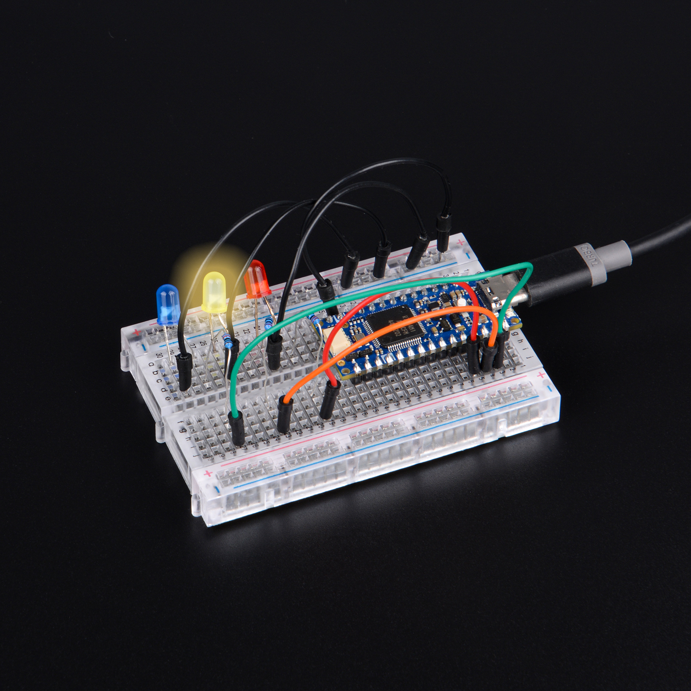

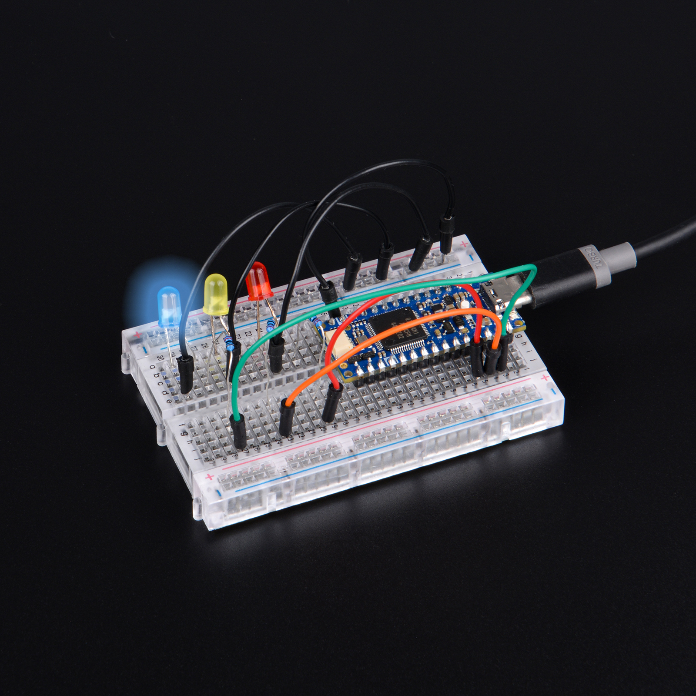

### Project 3: Button Control

**What you'll learn**: Reading inputs and using if statements

#### Components needed:

- Arduino Nano R4
- 1 LED
- 1 × 220Ω resistor
- 1 x button
- 1 x button cap
- 1 × 220Ω resistor (pull-down)
- Jumper wires
- Breadboard

#### Circuit Setup:

1. Connect button between pin 2 and 5V.
2. Connect 220Ω resistor from pin 2 to GND (pull-down).
3. Connect LED to pin 13 through 220Ω resistor.

#### The Code:

```cpp
const int buttonPin = 2;
const int ledPin = 13;
int buttonState = 0;

void setup() {
    pinMode(buttonPin, INPUT);
    pinMode(ledPin, OUTPUT);
}

void loop() {
    buttonState = digitalRead(buttonPin);
    if (buttonState == HIGH) {
        digitalWrite(ledPin, HIGH); // Button pressed = LED on
    } else {
        digitalWrite(ledPin, LOW); // Button not pressed = LED off
    }
}
```

When the button is not pressed, the LED will remain up.

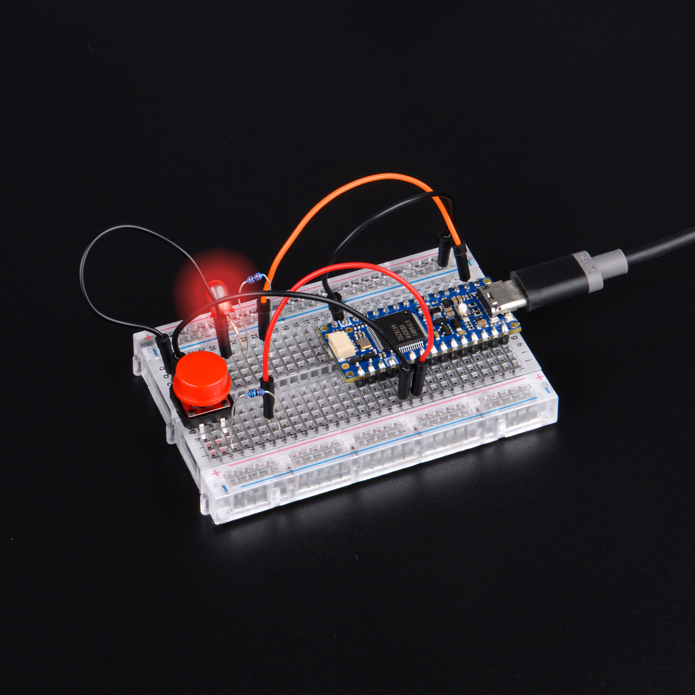

It will turn off once the button has been pressed. 

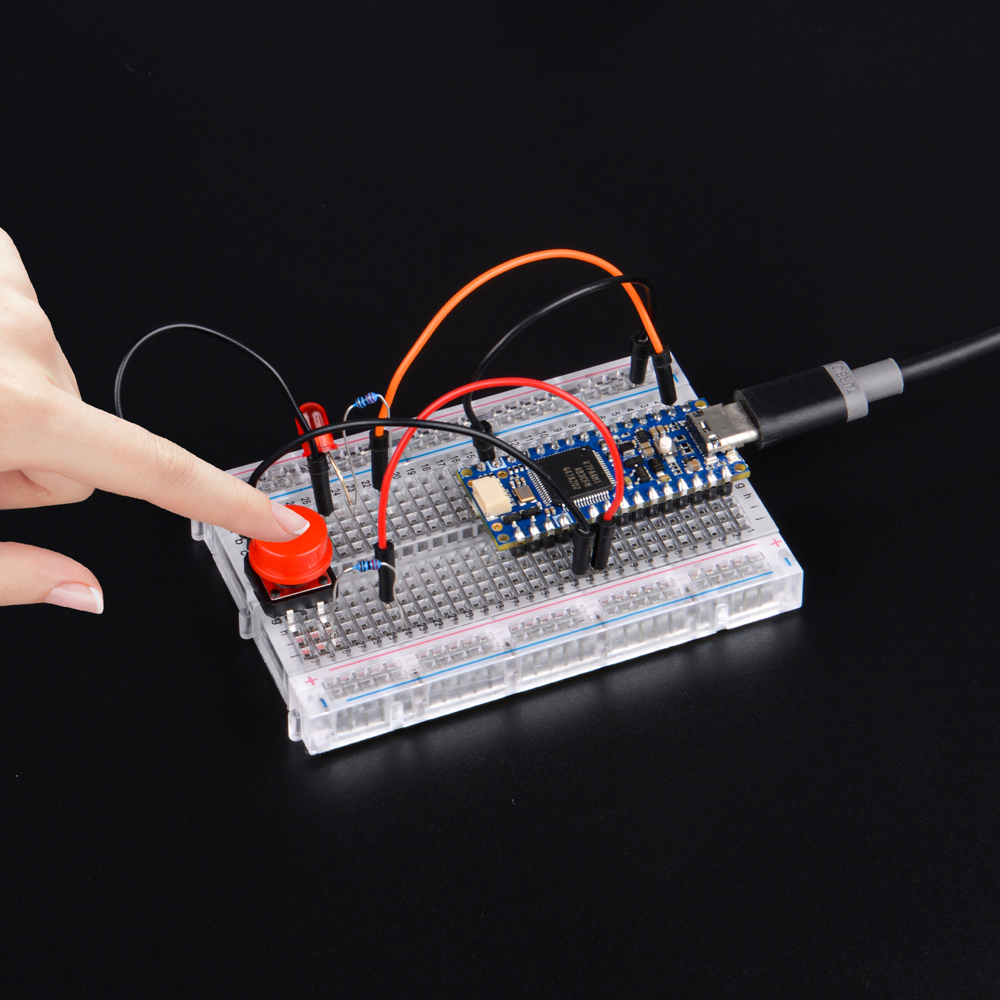

------

## Intermediate Projects

### Project 4: RGB Color Mixer

**What you'll learn**: PWM (Pulse Width Modulation) for brightness control

#### Components needed:

- Arduino Nano R4
- 1 RGB LED (3 separate LEDs: Red, Green, Blue)
- 3 × 220Ω resistors
- Jumper wires
- Breadboard

#### Circuit Setup:

1. Connect each color to a PWM pin (D3, D5, D6).
2. Use 220Ω resistors for each LED.

#### The Code:

```cpp
int redPin = 3;
int greenPin = 5;
int bluePin = 6;

void setup() {
    pinMode(redPin, OUTPUT);
    pinMode(greenPin, OUTPUT);
    pinMode(bluePin, OUTPUT);
}

void loop() {
    // Fade through colors
    for(int i = 0; i < 256; i++) {
        analogWrite(redPin, i);
        analogWrite(greenPin, 255-i);
        analogWrite(bluePin, 128);
        delay(10);
    }
}
```

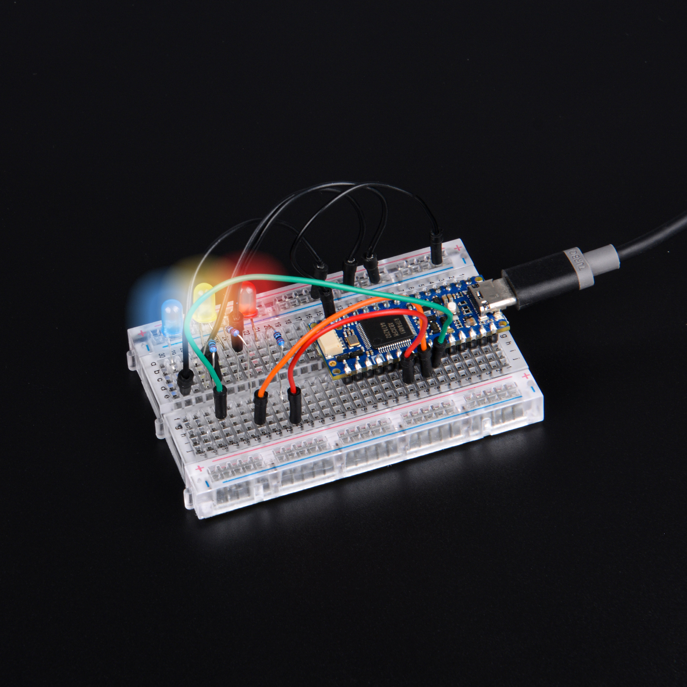


### Project 5: Transistor Switch

**What you'll learn**: Using transistors as electronic switches

#### Components needed:

- Arduino Nano R4
- 1 NPN transistor
- 1 LED
- 2 × 220Ω resistors
- Jumper wires
- Breadboard

#### Circuit Setup:

1. Connect Arduino pin 8 to transistor base through 220Ω resistor.

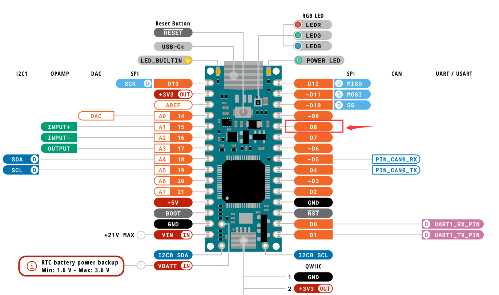

2. Connect LED **Short** leg to transistor collector.
3. Connect LED **Long** leg to 5V though 220Ω resistor.
4. Connect transistor emitter to GND.

**NOTE: The 2N5551 is a popular NPN Bipolar Junction Transistor (BJT) known for high-voltage applications, used as a general-purpose amplifier or switch in TO-92 package, handling up to 160V at 600mA with good current gain (hFE) and speed, making it suitable for audio, signal processing, and display drivers**

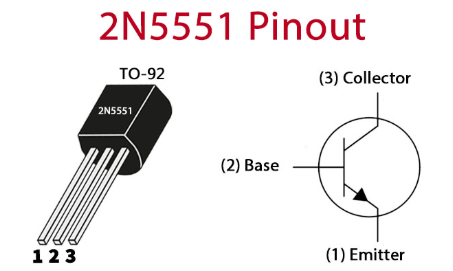

#### The Code:

```cpp
const int controlPin = 8;

void setup() {
    pinMode(controlPin, OUTPUT);
}

void loop() {
    digitalWrite(controlPin, HIGH); // Turn on transistor
    delay(1000);
    digitalWrite(controlPin, LOW); // Turn off transistor
    delay(1000);
}
```

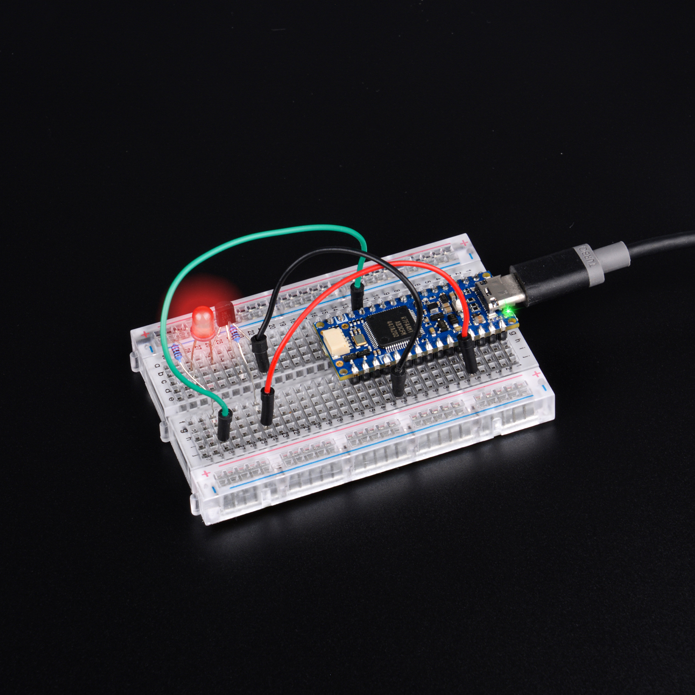

### Project 6: Button Counter

**What you'll learn**: Variables and counting

#### Components needed:

- Arduino Nano R4
- 1 button
- 1 LED
- 1 × 220Ω resistor
- Jumper wires
- Breadboard

#### The Code:

```cpp
const int buttonPin = 2;
const int ledPin = 13;
int buttonPushCounter = 0;
int buttonState = 0;
int lastButtonState = 0;

void setup() {
    pinMode(buttonPin, INPUT);
    pinMode(ledPin, OUTPUT);
    Serial.begin(9600);
}

void loop() {
    buttonState = digitalRead(buttonPin);
    if (buttonState != lastButtonState) {
        if (buttonState == HIGH) {
            buttonPushCounter++;
            Serial.print("Button pushes: ");
            Serial.println(buttonPushCounter);

            // Blink LED number of times equal to counter
            for(int i = 0; i < buttonPushCounter; i++) {
                digitalWrite(ledPin, HIGH);
                delay(200);
                digitalWrite(ledPin, LOW);
                delay(200);
            }
        }
        delay(50); // debounce delay
    }
    lastButtonState = buttonState;
}
```

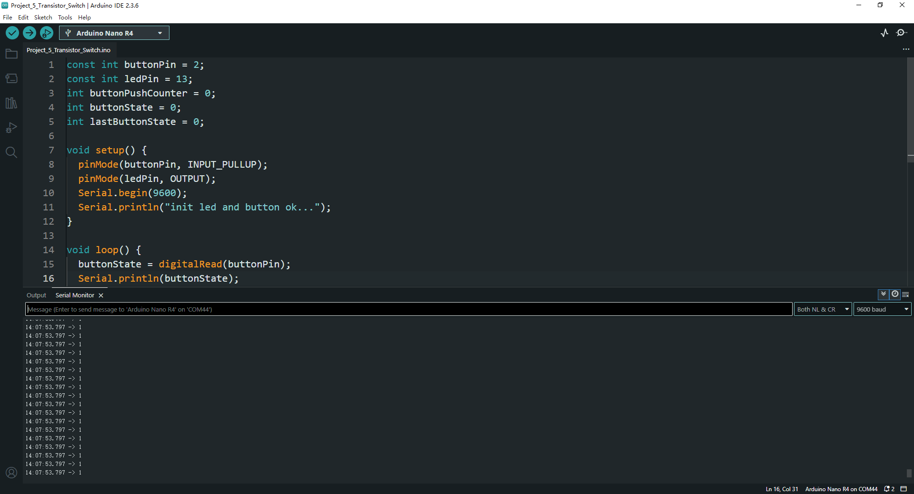

Once you press the button, you will see the status change in the serial monitor, such as the following figure:

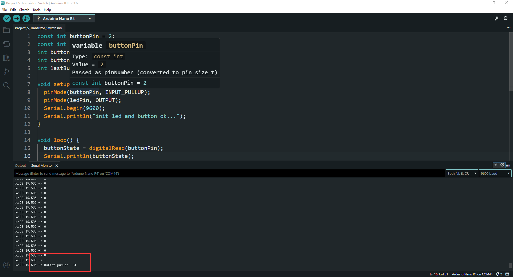

And then the LED will blink 13 times, and the button counter will reset.

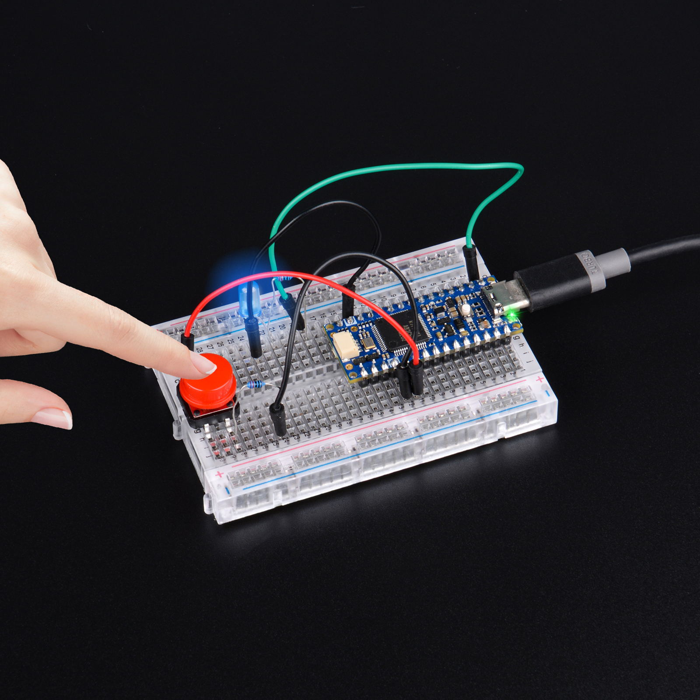

---

## Advanced Projects

### Project 7: Interactive LED Game

**What you'll learn**: Random numbers, timing, and game logic

#### Components needed:

- Arduino Nano R4
- 4 LEDs (different colors)
- 4 buttons
- 4 × 220Ω resistors
- Jumper wires
- Big Breadboard (additional purchase required)

#### The Code:

```cpp
int ledPins[] = {8, 9, 10, 11};
int buttonPins[] = {2, 3, 4, 5};
int sequence[10];
int playerSequence[10];
int sequenceLength = 3;
int currentStep = 0;
bool playingSequence = true;
unsigned long startTime;

void setup() {
    for(int i = 0; i < 4; i++) {
        pinMode(ledPins[i], OUTPUT);
        pinMode(buttonPins[i], INPUT);
    }
    randomSeed(analogRead(0)); // Use analog noise for random seed
    generateSequence();
}

void loop() {
    if(playingSequence) {
        playSequence();
        playingSequence = false;
        startTime = millis();
    } else {
        checkPlayerInput();
    }
}

void generateSequence() {
    for(int i = 0; i < sequenceLength; i++) {
        sequence[i] = random(4);
    }
}

void playSequence() {
    for(int i = 0; i < sequenceLength; i++) {
        digitalWrite(ledPins[sequence[i]], HIGH);
        delay(500);
        digitalWrite(ledPins[sequence[i]], LOW);
        delay(250);
    }
}

void checkPlayerInput() {
    for(int i = 0; i < 4; i++) {
        if(digitalRead(buttonPins[i]) == HIGH) {
            digitalWrite(ledPins[i], HIGH);
            delay(200);
            digitalWrite(ledPins[i], LOW);
            if(i == sequence[currentStep]) {
                currentStep++;
                if(currentStep >= sequenceLength) {
                    // Player won this round!
                    sequenceLength++;
                    currentStep = 0;
                    playingSequence = true;
                    delay(1000);
                }
            } else {
                // Game over - flash all LEDs
                for(int j = 0; j < 3; j++) {
                    for(int k = 0; k < 4; k++) {
                        digitalWrite(ledPins[k], HIGH);
                    }
                    delay(300);
                    for(int k = 0; k < 4; k++) {
                        digitalWrite(ledPins[k], LOW);
                    }
                    delay(300);
                }
                // Reset game
                sequenceLength = 3;
                currentStep = 0;
                playingSequence = true;
                delay(2000);
            }
        }
    }
}
```

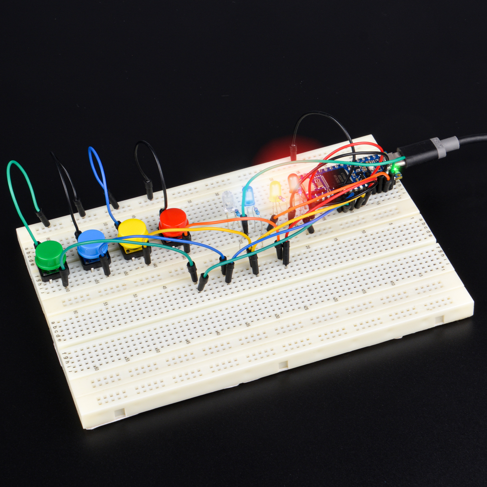

### Project 8: LED Patterns with Arrays

**What you'll learn**: Arrays and for loops

#### Components needed:

- Arduino Nano R4
- 8 LEDs
- 8 × 220Ω resistors
- Jumper wires
- Breadboard

#### The Code:

```cpp
int ledPins[] = {2, 3, 4, 5, 6, 7, 8, 9};
int numLeds = 8;

void setup() {
    for(int i = 0; i < numLeds; i++) {
        pinMode(ledPins[i], OUTPUT);
    }
}

void loop() {
    // Knight Rider effect
    for(int i = 0; i < numLeds; i++) {
        digitalWrite(ledPins[i], HIGH);
        delay(100);
        digitalWrite(ledPins[i], LOW);
    }
    for(int i = numLeds - 2; i > 0; i--) {
        digitalWrite(ledPins[i], HIGH);
        delay(100);
        digitalWrite(ledPins[i], LOW);
    }

    // Random twinkle
    for(int i = 0; i < 20; i++) {
        int randomLed = random(numLeds);
        digitalWrite(ledPins[randomLed], HIGH);
        delay(50);
        digitalWrite(ledPins[randomLed], LOW);
    }
}
```

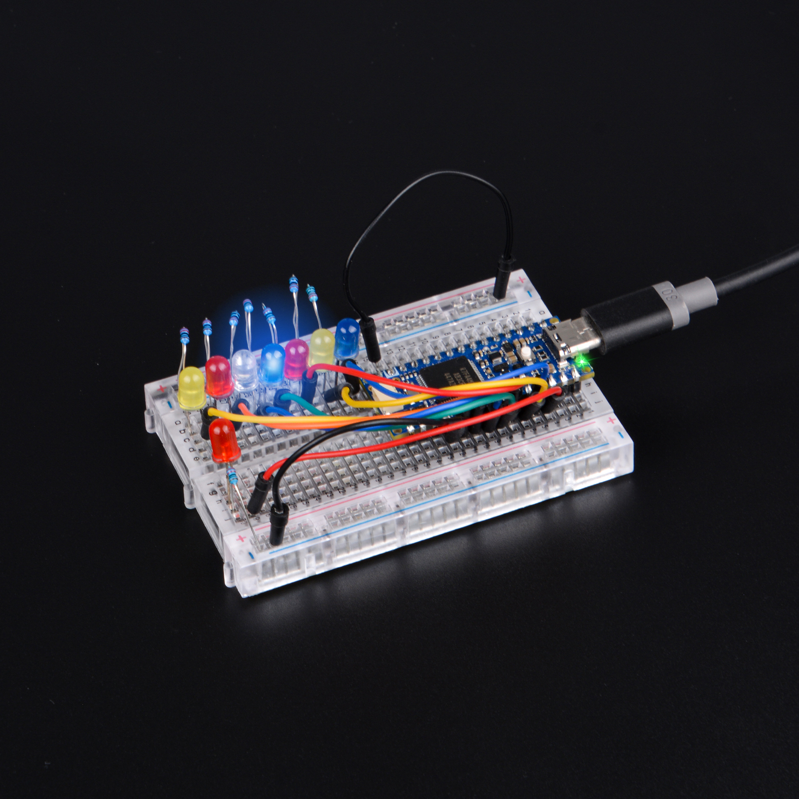

### Project 9: Button Combinations

**What you'll learn**: Logic operations and combinations

#### Components needed:

- Arduino Nano R4
- 3 buttons
- 1 RGB LED
- 3 × 220Ω resistors
- Jumper wires
- Breadboard

#### The Code:

```cpp
const int button1 = 2;
const int button2 = 3;
const int button3 = 4;
const int redPin = 5;
const int greenPin = 6;
const int bluePin = 7;

void setup() {
    pinMode(button1, INPUT_PULLUP);
    pinMode(button2, INPUT_PULLUP);
    pinMode(button3, INPUT_PULLUP);
    pinMode(redPin, OUTPUT);
    pinMode(greenPin, OUTPUT);
    pinMode(bluePin, OUTPUT);
}

void loop() {
    bool b1 = digitalRead(button1);
    bool b2 = digitalRead(button2);
    bool b3 = digitalRead(button3);

    // Reset all LEDs
    digitalWrite(redPin, LOW);
    digitalWrite(greenPin, LOW);
    digitalWrite(bluePin, LOW);

    // Check combinations
    if(b1 && b2 && b3) {
        // All buttons pressed = white
        digitalWrite(redPin, HIGH);
        digitalWrite(greenPin, HIGH);
        digitalWrite(bluePin, HIGH);
    } else if(b1 && b2) {
        // Buttons 1&2 = yellow
        digitalWrite(redPin, HIGH);
        digitalWrite(greenPin, HIGH);
    } else if(b1 && b3) {
        // Buttons 1&3 = magenta
        digitalWrite(redPin, HIGH);
        digitalWrite(bluePin, HIGH);
    } else if(b2 && b3) {
        // Buttons 2&3 = cyan
        digitalWrite(greenPin, HIGH);
        digitalWrite(bluePin, HIGH);
    } else if(b1) {
        // Button 1 = red
        digitalWrite(redPin, HIGH);
    } else if(b2) {
        // Button 2 = green
        digitalWrite(greenPin, HIGH);
    } else if(b3) {
        // Button 3 = blue
        digitalWrite(bluePin, HIGH);
    }
    delay(50); // Small delay for stability
}
```

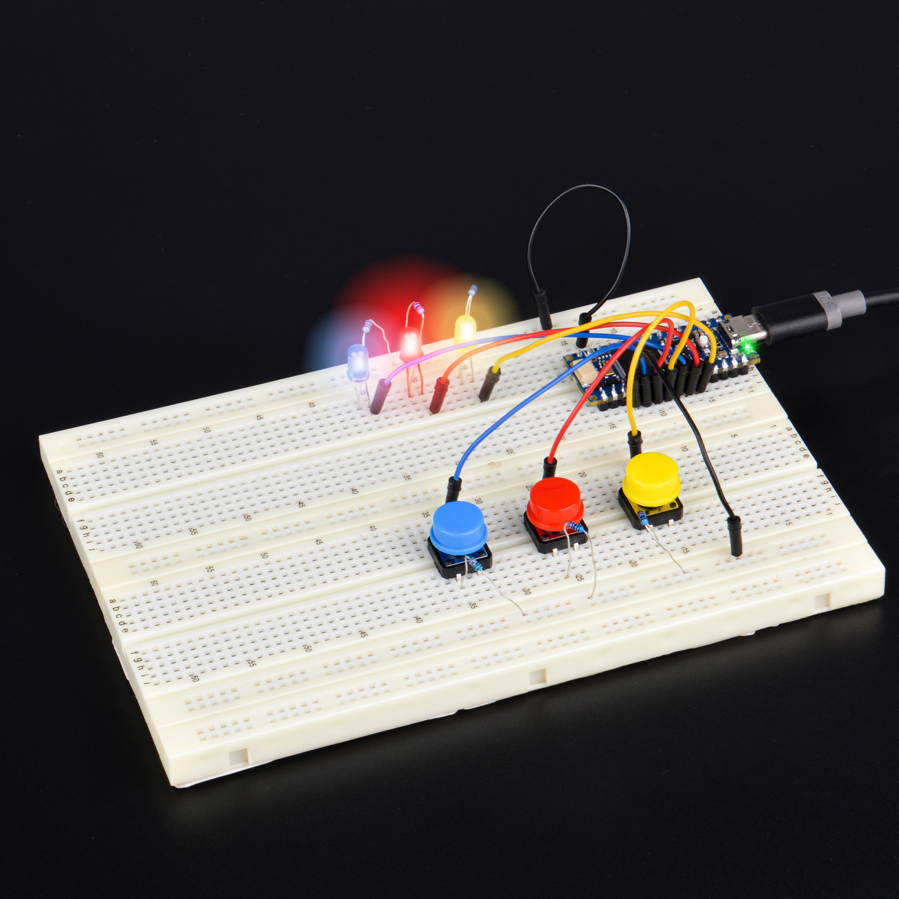

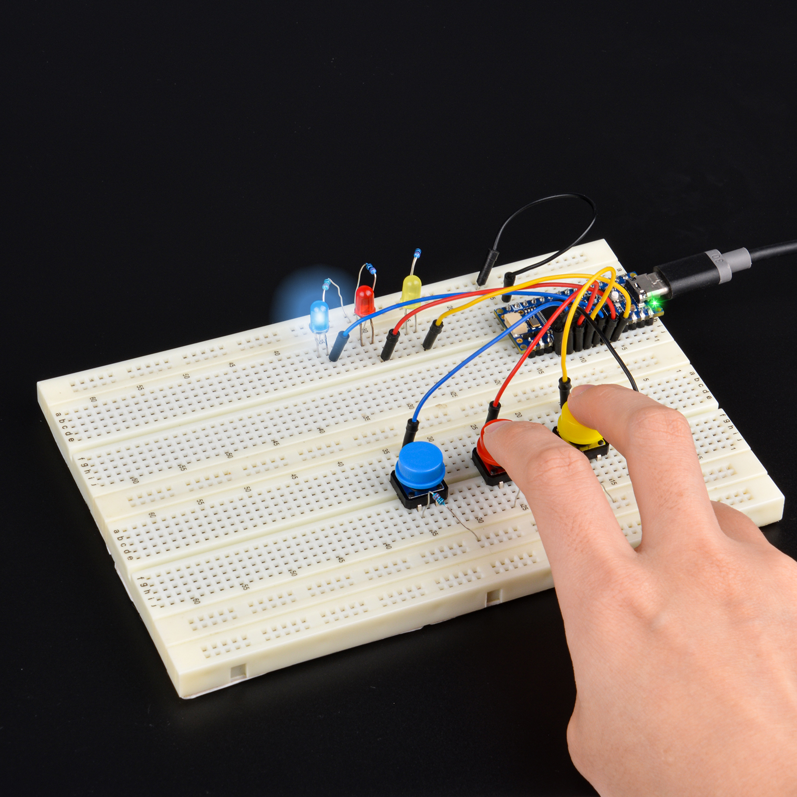

---

## Download Music Demo Sketches 

* [Projects Demo Sketches](./imgs/Arduino_NANO_R4_Starter_kit.zip)
* [Music Demo Sketches](./imgs/Music_demo_sketches.zip)

## Understanding Electronics Basics

### Ohm's Law

Voltage (V) = Current (I) × Resistance (R)

This explains why we use 220Ω resistors with LEDs:

- Arduino output: 5V
- LED forward voltage: ~2V
- Desired current: ~15mA
- Resistor needed: (5V - 2V) / 0.015A = 200Ω

### Digital vs Analog

- **Digital**: On/Off (HIGH/LOW, 1/0)
- **Analog**: Variable values (0-255 with PWM, 0-1023 with analog inputs)

### Pull-up and Pull-down Resistors

- **Pull-down**: Connects pin to ground when button is not pressed.
- **Pull-up**: Connects pin to 5V when button is not pressed (Arduino has internal pull-ups).

---

## Troubleshooting Guide

### Common Issues and Solutions

**Problem**: LED doesn't light up

- **Check**: LED orientation (longer leg = positive).
- **Check**: Resistor value (should be 220Ω).
- **Check**: Wiring connections.
- **Check**: Pin number in code matches physical connection.

**Problem**: Button doesn't work

- **Check**: Button orientation (try rotating 90°).
- **Check**: Pull-down resistor connection.
- **Check**: Code logic (HIGH when pressed vs LOW).

**Problem**: Code won't upload

- **Check**: Correct board selected (UNO R4 Minima).
- **Check**: Correct port selected.
- **Check**: USB-C cable is data cable (not charge-only).
- **Check**: Drivers installed (Windows).

**Problem**: Transistor circuit not working

- **Check**: Transistor orientation (flat side usually indicates pins).
- **Check**: Correct pin connections (Collector, Base, Emitter).
- **Check**: Resistor between Arduino and base.

---

## Using the Resistor Color Code Card

Your kit includes a resistor color code card. Here's how to read it:

- **Band 1**: First digit
- **Band 2**: Second digit
- **Band 3**: Multiplier
- **Band 4**: Tolerance

Example: Red-Red-Brown-Gold = 22 × 10 = 220Ω ±5%

---

## Next Steps

Congratulations! You've completed the basic projects. Here are some ideas for what to try next:

1. **Combine Projects**: Mix LEDs, buttons, and transistors.
2. **Add Sensors**: Temperature, light, or motion sensors.
3. **Learn More**: Study Arduino programming concepts.
4. **Join Community**: Visit Arduino forums and share projects.
5. **Build Something Useful**: Create a project that solves a real problem.

---

## Additional Resources

- [Arduino Official Website](https://www.arduino.cc/)
- [Arduino Reference](https://www.arduino.cc/reference/en/)
- [Project Hub](https://create.arduino.cc/projecthub)

---

## Full Pinout


The Arduino UNO R4 Boards core provides support for the following:

- Board control and configuration (reset, pin configuration and power management)
- Advanced peripheral functions (12-bit DAC, ADC, CAN bus and OpAmp)
- Communication interfaces (UART, I²C and SPI)
- Onboard LED control (RGB LED and orange LED)
- Real-time clock (RTC) functionality
- HID emulation capabilities (keyboard and mouse)
- Standard Arduino libraries compatibility

There are plenty of experiments that can be done using Arduino Nano R4.

Remember: The best way to learn is by doing. Don't be afraid to experiment, make mistakes, and try new things. Every expert was once a beginner!

Happy Making!
