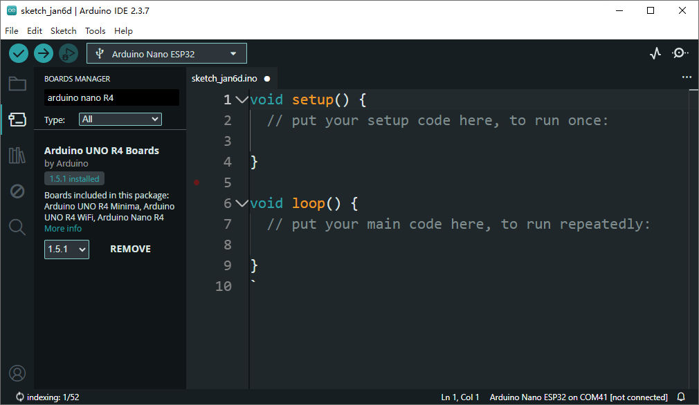
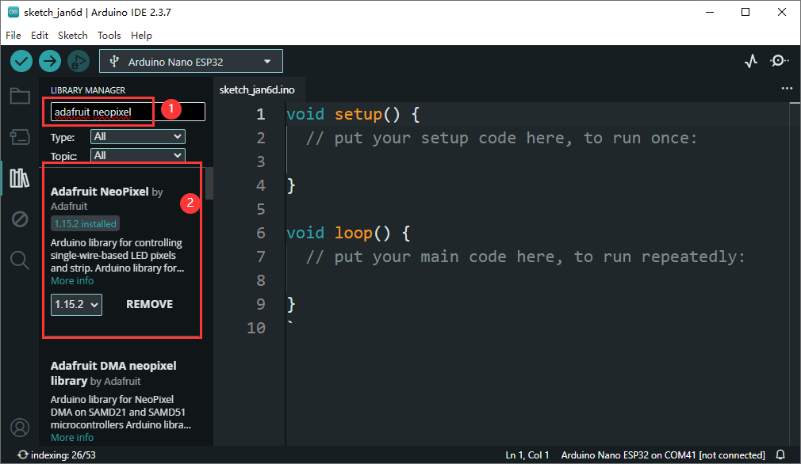
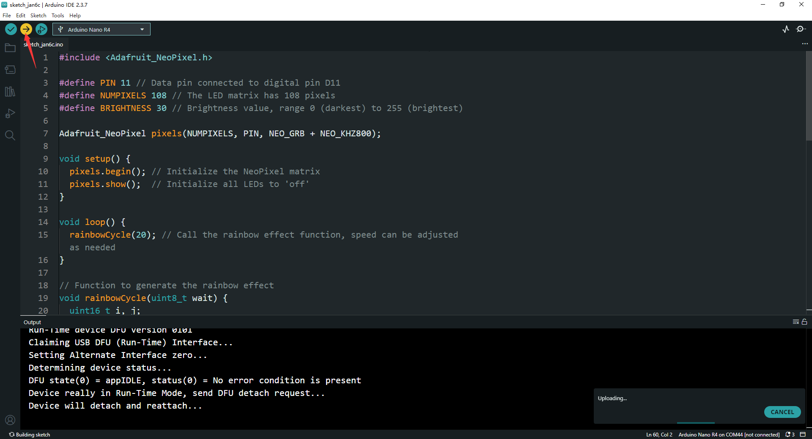
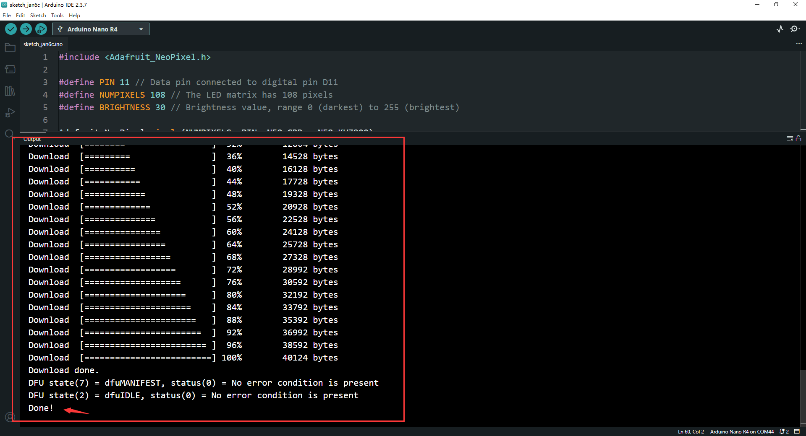

# RGB LED Matrix Nano R4 Kit 

## Description
The **RGB LED Matrix Nano R4 Kit** is a versatile and visually stunning development kit designed for makers, hobbyists, and developers. This kit combines the powerful Arduino Nano R4 development board with a high-quality RGB LED matrix, featuring 108 individually addressable RGB LEDs. It is perfect for creating dynamic lighting effects, interactive displays, and various creative projects.

## Features

- **108 RGB LEDs**: The matrix consists of 108 RGB LEDs, arranged in a layout that allows for flexible and dynamic lighting effects.
- **2020 LED Specification**: Each LED is of the 2020 specification, ensuring high brightness and color accuracy.
- **Input Signal Pin**: The matrix is controlled via the D11 pin on the Arduino Nano R4, making it easy to integrate and control.
- **Arduino Nano R4 Compatibility**: The kit is specifically designed to work seamlessly with the Arduino Nano R4 development board.

## Basic Setup

### Hardware Requirements

- Arduino Nano R4 development board
- RGB LED Matrix (108 LEDs)
- USB cable for power and programming

### Wiring

> You don't have to wiring anything, just plug the Arduino Nano R4 board to the
> RGB LED matrix on GPIO pin header will be ok. 

* Default wiring:
1. Connect the **VCC** pin of the RGB LED Matrix to the **5V** pin on the Arduino Nano R4.
2. Connect the **GND** pin of the RGB LED Matrix to the **GND** pin on the Arduino Nano R4.
3. Connect the **DIN** pin of the RGB LED Matrix to the **D11** pin on the Arduino Nano R4.

### Power Supply

- Ensure that the Arduino Nano R4 is powered via the USB cable or an external power supply.

- If using an external power supply, connect the power supply to the **Vin** and **GND** pins on the Arduino Nano R4.

## Installing the Adafruit NeoPixel Library

### Using the Arduino IDE Library Manager

1. Open the Arduino IDE.

Go to **Board manager** and adding **Arduino NANO R4** 



2. Go to **Sketch** > **Include Library** > **Manage Libraries...**

3. In the Library Manager, search for "Adafruit NeoPixel".

4. Select the "Adafruit NeoPixel" library by Adafruit and click **Install**.



### Manual Installation

1. Download the Adafruit NeoPixel library from the [Adafruit GitHub repository](https://github.com/adafruit/Adafruit_NeoPixel).

2. Extract the downloaded ZIP file.

3. Rename the extracted folder to "Adafruit_NeoPixel".

4. Move the "Adafruit_NeoPixel" folder to the "libraries" folder in your Arduino sketchbook directory (usually located in `Documents/Arduino/libraries` on Windows or `~/Documents/Arduino/libraries` on macOS/Linux).

## Basic Code Example

### Demo 1 Rainbow Flow 

```cpp
#include <Adafruit_NeoPixel.h>

#define PIN 11 // Data pin connected to digital pin D11
#define NUMPIXELS 108 // The LED matrix has 108 pixels
#define BRIGHTNESS 30 // Brightness value, range 0 (darkest) to 255 (brightest)

Adafruit_NeoPixel pixels(NUMPIXELS, PIN, NEO_GRB + NEO_KHZ800);

void setup() {
  pixels.begin(); // Initialize the NeoPixel matrix
  pixels.show();  // Initialize all LEDs to 'off'
}

void loop() {
  rainbowCycle(20); // Call the rainbow effect function, speed can be adjusted as needed
}

// Function to generate the rainbow effect
void rainbowCycle(uint8_t wait) {
  uint16_t i, j;

  for (j = 0; j < 256; j++) { // 256 steps of rainbow gradient
    for (i = 0; i < pixels.numPixels(); i++) {
      uint32_t color = Wheel((i * 256 / pixels.numPixels() + j) & 255);
      pixels.setPixelColor(i, dimColor(color, BRIGHTNESS));
    }
    pixels.show();
    delay(wait);
  }
}

// Function to generate rainbow colors
uint32_t Wheel(byte WheelPos) {
  WheelPos = 255 - WheelPos; // Reverse the color order
  if (WheelPos < 85) {
    // Red to Yellow
    return pixels.Color(WheelPos * 3, 255 - WheelPos * 3, 0);
  }
  if (WheelPos < 170) {
    // Yellow to Green
    WheelPos -= 85;
    return pixels.Color(255 - WheelPos * 3, 0, WheelPos * 3);
  }
  // Green to Blue
  WheelPos -= 170;
  return pixels.Color(0, WheelPos * 3, 255 - WheelPos * 3);
}

// Function to reduce color brightness
uint32_t dimColor(uint32_t color, uint8_t brightness) {
  uint8_t r = (color >> 16) & 0xFF;
  uint8_t g = (color >> 8) & 0xFF;
  uint8_t b = color & 0xFF;

  r = r * brightness / 255;
  g = g * brightness / 255;
  b = b * brightness / 255;

  return pixels.Color(r, g, b);
}
```

### Code Explanation

#### Include the Library

```cpp
#include <Adafruit_NeoPixel.h>
```

- This line includes the Adafruit NeoPixel library, which provides functions to control WS2812 LED matrices.

#### Define Constants

```cpp
#define PIN 11 // Data pin connected to digital pin D11
#define NUMPIXELS 108 // The LED matrix has 108 pixels
#define BRIGHTNESS 30 // Brightness value, range 0 (darkest) to 255 (brightest)
```

- `PIN`: Specifies the digital pin on the Arduino Nano R4 connected to the data input of the LED matrix.

- `NUMPIXELS`: Defines the total number of LEDs in the matrix.

- `BRIGHTNESS`: Sets the overall brightness of the LEDs. Lower values make the LEDs dimmer, while higher values make them brighter.

#### Initialize NeoPixel Matrix

```cpp
Adafruit_NeoPixel pixels(NUMPIXELS, PIN, NEO_GRB + NEO_KHZ800);
```

- This line initializes the NeoPixel matrix with the specified number of pixels, data pin, and color order (NEO_GRB) and signal frequency (NEO_KHZ800).

#### Setup Function

```cpp
void setup() {
  pixels.begin(); // Initialize the NeoPixel matrix
  pixels.show();  // Initialize all LEDs to 'off'
}
```

- `pixels.begin()`: Initializes the NeoPixel matrix.

- `pixels.show()`: Sets all LEDs to 'off' initially.

#### Loop Function

```cpp
void loop() {
  rainbowCycle(20); // Call the rainbow effect function, speed can be adjusted as needed
}
```

- This function continuously runs the `rainbowCycle` function, which generates a rainbow effect on the LED matrix. The delay value (20 milliseconds) controls the speed of the animation.

#### Rainbow Cycle Function

```cpp
void rainbowCycle(uint8_t wait) {
  uint16_t i, j;

  for (j = 0; j < 256; j++) { // 256 steps of rainbow gradient
    for (i = 0; i < pixels.numPixels(); i++) {
      uint32_t color = Wheel((i * 256 / pixels.numPixels() + j) & 255);
      pixels.setPixelColor(i, dimColor(color, BRIGHTNESS));
    }
    pixels.show();
    delay(wait);
  }
}
```

- This function generates a rainbow effect by cycling through 256 steps of color gradients.

- `Wheel` function generates the color for each pixel based on its position and the current step.

- `dimColor` function adjusts the brightness of the generated color.

- `pixels.setPixelColor` sets the color of each pixel.

- `pixels.show` updates the LED matrix to display the new colors.

#### Wheel Function

```cpp
uint32_t Wheel(byte WheelPos) {
  WheelPos = 255 - WheelPos; // Reverse the color order
  if (WheelPos < 85) {
    // Red to Yellow
    return pixels.Color(WheelPos * 3, 255 - WheelPos * 3, 0);
  }
  if (WheelPos < 170) {
    // Yellow to Green
    WheelPos -= 85;
    return pixels.Color(255 - WheelPos * 3, 0, WheelPos * 3);
  }
  // Green to Blue
  WheelPos -= 170;
  return pixels.Color(0, WheelPos * 3, 255 - WheelPos * 3);
}
```

- This function generates colors in the order of a rainbow (red to yellow, yellow to green, green to blue).

- It calculates the RGB values based on the input position (`WheelPos`).

#### Dim Color Function

```cpp
uint32_t dimColor(uint32_t color, uint8_t brightness) {
  uint8_t r = (color >> 16) & 0xFF;
  uint8_t g = (color >> 8) & 0xFF;
  uint8_t b = color & 0xFF;

  r = r * brightness / 255;
  g = g * brightness / 255;
  b = b * brightness / 255;

  return pixels.Color(r, g, b);
}
```

- This function reduces the brightness of a given color by scaling its RGB components according to the specified brightness value.

This code provides a basic example of how to control an RGB LED matrix using the Arduino Nano R4 and the Adafruit NeoPixel library. You can modify the `BRIGHTNESS` value and the `rainbowCycle` function to customize the effect to your liking.

### Compile and upload sketch to board 

* Connect `Arduino NANO R4` to your PC or laptop by using a `USB-C programming cable`. 

* Click `upload` icon on menu to compile and upload sketch to `Arduino Nano R4`





After a while, you will see: 


### Demo 2 RGB Round Robin 

```cpp
#include <Adafruit_NeoPixel.h>

#define PIN 11 // Data pin connected to digital pin D11
#define NUMPIXELS 108  // The LED matrix has 108 pixels
#define BRIGHTNESS 50 // Brightness value, range 0 (darkest) to 255 (brightest)

Adafruit_NeoPixel pixels(NUMPIXELS, PIN, NEO_GRB + NEO_KHZ800);

void setup() {
  pixels.begin(); // Initialize the NeoPixel matrix
  pixels.setBrightness(BRIGHTNESS); // Set the brightness level
  pixels.show();  // Turn off all LEDs initially
}

void loop() {
  // Set each pixel to red
  for (int i = 0; i < NUMPIXELS; i++) {
    pixels.setPixelColor(i, pixels.Color(255, 0, 0)); // Set color to red
  }
  pixels.show(); // Update the matrix to display the color
  delay(1000); // Wait for 1 second

  // Set each pixel to green
  for (int i = 0; i < NUMPIXELS; i++) {
    pixels.setPixelColor(i, pixels.Color(0, 255, 0)); // Set color to green
  }
  pixels.show();
  delay(1000);

  // Set each pixel to blue
  for (int i = 0; i < NUMPIXELS; i++) {
    pixels.setPixelColor(i, pixels.Color(0, 0, 255)); // Set color to blue
  }
  pixels.show();
  delay(1000);
}
```

### Code Explanation

#### Include the Library

```cpp
#include <Adafruit_NeoPixel.h>
```

- This line includes the Adafruit NeoPixel library, which provides functions to control WS2812 LED matrices.

#### Define Constants

```cpp
#define PIN 11 // Data pin connected to digital pin D11
#define NUMPIXELS 108 // The LED matrix has 108 pixels
#define BRIGHTNESS 50 // Brightness value, range 0 (darkest) to 255 (brightest)
```

- `PIN`: Specifies the digital pin on the Arduino board connected to the data input of the LED matrix.

- `NUMPIXELS`: Defines the total number of LEDs in the matrix.

- `BRIGHTNESS`: Sets the overall brightness of the LEDs. 
                Lower values make the LEDs dimmer, while higher values make them brighter.

#### Initialize NeoPixel Matrix
                j
```cpp
Adafruit_NeoPixel pixels(NUMPIXELS, PIN, NEO_GRB + NEO_KHZ800);
```

- This line initializes the NeoPixel matrix with the specified number of pixels, data pin, and color order (NEO_GRB) and signal frequency (NEO_KHZ800).

#### Setup Function

```cpp
void setup() {
  pixels.begin(); // Initialize the NeoPixel matrix
  pixels.setBrightness(BRIGHTNESS); // Set the brightness level
  pixels.show();  // Turn off all LEDs initially
}
```

- `pixels.begin()`: Initializes the NeoPixel matrix.

- `pixels.show()`: Sets all LEDs to 'off' initially.

- `pixels.setBrightness(BRIGHTNESS)`:  Set the brightness level

#### Loop Function

```cpp
void loop() {
  // Set each pixel to red
  for (int i = 0; i < NUMPIXELS; i++) {
    pixels.setPixelColor(i, pixels.Color(255, 0, 0)); // Set color to red
  }
  pixels.show(); // Update the matrix to display the color
  delay(1000); // Wait for 1 second

  // Set each pixel to green
  for (int i = 0; i < NUMPIXELS; i++) {
    pixels.setPixelColor(i, pixels.Color(0, 255, 0)); // Set color to green
  }
  pixels.show();
  delay(1000);

  // Set each pixel to blue
  for (int i = 0; i < NUMPIXELS; i++) {
    pixels.setPixelColor(i, pixels.Color(0, 0, 255)); // Set color to blue
  }
  pixels.show();
  delay(1000);
}
```

- This function continuously cycles through three colors: red, green, and blue.

- **Red**: Sets all pixels to red using `pixels.Color(255, 0, 0)`.

- **Green**: Sets all pixels to green using `pixels.Color(0, 255, 0)`.

- **Blue**: Sets all pixels to blue using `pixels.Color(0, 0, 255)`.

- `pixels.show()`: Updates the LED matrix to display the current color.

- `delay(1000)`: Pauses for 1 second before changing to the next color.

### How It Works

1. **Initialization**: When the Arduino starts, the `setup()` function initializes the NeoPixel matrix and turns off all LEDs.

2. **Color Cycle**: The `loop()` function cycles through three colors:

   - **Red**: All LEDs are set to red.

   - **Green**: All LEDs are set to green.

   - **Blue**: All LEDs are set to blue.

3. **Display Update**: After setting the color for each pixel, `pixels.show()` updates the matrix to display the new color.

4. **Delay**: The `delay(1000)` function pauses for 1 second between color changes, creating a visible transition.

This code provides a simple demonstration of how to control an RGB LED matrix using the Adafruit NeoPixel library. You can modify the colors and delay times to create different effects.

## Compile and upload the Sketch

* Demo video:


### Demo Sketch Download 

* [Arduino_NANO_R4_Rainbow_Demo_1](./imgs/Arduino_NANO_R4_Rainbow_Demo1.zip)

* [Arduino_NANO_R4_RGBRoundRobin](./imgs/Arduino_NANO_R4_RGBRoundRobin.zip)

## Conclusion

The **RGB LED Matrix Nano R4 Kit** provides a powerful and flexible platform for creating dynamic and visually appealing projects. 
With the Arduino Nano R4 and the Adafruit NeoPixel library, you can easily control the RGB LED matrix and create a wide range of lighting effects. 
This kit is ideal for both beginners and experienced developers looking to add vibrant and interactive lighting to their projects.
