# Arduino UNO Q 5V GPIO Kit

**SKU: KZ-0092**

---

## Table of Contents

1. [Product Overview](#1-product-overview)
2. [Safety Instructions](#2-safety-instructions)
3. [Kit Contents](#3-kit-contents)
4. [Hardware Introduction](#4-hardware-introduction)
5. [Installation Instructions](#5-installation-instructions)
6. [Software Preparation](#6-software-preparation)
7. [Basic Experiments](#7-basic-experiments)
8. [Comprehensive Project](#8-comprehensive-project)
9. [Troubleshooting](#9-troubleshooting)
10. [Appendix](#10-appendix)
11. [Download DemoCodes Zip files](#11-download)

---

## 1. Product Overview

The Arduino UNO Q 5V GPIO Kit is a comprehensive learning and prototyping package designed to bridge the gap between the Arduino UNO Q's 3.3V GPIO logic and the vast ecosystem of 5V-compatible sensors, displays, and actuators.

### 1.1 Why This Kit?

The Arduino UNO Q uses an **STM32U585 Cortex-M33** microcontroller with **3.3V GPIO** logic levels. While some digital pins are 5V-tolerant in digital mode, the analog inputs (A0–A5) and I2C pins in analog mode **must never exceed 3.6V** — voltages above VDD + 0.3V will permanently damage the chip.

Most traditional Arduino sensors, displays, and actuators on the market are designed for **5V logic levels**. Direct connection without proper level translation results in:

- **Communication failure**: 3.3V HIGH may not be recognized as logic "1" by 5V devices
- **Device damage**: 5V signals back-feed into 3.3V pins, burning the MCU
- **Analog reading distortion**: 5V sensor outputs exceed the 3.3V ADC range

The **52Pi EP-0257 Level-Shift Shield** uses the **TI TXS0108EPWR** auto-direction-sensing bidirectional level translator to safely convert all digital and analog pins to 5V-compatible levels, while preserving the onboard LED matrix visibility window.

> 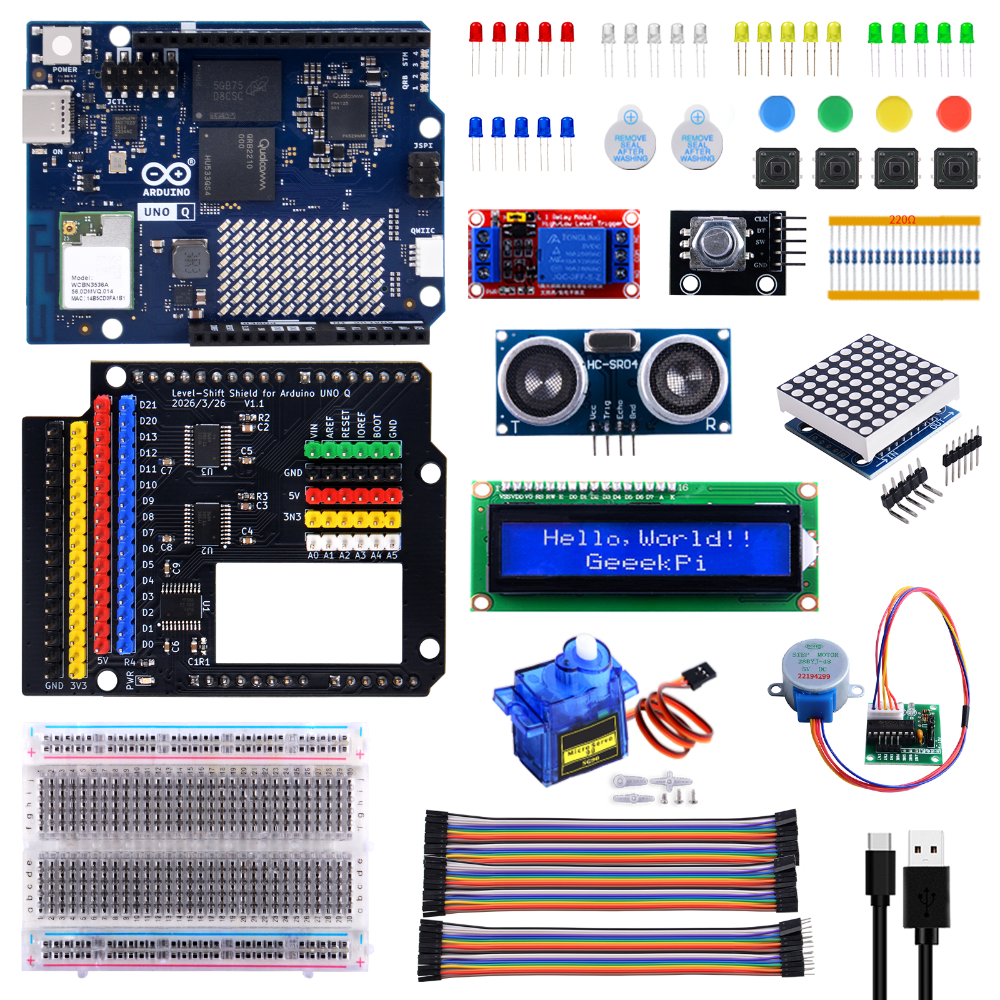
> *Figure 1-1: Complete kit contents overview*

> 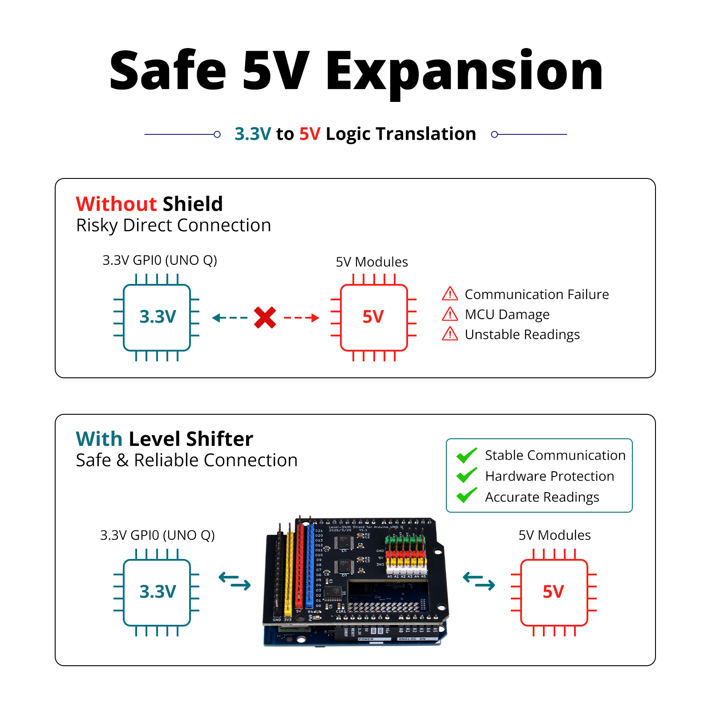
> *Figure 1-2: Safe 5V expansion with level-shifting shield*

> 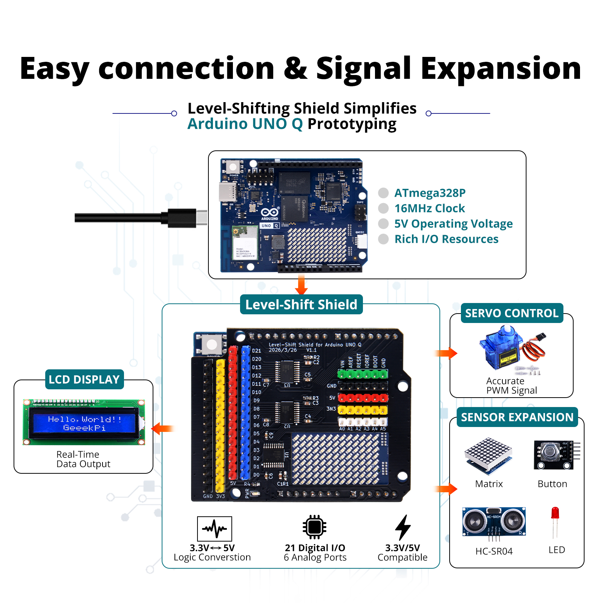
> *Figure 1-3: Easy connection and signal expansion diagram*

---

## 2. Safety Instructions

⚠️ **Read these safety instructions carefully before using this kit.**

### 2.1 General Safety Warnings

1. **Power Off Before Wiring**: Always disconnect USB or external power before connecting or disconnecting any components. Hot-swapping Dupont lines may cause voltage surges that damage sensitive components.

2. **Green Pin Warning**: The green pins on the EP-0257 shield (VIN, AREF, IOREF, RESET, BOOT) are **pass-through pins** directly connected to the UNO Q internal circuitry. **Never connect 5V signals to these pins** — doing so will permanently damage the mainboard.

3. **Voltage Limits**: When using A0–A5 as analog inputs, input voltage must never exceed 3.3V. A voltage divider (e.g., 10kΩ + 20kΩ) is required when interfacing with 5V analog sensors.

4. **High Voltage Prohibition**: The relay module in this kit is intended for low-voltage loads only (<< 30V DC). Controlling mains voltage (220V AC) requires professional knowledge and insulation protection — **beginners are strictly prohibited from attempting this.**

5. **Current Budget**: The UNO Q USB power total is ~500mA, and the 3.3V regulator output is ~150mA. High-power devices (servo, relay, motor) **must use external power** with a common ground connection.

6. **Servo Power Requirement**: The SG90 servo **must** be powered by an external 5V supply. The UNO Q should only provide the PWM signal and share a common ground.

### 2.2 Safe Operating Practices

| Practice | Description |
|----------|-------------|
| Power sequencing | Always connect ground first, then power, then signal lines |
| Common ground | External power supply and UNO Q must share GND |
| ESD protection | Touch grounded metal before handling components |
| Visual inspection | Check for bent pins or short circuits before powering on |

---

## 3. Kit Contents

### 3.1 Component List

| No. | Component | Qty | Description |
|-----|-----------|-----|-------------|
| 1 | Arduino UNO Q Official Board | 1 | 3.3V GPIO, STM32U585 Cortex-M33 @ 160MHz |
| 2 | 52Pi EP-0257 Level-Shift Shield | 1 | TXS0108EPWR bidirectional level translation |
| 3 | USB-C 5V Programming Cable | 1 | Power + Data |
| 4 | LCD1602 I2C 5V Display Module | 1 | I2C interface, blue backlight |
| 5 | MAX7219 8×8 LED Matrix Module | 1 | SPI interface, cascade support |
| 6 | HC-SR04 Ultrasonic Module | 1 | 5V powered, 2cm–400cm range |
| 7 | 5V Active Buzzer Module | 1 | Low-level trigger |
| 8 | 1-Channel 5V Relay Module | 1 | Optocoupler isolation, HIGH/LOW selectable |
| 9 | Push Button Module | 2 | With pull-down resistor, HIGH when pressed |
| 10 | Rotary Encoder Module | 1 | Incremental, with push button |
| 11 | Stepper Motor + ULN2003 Driver | 1 | 5V 4-phase 5-wire |
| 12 | SG90 9g Servo | 1 | 5V powered, 180° range |
| 13 | Breadboard | 1 | 400 tie-points |
| 14 | Dupont Lines (M-F / F-F) | 40 pcs | Multiple colors |
| 15 | Quick Reference Card | 1 | Resistor code sheet |

> 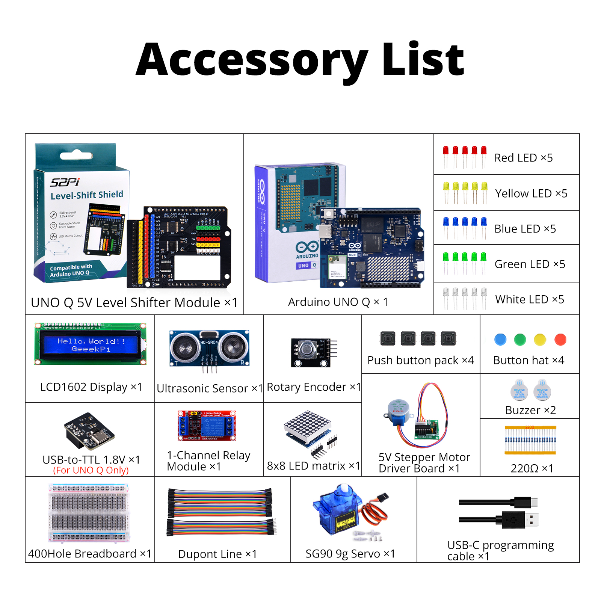
> *Figure 3-1: Complete accessory list with all components*

### 3.2 Additional Components 

Based on the product images, the kit also includes:

* Red LED × 5
* Yellow LED × 5
* Blue LED × 5
* Green LED × 5
* White LED × 5
* Button hat × 4
* Buzzer × 2
* 220Ω Resistor pack × 1

---

## 4. Hardware Introduction

### 4.1 Arduino UNO Q Board

The Arduino UNO Q features:

* **MCU**: STM32U585 Cortex-M33 @ 160MHz

* **Operating Voltage**: 5V (via USB-C or DC jack)

* **GPIO Logic**: 3.3V (5V-tolerant on digital pins only)

* **I/O**: 21 Digital I/O, 6 Analog Inputs (A0–A5)

* **Communication**: I2C (A4/A5), SPI (D10–D13), UART (D0/D1)

* **Onboard Features**: LED matrix, USB-C programming port

> 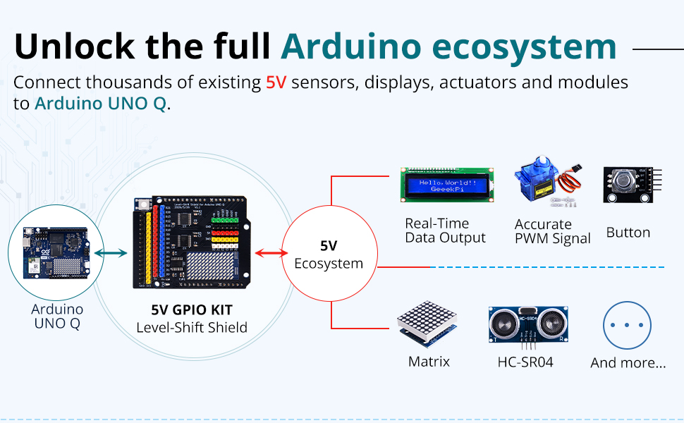
> *Figure 4-1: Arduino UNO Q with key features highlighted*

### 4.2 EP-0257 Level-Shift Shield

The 52Pi EP-0257 shield is the core component enabling safe 5V expansion:

| Color | Type | Description | 5V Shifted |
|-------|------|-------------|------------|
| 🔵 Blue | Digital I/O | D0–D13, D20–D21, level-shifted | ✅ Yes |
| ⚪ White | Analog/Digital | A0–A5, digital or analog use, shifted | ✅ Yes |
| 🔴 Red | Power Output | 5V output (from UNO Q regulator) | — |
| 🟡 Yellow | Power Output | 3.3V output | — |
| ⚫ Black | Ground | GND | — |
| 🟢 Green | Pass-through | VIN, AREF, IOREF, RESET, BOOT | ❌ **Never connect 5V!** |

> 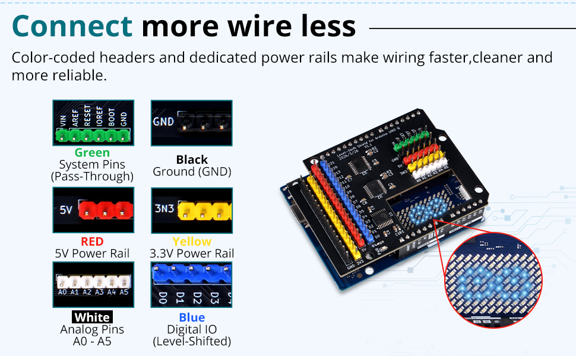
> *Figure 4-2: Shield mounting orientation*

### 4.3 Module Specifications

#### LCD1602 I2C Display
- Interface: I2C (SDA/SCL)
- Controller: PCF8574 I/O expander
- Address: 0x27 (default) or 0x3F
- Backlight: Blue LED
- Voltage: 5V

#### MAX7219 8×8 LED Matrix
- Interface: SPI (CS, DIN, CLK)
- Driver: MAX7219 dedicated LED driver
- Cascade: Supports multiple modules chained
- Voltage: 5V

#### HC-SR04 Ultrasonic Sensor
- Range: 2cm – 400cm
- Accuracy: ±3mm
- Trigger: 10μs HIGH pulse
- Echo: Pulse width proportional to distance
- Voltage: 5V

#### SG90 Servo
- Type: Micro servo, 9g
- Rotation: 0°–180°
- PWM: 20ms period, 0.5ms–2.5ms pulse width
- Current: ~100mA typical, ~250mA stall
- Voltage: 5V

#### 28BYJ-48 Stepper Motor
- Type: 4-phase, 5-wire unipolar
- Step angle: 5.625° (with 64:1 gear ratio, effective ~0.088°)
- Driver: ULN2003 Darlington transistor array
- Voltage: 5V
- Current: ~100–200mA per phase

#### 1-Channel Relay Module
- Trigger: Active-LOW or Active-HIGH (selectable via jumper)
- Isolation: Optocoupler isolation
- Rating: 10A @ 250V AC / 10A @ 30V DC
- LED indicator: Shows relay state
- Voltage: 5V

> 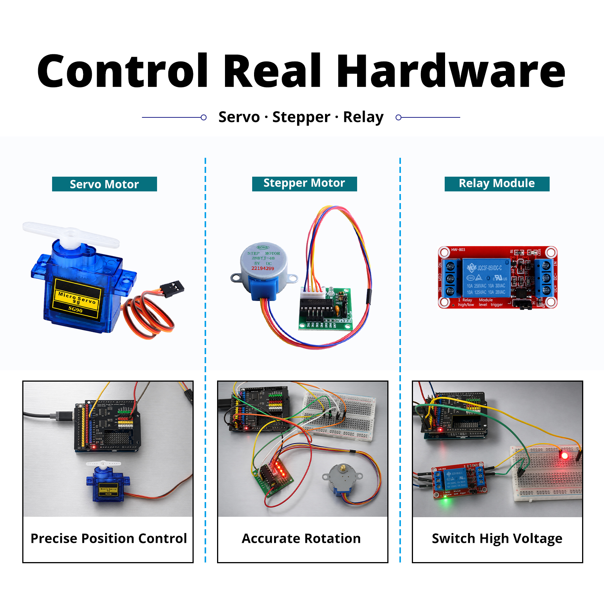
> *Figure 4-3: Servo, stepper motor, and relay module control examples*

---

## 5. Installation Instructions

### 5.1 Shield Installation

1. **Power Off**: Ensure the UNO Q is disconnected from USB or external power.

2. **Alignment Check**: Verify shield pins are not bent. The central rectangular window should align with the UNO Q LED matrix.

3. **Orientation**: The shield USB connector side should face the same direction as the UNO Q USB-C port.

4. **Vertical Mounting**: Press down evenly until both boards are fully parallel and all pins are fully seated.

5. **Power-On Test**: Connect the USB-C cable and verify the UNO Q power LED illuminates.

### 5.2 Wiring Best Practices

- Use color-coded Dupont lines to match the shield pin colors
- Keep high-voltage relay wires (NO/COM/NC) separate from low-voltage signal wires
- Use the breadboard for prototyping and testing connections
- Secure loose wires to prevent accidental disconnections

---

## 6. Software Preparation

### 6.1 Arduino IDE Setup

1. Install the [Arduino App Lab](https://www.arduino.cc/en/software/#app-lab-section)
2. Connect the UNO Q via USB-C cable
3. Waiting for it starup finished.(The indicator on QRB silk mark will light up) 
4. Open **Arduino App Lab** and then select the board that recognized by the App. 

> 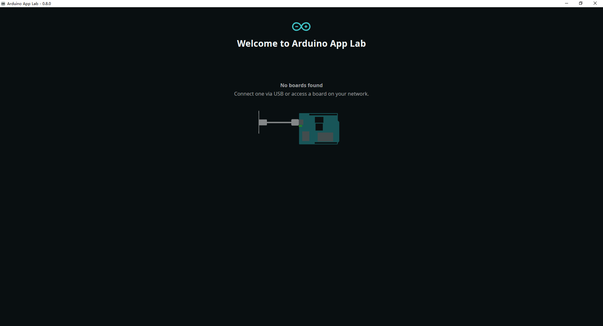
> *Figure 6-1: Arduino App Lab settings*

> 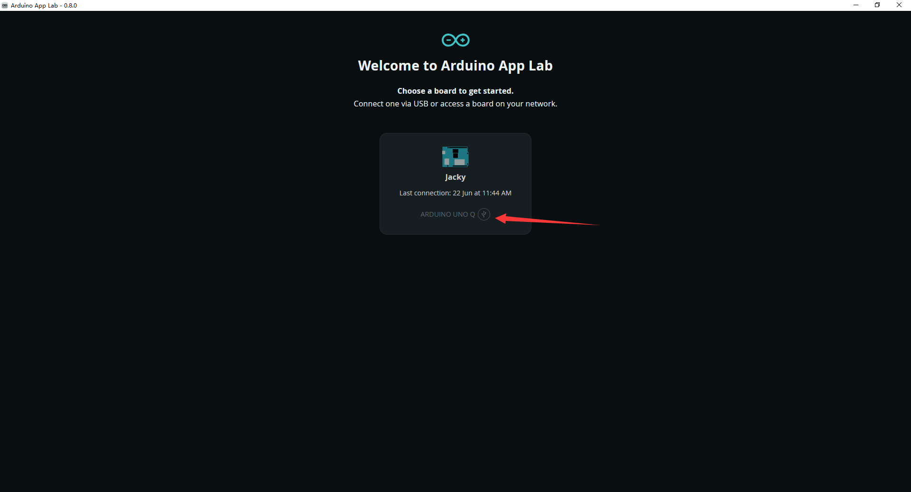
> *Figure 6-2: Arduino App Lab settings*

> 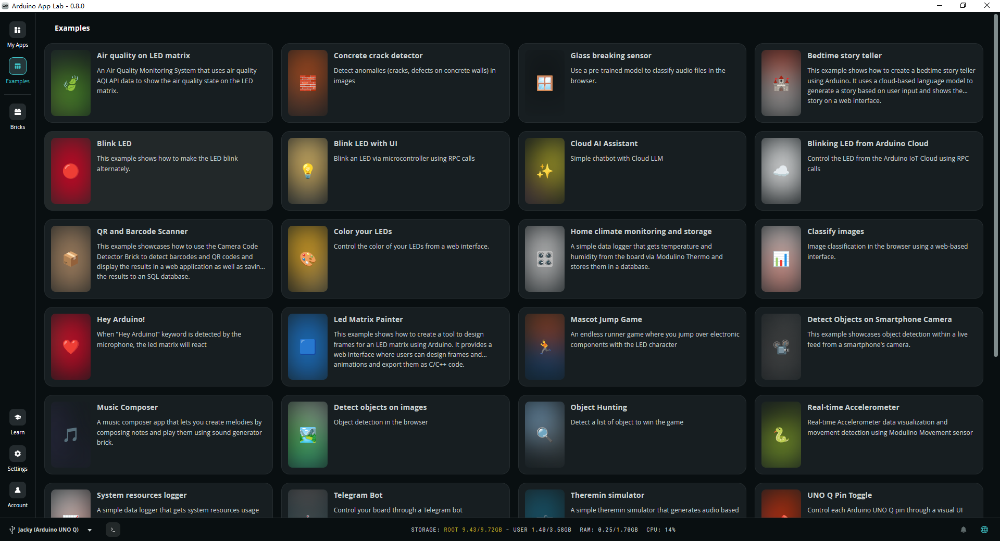
> *Figure 6-1: Arduino App Lab settings*

> 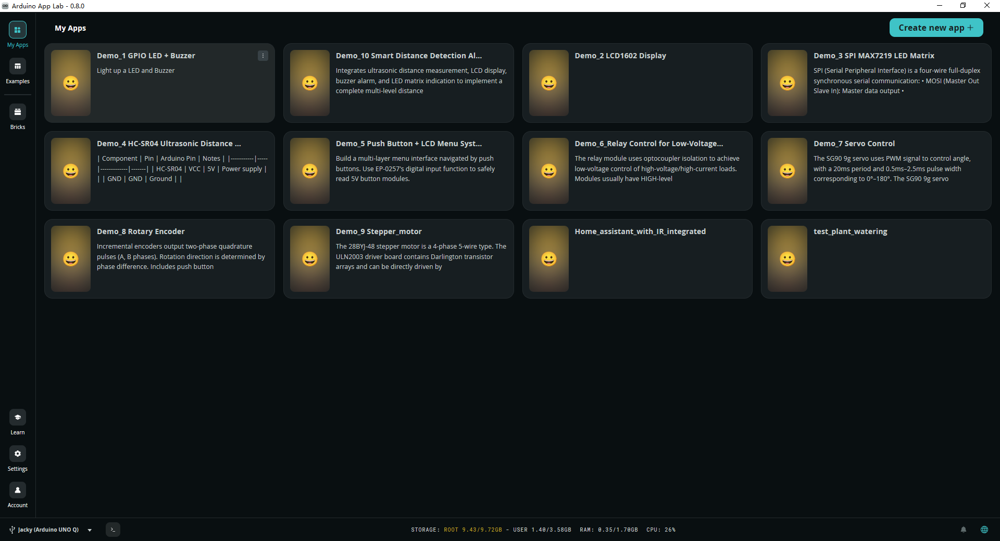
> *Figure 6-4: Arduino App Lab settings*

And then, click `Create app+` to create new project or just click it and select
`import` to import the demo code apps.(zip file type only) 

Once the sketch has been created and filling with code, you can just click `run`
button to compile it and upload the code to the borad.

> 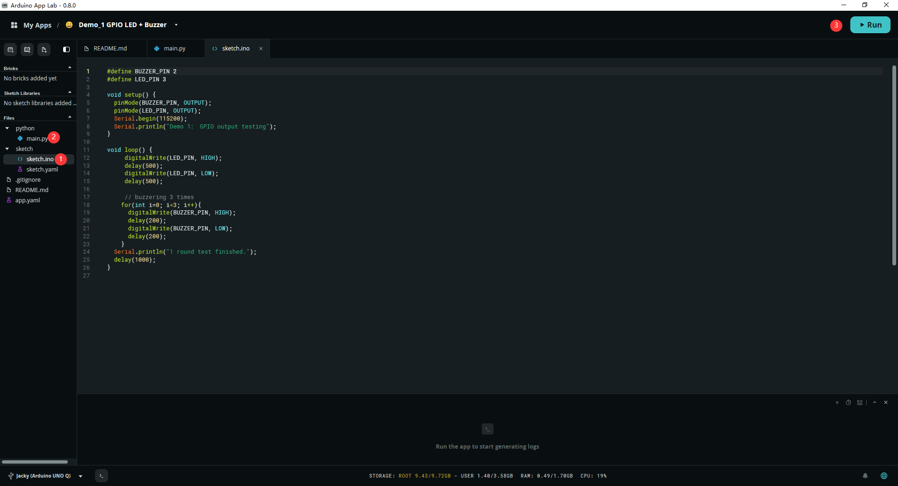
> *Figure 6-5: Arduino App Lab settings*

### 6.2 Required Libraries

Install the following libraries via the Arduino Library Manager (**Sketch → Include Library → Manage Libraries**):

| Library | Author | Version | Purpose |
|---------|--------|---------|---------|
| Bonezegei_LCD1602_I2C | Bonezegei | v1.0.4+ | LCD1602 I2C display control |
| MD_MAX72xx | MajicDesigns | Latest | MAX7219 LED matrix control |
| Servo | Arduino | Built-in | SG90 servo control |
| Wire | Arduino | Built-in | I2C communication |
| SPI | Arduino | Built-in | SPI communication |

> 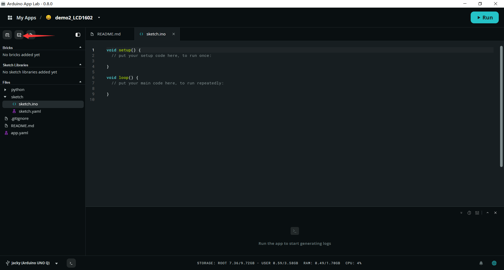
> *Figure 6-1: Library installation reference — search and install via Library Manager*

> 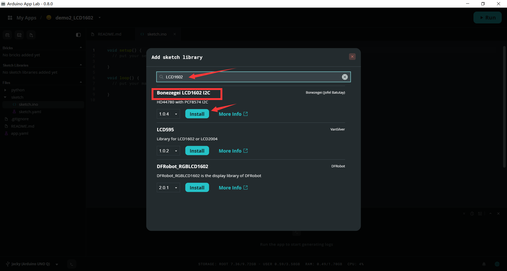
> *Figure 6-2: Library installation reference — search and install via Library Manager*

> 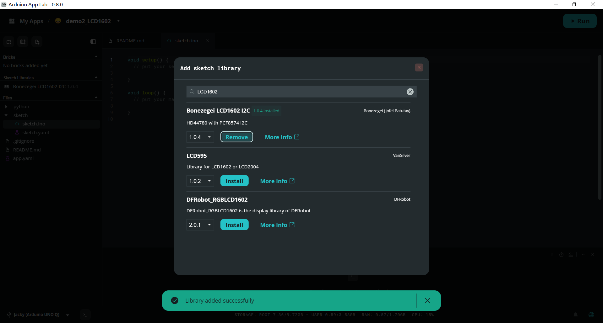
> *Figure 6-3: Library installation reference — search and install via Library Manager*


### 6.3 I2C Address Scanner

If unsure of the LCD module's I2C address, upload this scanner sketch first:

```cpp
#include <Wire.h>

void setup() {
  Wire.begin();
  Serial.begin(115200);
  Serial.println("I2C Scanner");
  for (byte addr = 1; addr < 127; addr++) {
    Wire.beginTransmission(addr);
    if (Wire.endTransmission() == 0) {
      Serial.print("I2C device found at address: 0x");
      Serial.println(addr, HEX);
    }
  }
}

void loop() {}
```

----

## 7. Basic Experiments

### Experiment 1: GPIO LED + Buzzer

#### Objective
Learn basic digital output control through the level-shifting shield.

#### Principle
Digital GPIO outputs HIGH/LOW levels to control external modules. Through the EP-0257, 3.3V signals are boosted to 5V, ensuring reliable recognition by 5V modules.

#### Wiring Diagram

| UNO Q / EP-0257 | Wire Color | Component | Pin / Leg | Function |
|-----------------|------------|-----------|-----------|----------|
| D2 | Blue | 5V Active Buzzer | VCC (Power +) | Buzzer Signal |
| D3 | Blue | LED / LED Module | Anode (Long Leg) | LED Signal |
| GND | Black | 5V Active Buzzer | Short Pin (GND) | Buzzer Ground |
| GND | Black | LED / LED Module | Cathode (Short Leg) | LED Ground |

> 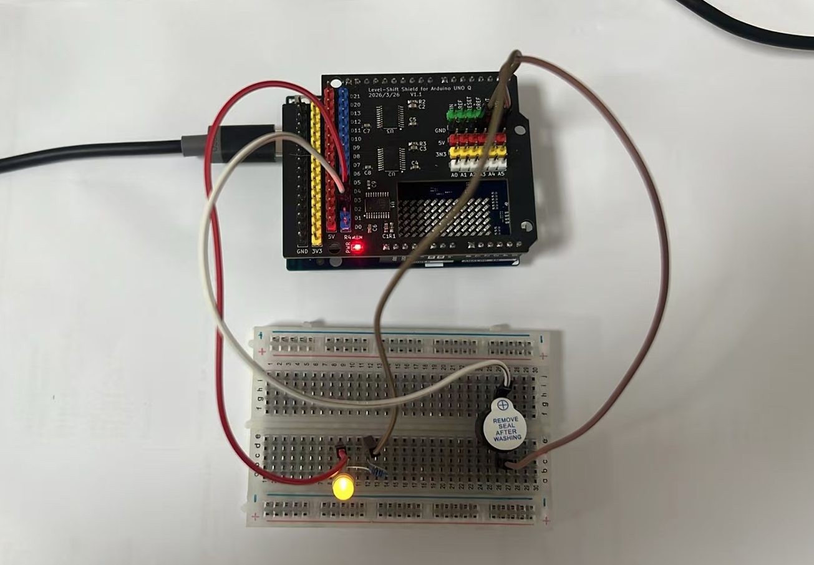
> *Figure 7-1: Experiment 1 — GPIO LED + Buzzer wiring diagram*

#### Code

```cpp
/*
 * Experiment 1: GPIO LED + Buzzer
 * Function: D2 controls buzzer alarm, D3 controls LED blinking
 * Hardware: EP-0257 Shield + 5V Buzzer Module + LED
 */

#define BUZZER_PIN 2    // Buzzer connected to D2 (Blue pin)
#define LED_PIN    3    // LED connected to D3 (Blue pin)

void setup() {
  pinMode(BUZZER_PIN, OUTPUT);
  pinMode(LED_PIN, OUTPUT);
  Serial.begin(115200);
  Serial.println("Experiment 1: GPIO Output Test");
}

void loop() {
  // LED blinking
  digitalWrite(LED_PIN, HIGH);
  delay(500);
  digitalWrite(LED_PIN, LOW);
  delay(500);

  // Buzzer beeps 3 times
  for (int i = 0; i < 3; i++) {
    digitalWrite(BUZZER_PIN, HIGH);  // Active buzzer: HIGH level triggers sound
    delay(200);
    digitalWrite(BUZZER_PIN, LOW);
    delay(200);
  }

  Serial.println("One cycle completed");
  delay(1000);
}
```

#### Code Explanation

- `pinMode(pin, OUTPUT)`: Configures pin as output mode
- `digitalWrite(pin, HIGH/LOW)`: Outputs 3.3V HIGH or 0V LOW, auto-converted to 5V/0V by shield
- Active buzzer contains internal oscillator circuit; only needs DC level to sound

> 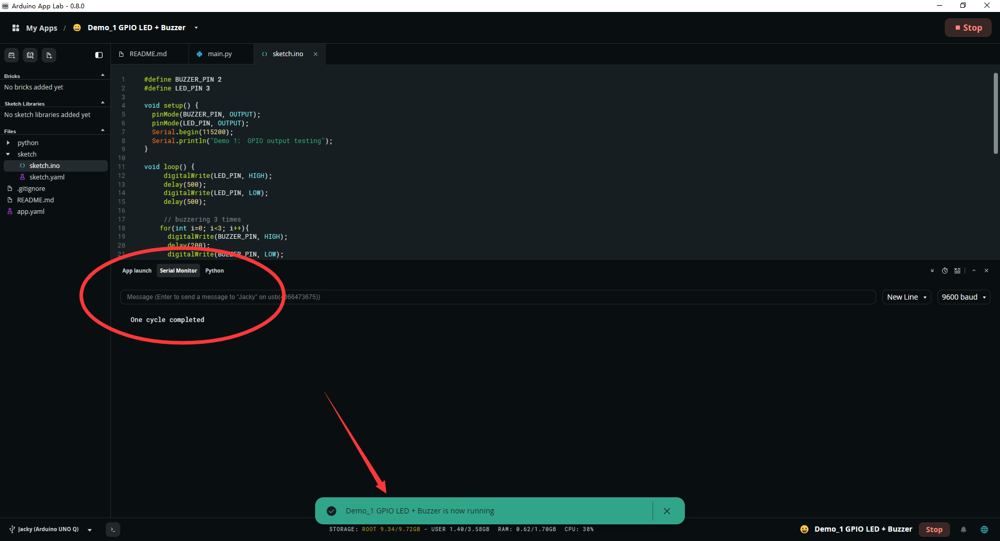
> *Figure 7-2: Experiment 1 — Expected output on serial monitor*

---

### Experiment 2: I2C LCD1602 Display

#### Objective
Learn I2C communication and LCD display control.

#### Principle
I2C (Inter-Integrated Circuit) is a two-wire serial bus (SDA data + SCL clock). UNO Q I2C pins are **A4 (SDA)** and **A5 (SCL)**, which after EP-0257 conversion can directly drive 5V I2C devices.

The LCD1602 I2C module integrates a PCF8574 expander chip, converting parallel interface to I2C, requiring only 4 wires for display control.

> 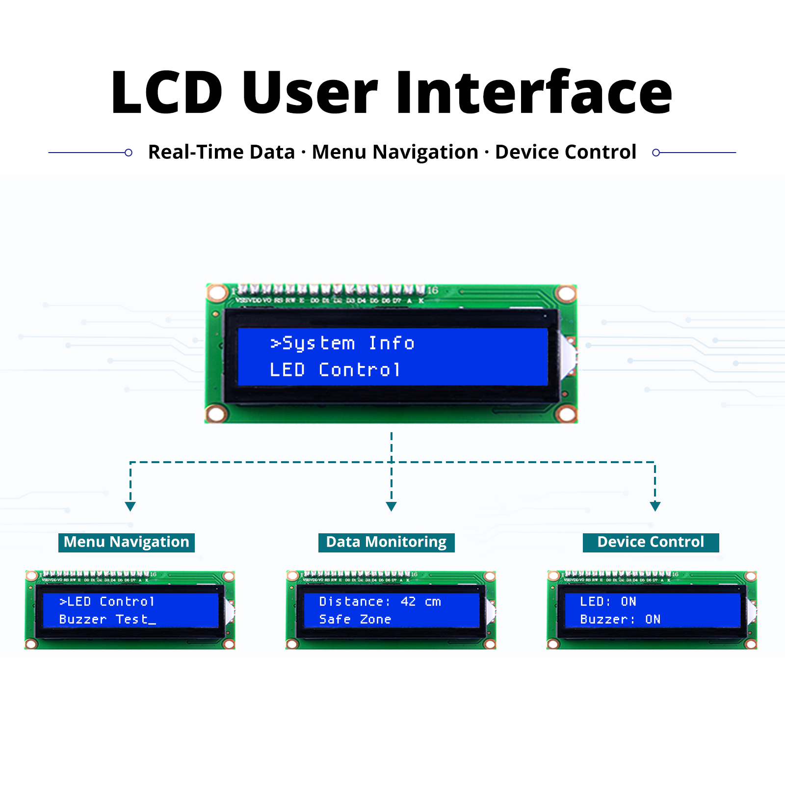
> *Figure 7-3: LCD user interface examples — Menu Navigation, Data Monitoring, Device Control*

#### Wiring Diagram

| UNO Q / EP-0257 | Wire Color | LCD1602 I2C | Pin / Function |
|-----------------|------------|-------------|----------------|
| A4 (SDA / D20) | White | SDA | I2C Data Line |
| A5 (SCL / D21) | White | SCL | I2C Clock Line |
| 5V | Red | VCC | Power Supply (+5V) |
| GND | Black | GND | Ground (0V) |

**Note**: I2C bus requires pull-up resistors; the LCD1602 module has them built-in.

#### Library Installation

1. Open Arduino IDE → Library Manager
2. Search for **"Bonezegei LCD1602 I2C"**
3. Find the library by author **Bonezegei**, click **Install**

> 
> *Figure 7-4: Library installation steps for Bonezegei LCD1602 I2C*

> 
> *Figure 7-5: Library installation steps for Bonezegei LCD1602 I2C*

> 
> *Figure 7-6: Library installation steps for Bonezegei LCD1602 I2C*

> 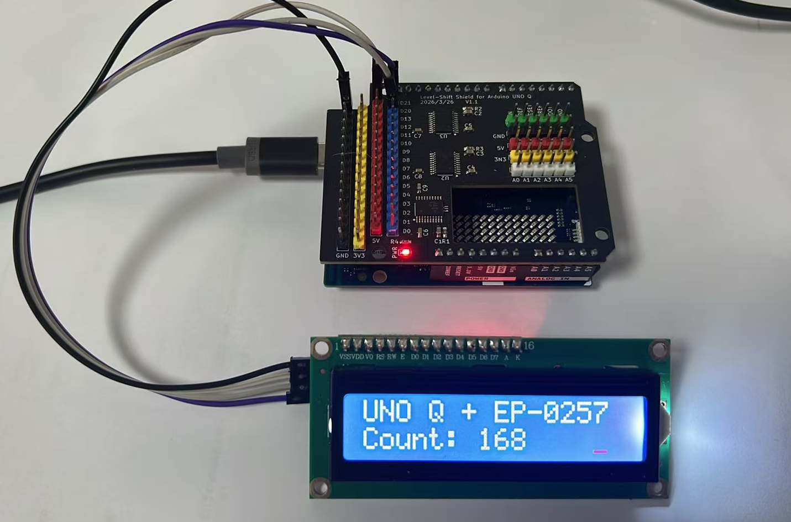
> *Figure 7-7: Library installation steps for Bonezegei LCD1602 I2C*

> 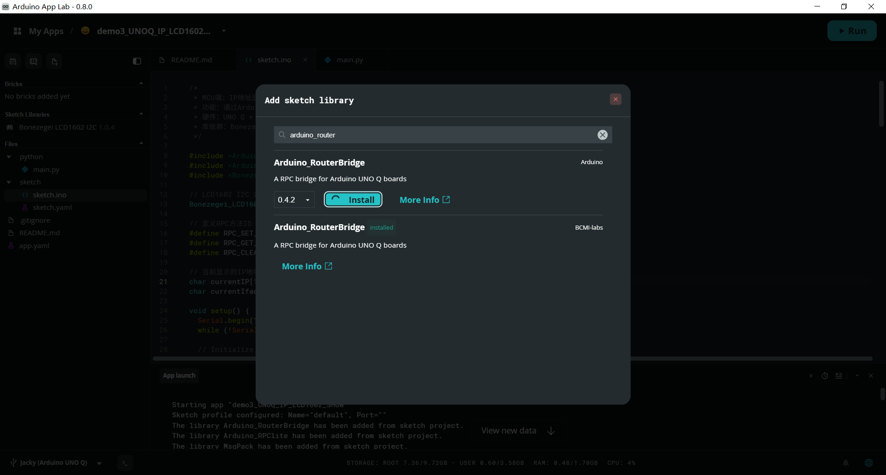
> *Figure 7-8: Library installation steps for Bonezegei LCD1602 I2C*

#### Code

```cpp
/*
 * Arduino UNO Q + EP-0257 + LCD1602 I2C - Kit Test
 * Bonezegei LCD1602 I2C v1.0.4 Corrected API
 */

#include <Bonezegei_LCD1602_I2C.h>

Bonezegei_LCD1602_I2C lcd(0x27);

void setup() {
  Serial.begin(115200);
  lcd.begin();
  lcd.setBacklight(1);  // Turn on backlight
  lcd.clear();

  // Welcome message
  lcd.setPosition(0, 0);
  lcd.print("UNO Q + EP-0257");
  lcd.setPosition(0, 1);
  lcd.print("Kit Ready!");

  Serial.println("LCD initialized with Bonezegei v1.0.4");
  delay(2000);
}

void loop() {
  static int count = 0;

  // Update second row with counter
  String msg = "Count: " + String(count) + "    ";
  lcd.setPosition(0, 1);
  lcd.print(msg.c_str());
  count++;
  delay(500);
}
```

> 
> *Figure 7-9: Experiment 2 — LCD1602 Experiment Result*

---

### Experiment 3: SPI MAX7219 8×8 LED Matrix

#### Objective
Learn SPI communication and LED matrix display control.

#### Principle
SPI (Serial Peripheral Interface) is a four-wire full-duplex synchronous serial communication:
- **MOSI** (Master Out Slave In): Master data output
- **MISO** (Master In Slave Out): Master data input
- **SCK** (Serial Clock): Clock signal
- **SS/CS** (Slave Select): Chip select, active LOW

MAX7219 is a dedicated LED driver chip. It receives display data via SPI and automatically handles scan refresh.

#### Wiring Diagram

| UNO Q / EP-0257 | Wire Color | MAX7219 Matrix | Pin / Function |
|-----------------|------------|----------------|----------------|
| D10 (SS) | Blue | CS | Chip Select |
| D11 (MOSI) | Blue | DIN | Data In |
| D12 (MISO) | Blue | — | Not used |
| D13 (SCK) | Blue | CLK | Clock |
| 5V | Red | VCC | Power Supply (+5V) |
| GND | Black | GND | Ground (0V) |

> 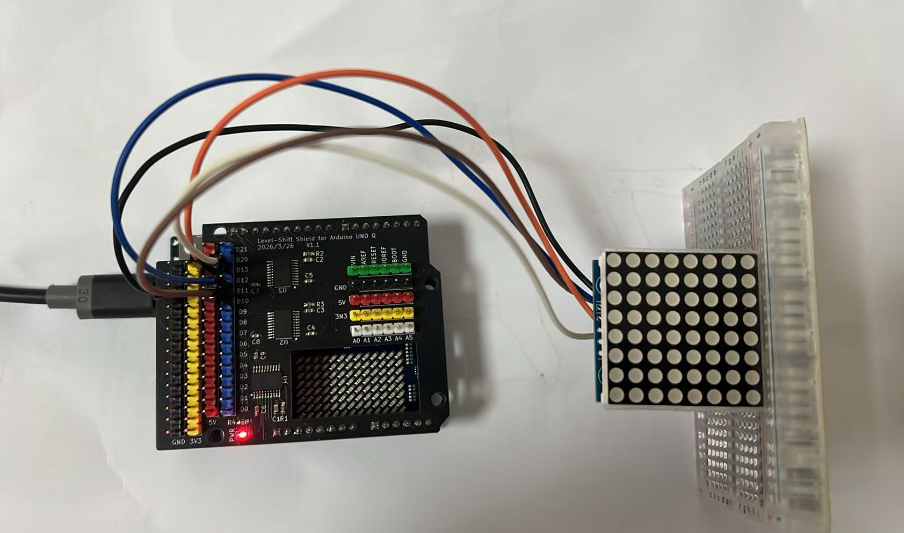
> *Figure 7-7: MD_MAX72xx library installation*


#### Library Installation

Install **MD_MAX72xx** via Arduino Library Manager.

> 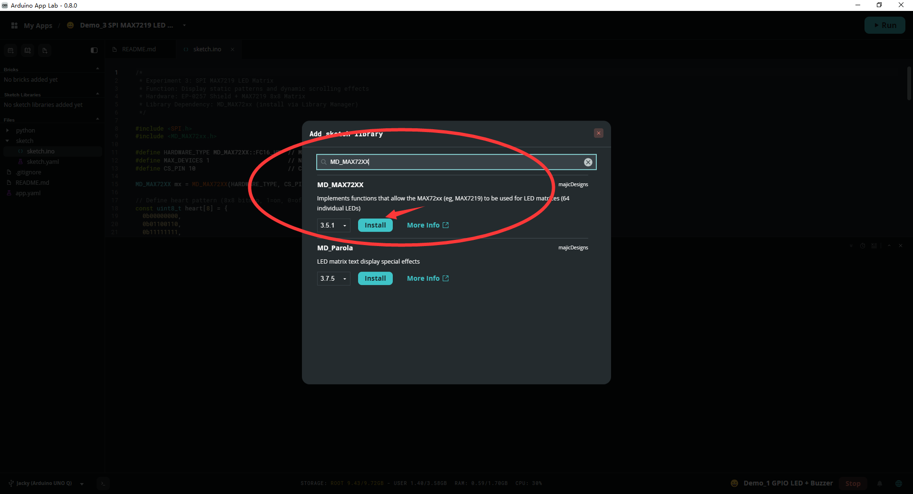
> *Figure 7-8: MD_MAX72xx library installation*

> 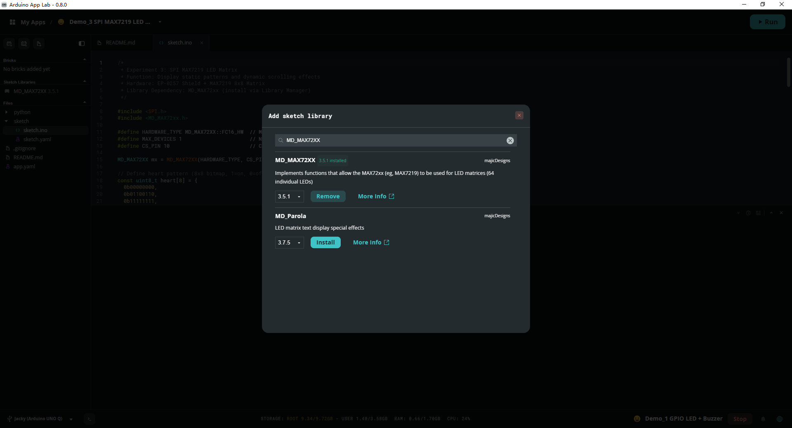
> *Figure 7-9: MD_MAX72xx library installation*


#### Code

```cpp
/*
 * Experiment 3: SPI MAX7219 LED Matrix
 * Function: Display static patterns and animations
 * Hardware: EP-0257 Shield + MAX7219 8x8 Matrix
 * Library: MD_MAX72xx
 */

#include <SPI.h>
#include <MD_MAX72xx.h>

#define HARDWARE_TYPE MD_MAX72XX::FC16_HW  // Module hardware type
#define MAX_DEVICES 1                      // Number of cascaded devices
#define CS_PIN 10                          // Chip select pin D10

MD_MAX72XX mx = MD_MAX72XX(HARDWARE_TYPE, CS_PIN, MAX_DEVICES);

// Define heart pattern (8x8 bitmap, 1=on, 0=off)
const uint8_t heart[8] = {
  0b00000000,
  0b01100110,
  0b11111111,
  0b11111111,
  0b01111110,
  0b00111100,
  0b00011000,
  0b00000000
};

void setup() {
  mx.begin();                            // Initialize MAX7219
  mx.control(MD_MAX72XX::INTENSITY, 8);  // Set brightness 0-15
  Serial.begin(115200);
  Serial.println("Experiment 3: MAX7219 LED Matrix");
  displayPattern(heart);
  delay(2000);
}

void loop() {
  // Display animated pattern
  animateHeart();
  delay(1000);
}

// Display static bitmap
void displayPattern(const uint8_t *pattern) {
  for (uint8_t row = 0; row < 8; row++) {
    mx.setRow(0, row, pattern[row]);
  }
}

// Heart breathing light effect
void animateHeart() {
  for (int brightness = 0; brightness <= 15; brightness++) {
    mx.control(MD_MAX72XX::INTENSITY, brightness);
    displayPattern(heart);
    delay(80);
  }
  for (int brightness = 15; brightness >= 0; brightness--) {
    mx.control(MD_MAX72XX::INTENSITY, brightness);
    displayPattern(heart);
    delay(80);
  }
}
```

#### Demo Result

> 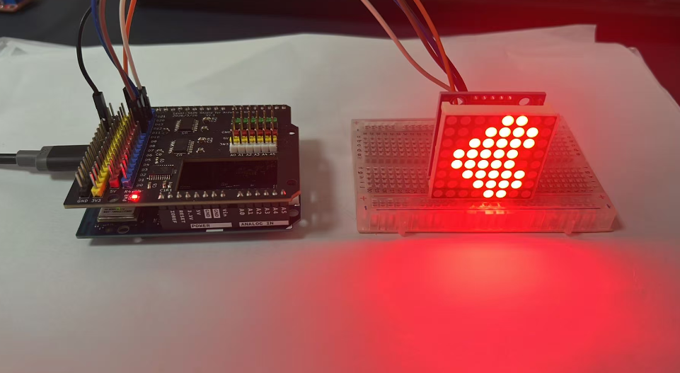
> *Figure 7-10: MD_MAX72xx library installation*

---

### Experiment 4: HC-SR04 Ultrasonic Distance Measurement + Buzzer Alert

#### Objective
Learn time-of-flight distance measurement and graded alarm implementation.

#### Principle

**Ultrasonic Distance Measurement:**

| Step | Action | Timing |
|------|--------|--------|
| ① | Send 10μs HIGH pulse to TRIG pin | Trigger signal |
| ② | Module emits 8 cycles of 40kHz ultrasound | ~200μs |
| ③ | Module waits for echo reflection | Variable |
| ④ | ECHO pin goes HIGH for duration = round-trip time | Measured by pulseIn() |

**Distance Formula:**

```
Distance = Duration × Speed of Sound / 2 = Duration × 343m/s / 2
In microseconds: Distance (cm) = Duration (μs) × 0.01715
```

**Proximity-Based Buzzer Alert:**

| Distance Zone | Behavior | Purpose |
|---------------|----------|---------|
| < 10 cm | Beep every ~100ms, 2kHz, 300ms long | Urgent warning |
| 10–50 cm | Beep every ~500ms, 1.2kHz, 200ms | Caution |
| 50–200 cm | Beep every ~1500ms, 700Hz, 130ms | Awareness |
| > 200 cm | Silent | Safe zone |
| Error | Slow beep every 1s | Sensor fault |

> 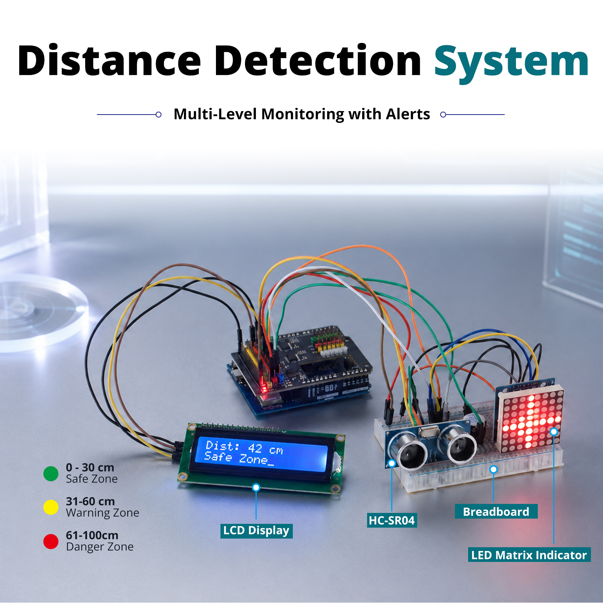
> *Figure 7-11: Distance detection system with multi-level monitoring*

#### Wiring Diagram

| Component | Pin | Arduino Pin | Notes |
|-----------|-----|-------------|-------|
| HC-SR04 | VCC | 5V | Power supply |
| HC-SR04 | GND | GND | Ground |
| HC-SR04 | TRIG | D4 | Trigger output |
| HC-SR04 | ECHO | D5 | Echo input |
| Buzzer | Signal (+) | D6 | PWM pin for tone() |
| Buzzer | GND (-) | GND | Ground |

> 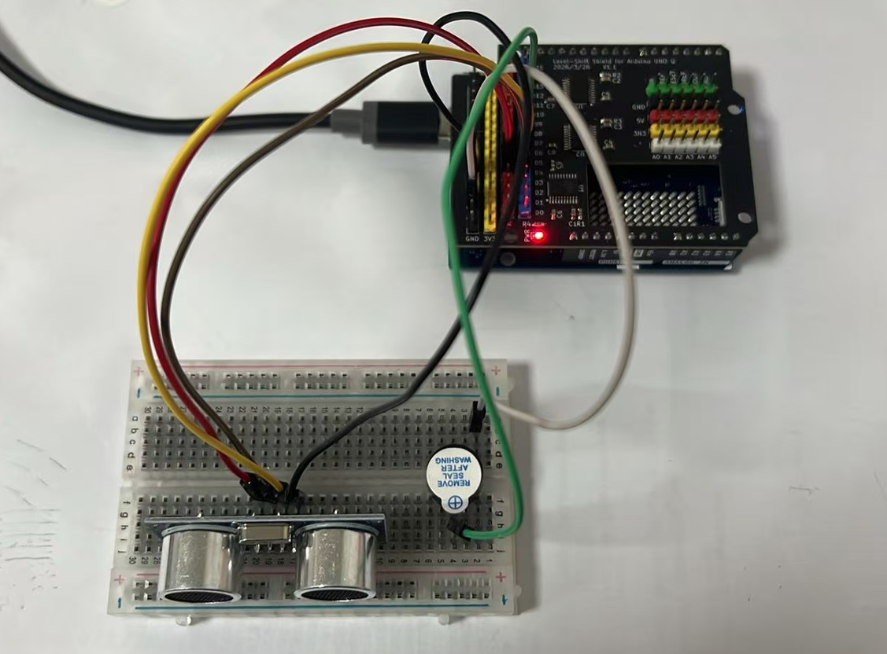
> *Figure 7-12: Demo 4 Wiring*

> 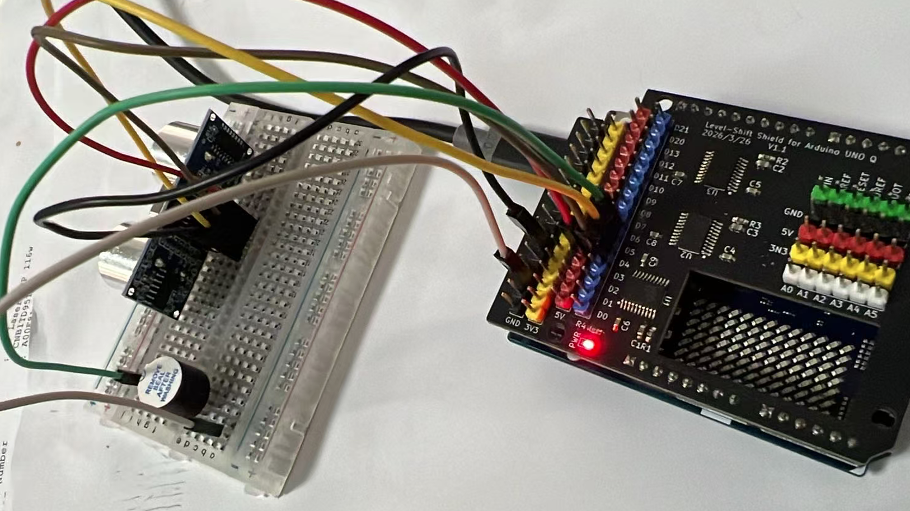
> *Figure 7-13: Demo 4 Wiring*


#### Code

```cpp
/*
 * Experiment 4: HC-SR04 Ultrasonic Distance Measurement + Buzzer Alert
 * Function: Measure distance, buzzer beeps faster when closer
 * Hardware: EP-0257 Shield + HC-SR04 + Buzzer
 */

#define TRIG_PIN 4
#define ECHO_PIN 5
#define BUZZER_PIN 6   // Buzzer pin

void setup() {
  pinMode(TRIG_PIN, OUTPUT);
  pinMode(ECHO_PIN, INPUT);
  pinMode(BUZZER_PIN, OUTPUT);
  Serial.begin(115200);
  Serial.println("Experiment 4: Ultrasonic Distance + Buzzer");
}

void loop() {
  long distance = measureDistance();

  // Serial output
  Serial.print("Distance: ");
  if (distance >= 0) {
    Serial.print(distance);
    Serial.println(" cm");
  } else if (distance == -1) {
    Serial.println("No signal!");
  } else if (distance == -2) {
    Serial.println("Out of range!");
  }

  // Buzzer alert logic
  handleBuzzer(distance);
  delay(100);  // Base sampling interval
}

// Buzzer control: shorter interval when closer
void handleBuzzer(long distance) {
  static unsigned long lastBeepTime = 0;
  unsigned long currentTime = millis();

  // Error state: warning beep every second
  if (distance < 0) {
    if (currentTime - lastBeepTime >= 1000) {
      tone(BUZZER_PIN, 1000, 200);
      lastBeepTime = currentTime;
    }
    return;
  }

  // Safe distance: silent (> 200cm)
  if (distance > 200) {
    noTone(BUZZER_PIN);
    return;
  }

  // Calculate beep interval: closer = shorter interval
  unsigned long beepInterval = map(distance, 10, 200, 100, 2000);
  beepInterval = constrain(beepInterval, 100, 2000);

  // Closer = higher pitch and longer beep
  int frequency = map(distance, 10, 200, 2000, 500);
  int duration = map(distance, 10, 200, 300, 100);
  frequency = constrain(frequency, 500, 2000);
  duration = constrain(duration, 100, 300);

  // Execute beep
  if (currentTime - lastBeepTime >= beepInterval) {
    tone(BUZZER_PIN, frequency, duration);
    lastBeepTime = currentTime;
  }
}

long measureDistance() {
  // Send trigger pulse
  digitalWrite(TRIG_PIN, LOW);
  delayMicroseconds(2);
  digitalWrite(TRIG_PIN, HIGH);
  delayMicroseconds(10);
  digitalWrite(TRIG_PIN, LOW);

  // Read echo pulse duration
  long duration = pulseIn(ECHO_PIN, HIGH, 30000);

  // Calculate distance (cm)
  long distance = duration * 0.01715;
  if (duration == 0) return -1;
  if (distance > 400 || distance < 2) return -2;
  return distance;
}
```

---

### Experiment 5: Push Button + LCD Menu System

#### Objective
Build a multi-layer menu interface navigated by push buttons.

#### Wiring Diagram

| UNO Q / EP-0257 | Wire Color | Component | Pin / Function |
|-----------------|------------|-----------|----------------|
| D6 | Blue | Button UP | Signal |
| D7 | Blue | Button DOWN | Signal |
| D8 | Blue | Button OK (Confirm) | Signal |
| D20 (SDA) | White | LCD1602 | SDA (I2C Data) |
| D21 (SCL) | White | LCD1602 | SCL (I2C Clock) |
| 5V | Red | LCD1602 VCC | Power (+5V) |
| GND | Black | Button Module GND | Ground (0V) |
| GND | Black | LCD1602 GND | Ground (0V) |
| D9 | Blue | LED Anode | LED Signal |
| D2 | Blue | Buzzer Signal (+) | Buzzer Signal |

> 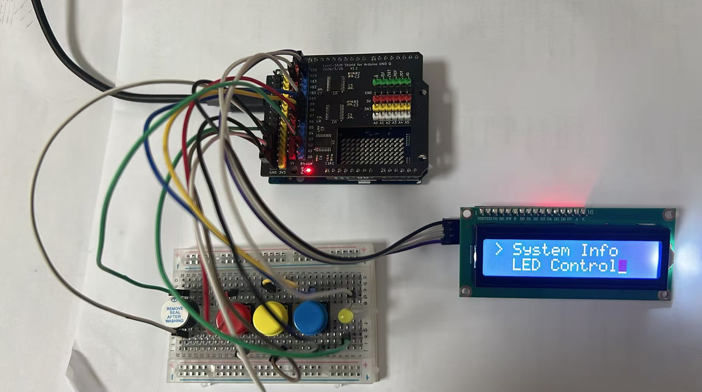
> *Figure 7-14: Demo 5 Wiring*

> 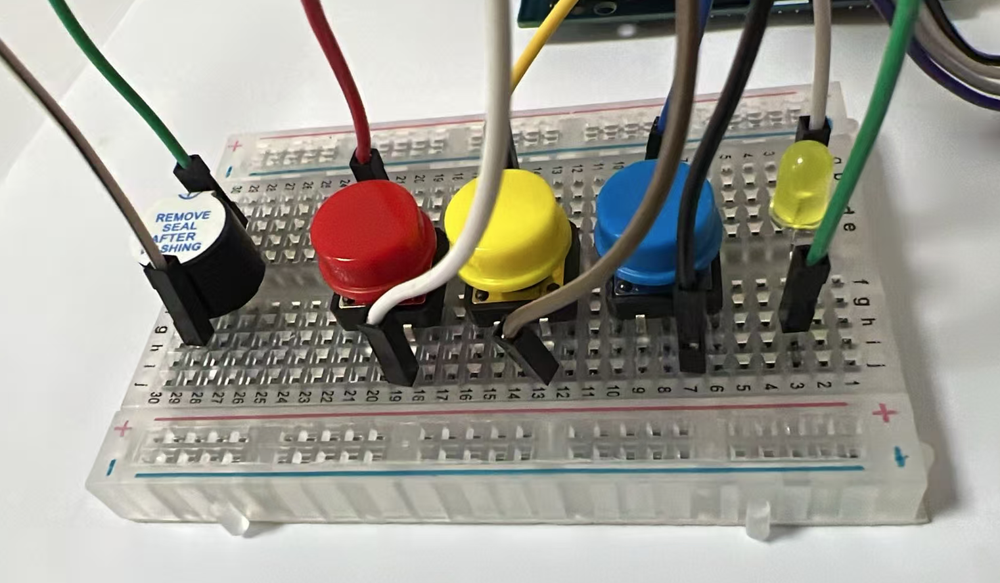
> *Figure 7-15: Demo 5 Wiring*

> 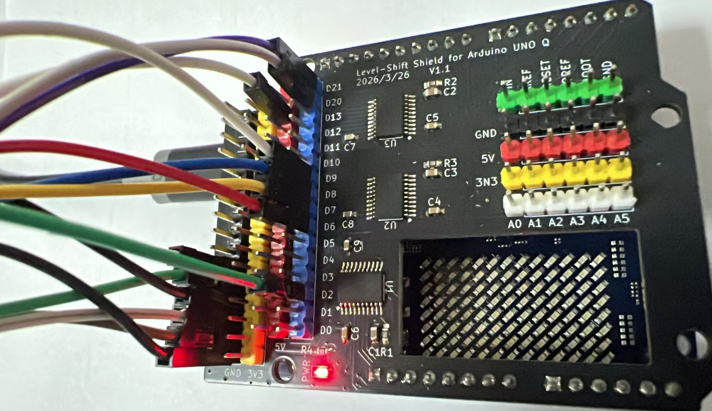
> *Figure 7-16: Demo 5 Wiring*

#### Library Installation 

> 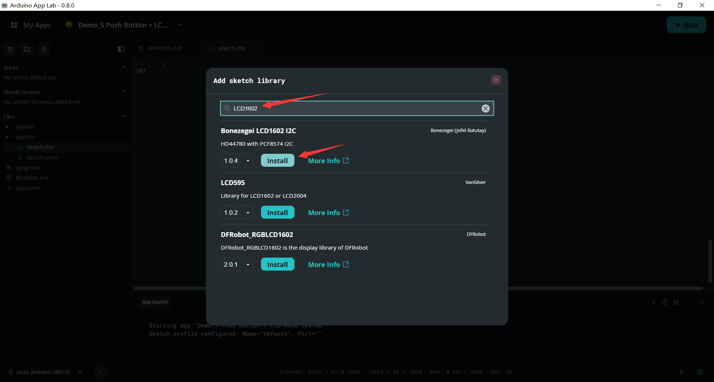
> *Figure 7-17: 1602 library installation*

> 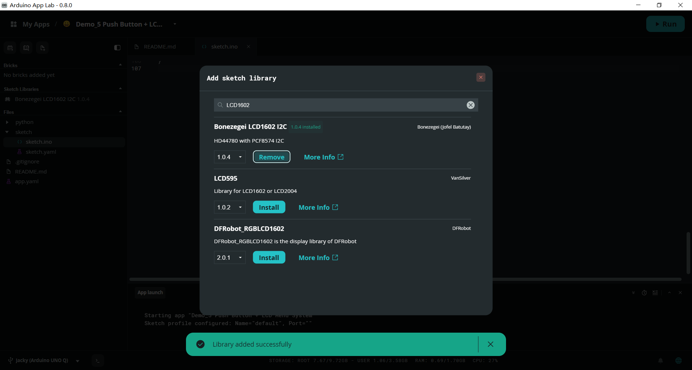
> *Figure 7-18: 1602 library installation*


#### Code

```cpp
/*
 * Experiment 5: Push Button + LCD Menu System
 * Function: Three-layer menu navigation, control LED and buzzer
 * Hardware: EP-0257 Shield + LCD1602 + 3x Push Buttons
 * Library: Bonezegei_LCD1602_I2C
 */

#include <Bonezegei_LCD1602_I2C.h>

// Create object lcd, default address is 0x27
Bonezegei_LCD1602_I2C lcd(0x27);

#define BTN_UP   6
#define BTN_DOWN 7
#define BTN_OK   8
#define LED_PIN  9
#define BUZZER   2

// Menu structure
const char* menuItems[] = {"LED Control", "Buzzer Test", "System Info"};
const int menuCount = 3;
int currentMenu = 0;
int menuLevel = 0;  // 0=Main menu, 1=Sub menu
bool ledState = false;

void setup() {
  pinMode(BTN_UP, INPUT);
  pinMode(BTN_DOWN, INPUT);
  pinMode(BTN_OK, INPUT);
  pinMode(LED_PIN, OUTPUT);
  pinMode(BUZZER, OUTPUT);

  lcd.begin();
  Serial.begin(115200);
  Serial.println("Experiment 5: Button Menu System");
  showMainMenu();
}

void loop() {
  handleButtons();
  delay(150);  // Simple debounce
}

void handleButtons() {
  if (digitalRead(BTN_UP) == HIGH) {
    if (menuLevel == 0) {
      currentMenu = (currentMenu - 1 + menuCount) % menuCount;
      showMainMenu();
    }
  }
  else if (digitalRead(BTN_DOWN) == HIGH) {
    if (menuLevel == 0) {
      currentMenu = (currentMenu + 1) % menuCount;
      showMainMenu();
    }
  }
  else if (digitalRead(BTN_OK) == HIGH) {
    executeMenu();
  }
}

void showMainMenu() {
  lcd.clear();
  lcd.setCursor(0, 0);
  lcd.print("> ");
  lcd.print(menuItems[currentMenu]);
  lcd.setCursor(0, 1);
  lcd.print("  ");
  lcd.print(menuItems[(currentMenu + 1) % menuCount]);
}

void executeMenu() {
  lcd.clear();
  switch (currentMenu) {
    case 0:  // LED Control
      ledState = !ledState;
      digitalWrite(LED_PIN, ledState ? HIGH : LOW);
      lcd.print("LED: ");
      lcd.print(ledState ? "ON " : "OFF");
      delay(1000);
      break;
    case 1:  // Buzzer Test
      lcd.print("Buzzer Test...");
      for (int i = 0; i < 3; i++) {
        digitalWrite(BUZZER, HIGH);
        delay(200);
        digitalWrite(BUZZER, LOW);
        delay(200);
      }
      break;
    case 2:  // System Info
      lcd.print("UNO Q + EP-0257");
      lcd.setCursor(0, 1);
      lcd.print("3.3V -> 5V OK");
      delay(2000);
      break;
  }
  showMainMenu();
}
```

#### Demo Result 

> 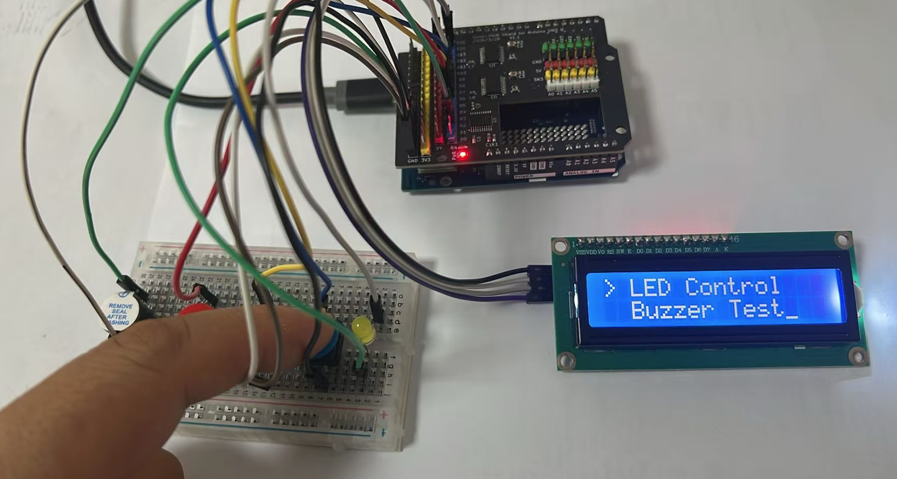
> *Figure 7-19: Menu navigation showing "System Info" and "LED Control" options*

> 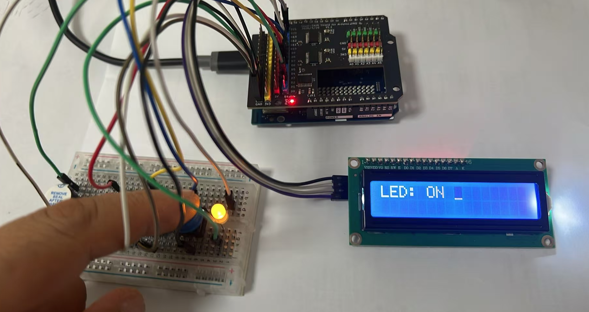
> *Figure 7-20: Menu navigation showing "System Info" and "LED Control" options*

> 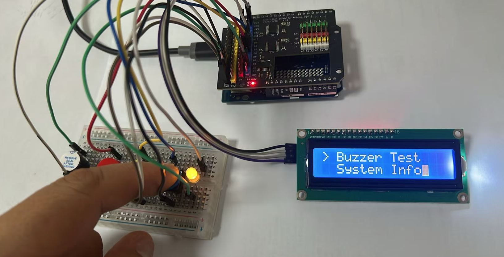
> *Figure 7-21: Menu navigation showing "System Info" and "LED Control" options*

> 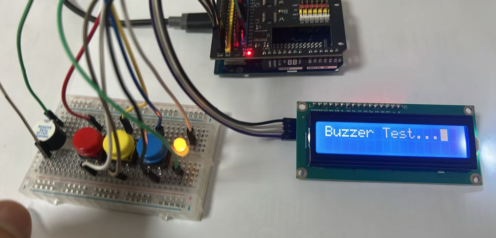
> *Figure 7-22: Menu navigation showing "System Info" and "LED Control" options*

> 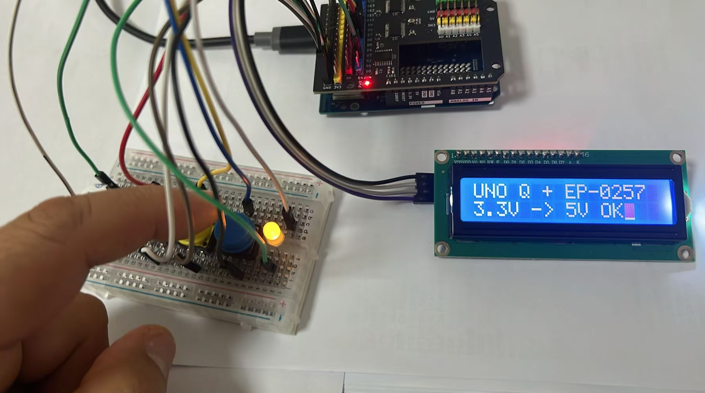
> *Figure 7-23: Menu navigation showing "System Info" and "LED Control" options*

---

### Experiment 6: Relay Control for Low-Voltage Loads

#### Objective
Learn relay control for switching external circuits.

#### Principle
The relay module uses optocoupler isolation to achieve low-voltage control of high-voltage/high-current loads. Modules usually have **HIGH-level trigger** and **LOW-level trigger** modes, selectable via jumper cap.

⚠️ **Safety Warning**: This kit is only for controlling low-voltage loads (<< 30V DC). Controlling mains voltage (220V AC) requires professional knowledge and insulation protection.

#### Wiring Diagram

| UNO Q / EP-0257 | Wire Color | Relay Module | Pin / Terminal | Function |
|-----------------|------------|--------------|----------------|----------|
| D9 | Blue | IN | Signal Input | Control signal |
| 5V | Red | VCC | Power Supply | Module power (+5V) |
| GND | Black | GND | Ground | Module ground (0V) |

>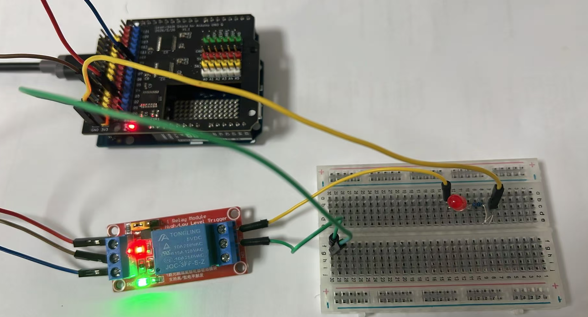
> *Figure 7-24: Demo 6 Wiring*

>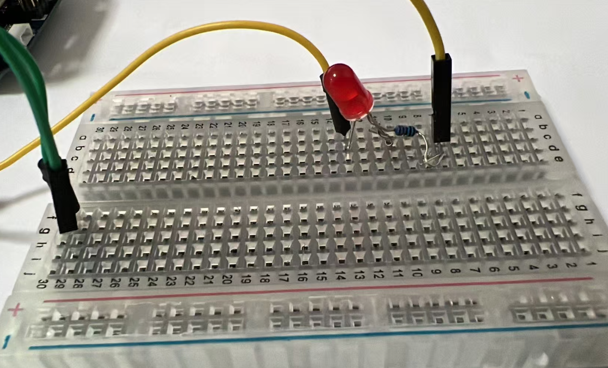
> *Figure 7-25: Demo 6 Wiring*

>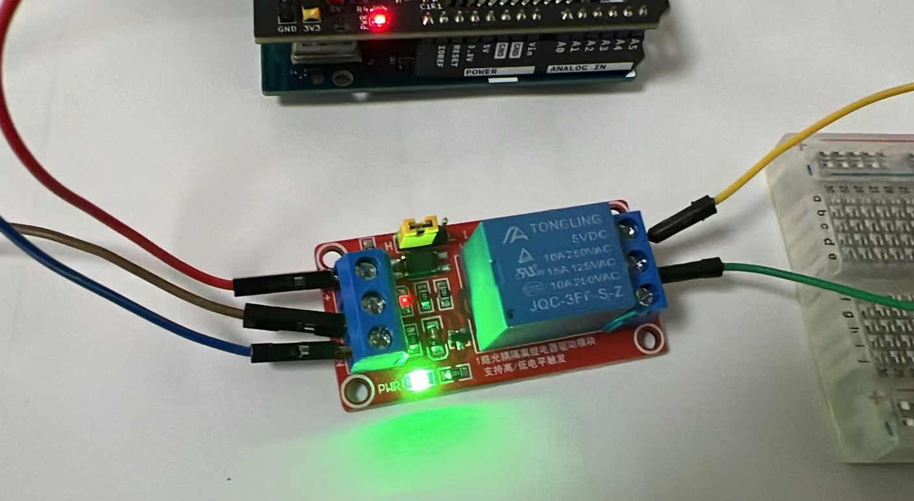
> *Figure 7-26: Demo 6 Wiring*

**Relay Output Terminals:**

| Terminal | Label | Connection | State |
|----------|-------|------------|-------|
| Common | COM | Load one end + Power positive | Shared connection |
| Normally Open | NO | Load other end | **Conducts when relay energized** |
| Normally Closed | NC | — | Conducts when relay de-energized |

>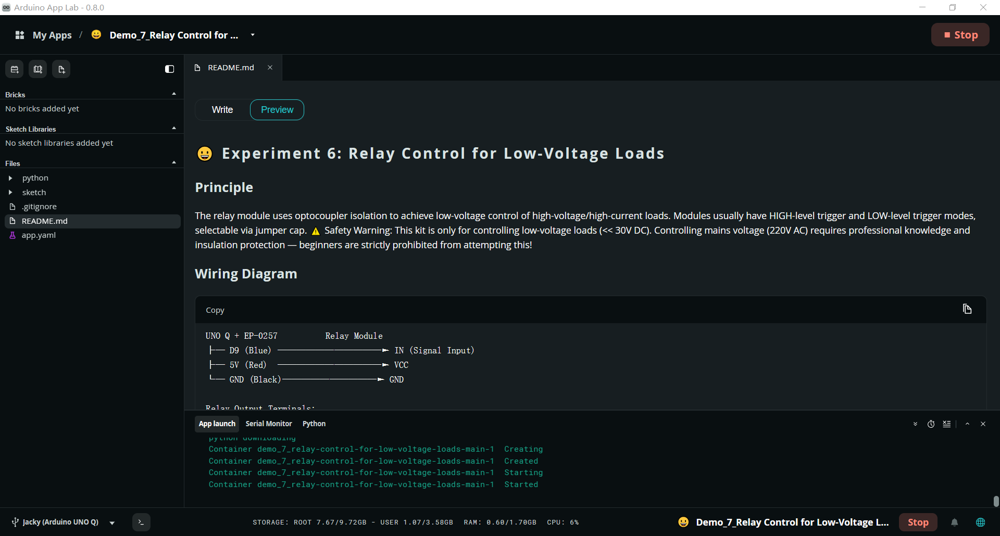
> *Figure 7-27: Demo 6 library installation*

#### Code

```cpp
/*
 * Experiment 6: Relay Control for Low-Voltage Loads
 * Function: Timed relay on/off control
 * Hardware: EP-0257 Shield + 1-Channel Relay Module + Low-Voltage Load
 */

#define RELAY_PIN 9

void setup() {
  pinMode(RELAY_PIN, OUTPUT);
  digitalWrite(RELAY_PIN, LOW);  // Initial state: OFF
  Serial.begin(115200);
  Serial.println("Experiment 6: Relay Control");
  Serial.println("Relay toggles every 3 seconds");
}

void loop() {
  Serial.println("Relay: ON (Energized)");
  digitalWrite(RELAY_PIN, HIGH);  // HIGH-level trigger mode
  delay(3000);
  Serial.println("Relay: OFF (De-energized)");
  digitalWrite(RELAY_PIN, LOW);
  delay(3000);
}
```

#### Demo Result

>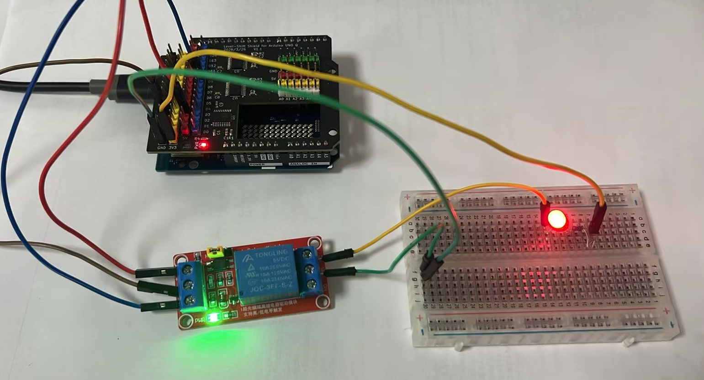
> *Figure 7-28: Relay module control demonstration*
---

### Experiment 7: Servo Control

#### Objective
Learn PWM servo control for precise angular positioning.

#### Principle
The SG90 9g servo uses **PWM signal** to control angle, with a **20ms period** and **0.5ms–2.5ms pulse width** corresponding to **0°–180°**. The SG90 draws approximately **100mA typical current** and **up to 250mA at stall**.

⚠️ **IMPORTANT**: Servo MUST be powered by external 5V supply. UNO Q only provides signal and common ground!

#### Wiring Diagram

| UNO Q + EP-0257 | Wire Color | SG90 9g Servo | Pin / Wire | Function |
|-----------------|------------|---------------|------------|----------|
| 5V | Red | Red Wire | VCC | Servo power supply (+5V) |
| GND | Brown/Black | Brown Wire | GND | Servo ground (0V) |
| D9 | Blue/Yellow | Yellow/Orange Wire | Signal | PWM control signal |

> 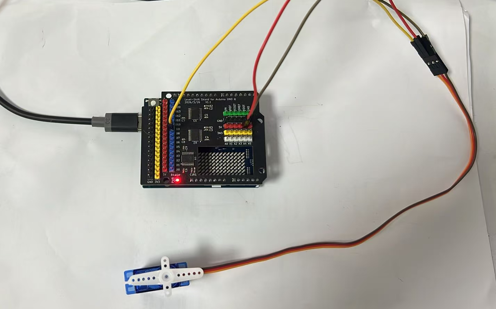
> *Figure 7-29: Servo motor precise position control*

> 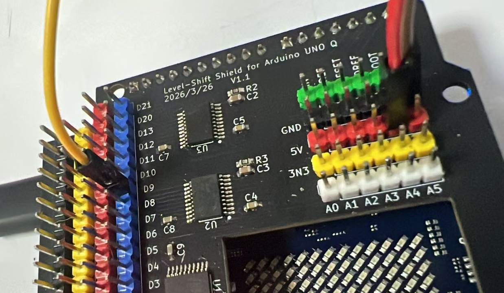
> *Figure 7-30: Servo motor precise position control*

#### Library Installation

Install the **Servo** library via Arduino Library Manager (built-in, may require manual installation).

> 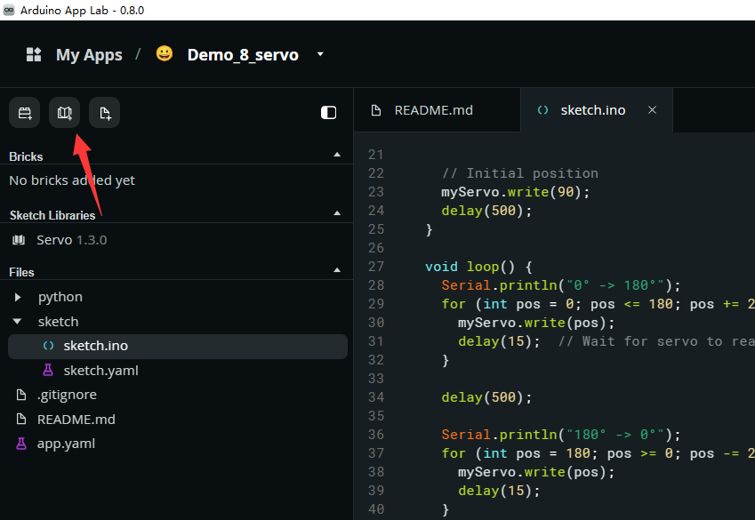
> *Figure 7-31: Demo 7 Library Installation*

> 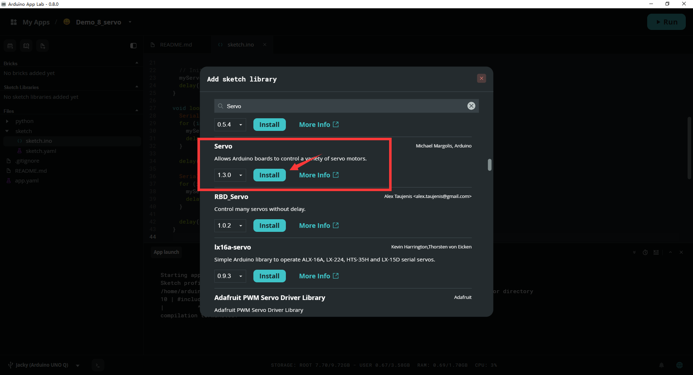
> *Figure 7-32: Demo 7 Library Installation*

> 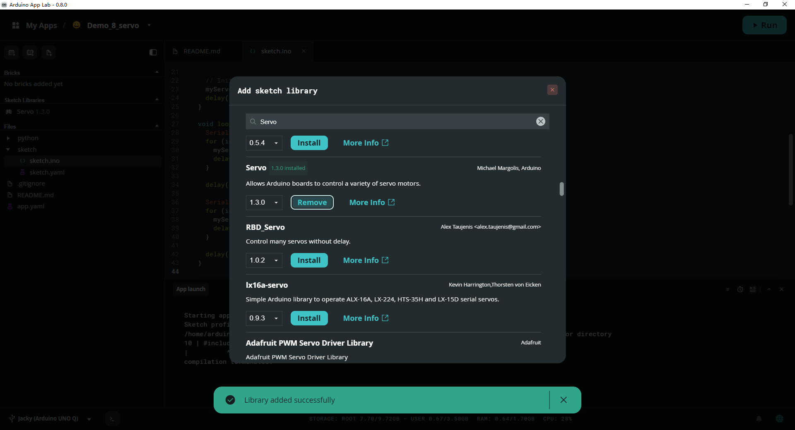
> *Figure 7-33: Demo 7 Library Installation*


#### Code

```cpp
/*
 * Experiment 7: Servo Control
 * Function: Servo sweeps 0°-180° back and forth
 * Hardware: EP-0257 Shield + SG90 + External 5V Power Supply
 * Library: Servo (built into Arduino)
 *
 * ⚠️ IMPORTANT: Servo MUST be powered by external 5V supply!
 */

#include <Servo.h>

Servo myServo;
#define SERVO_PIN 9

void setup() {
  myServo.attach(SERVO_PIN);  // Bind to PWM pin D9
  Serial.begin(115200);
  Serial.println("Experiment 7: Servo Control");
  Serial.println("Ensure servo uses external 5V power supply!");

  // Initial position
  myServo.write(90);
  delay(500);
}

void loop() {
  Serial.println("0° -> 180°");
  for (int pos = 0; pos <= 180; pos += 2) {
    myServo.write(pos);
    delay(15);  // Wait for servo to reach position
  }
  delay(500);

  Serial.println("180° -> 0°");
  for (int pos = 180; pos >= 0; pos -= 2) {
    myServo.write(pos);
    delay(15);
  }
  delay(500);
}
```

---

### Experiment 8: Rotary Encoder

#### Objective
Learn rotary encoder input with interrupt-based counting.

#### Principle
Incremental encoders output two-phase quadrature pulses (A, B phases). Rotation direction is determined by phase difference. Includes push button function, outputs LOW when pressed.

#### Wiring Diagram

| UNO Q / EP-0257 | Wire Color | Encoder Module | Pin / Signal | Function |
|-----------------|------------|--------------|--------------|----------|
| D2 | Blue | CLK | A-phase | Rotary pulse A (interrupt pin) |
| D3 | Blue | DT | B-phase | Rotary pulse B (direction detection) |
| D4 | Blue | SW | Button | Push-button switch |
| 5V | Red | + | VCC | Power supply (+5V) |
| GND | Black | GND | Ground | Ground (0V) |

> 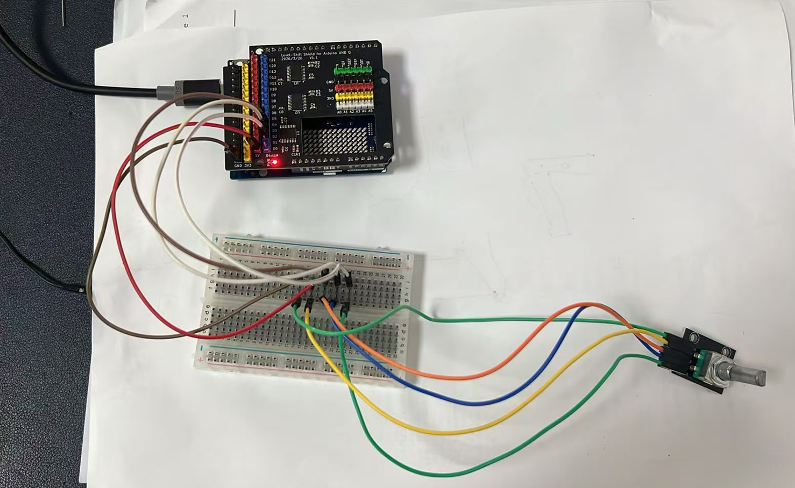
> *Figure 7-34: Demo 8 Rotary encoder wiring* 

#### Code

```cpp
/*
 * Experiment 8: Rotary Encoder
 * Function: Read rotation direction and count, with button reset
 * Hardware: EP-0257 Shield + Incremental Encoder
 */

#define CLK_PIN 2   // Must connect to pin supporting external interrupt (D2 or D3)
#define DT_PIN  3
#define SW_PIN  4

volatile int counter = 0;
volatile byte lastState = 0;
bool swLastState = HIGH;

void setup() {
  pinMode(CLK_PIN, INPUT);
  pinMode(DT_PIN, INPUT);
  pinMode(SW_PIN, INPUT_PULLUP);

  // Enable external interrupt, trigger on CLK pin change
  attachInterrupt(digitalPinToInterrupt(CLK_PIN), readEncoder, CHANGE);

  Serial.begin(115200);
  Serial.println("Experiment 8: Encoder Test");
  Serial.println("Rotate encoder to observe count changes");
}

void loop() {
  // Button detection (debounced)
  bool swState = digitalRead(SW_PIN);
  if (swState == LOW && swLastState == HIGH) {
    counter = 0;
    Serial.println("Counter reset!");
    delay(200);  // Debounce
  }
  swLastState = swState;

  static int lastCounter = -1;
  if (counter != lastCounter) {
    Serial.print("Count: ");
    Serial.println(counter);
    lastCounter = counter;
  }
}

// Interrupt Service Routine
void readEncoder() {
  byte clkState = digitalRead(CLK_PIN);
  byte dtState = digitalRead(DT_PIN);

  // Determine rotation direction
  if (clkState != lastState) {
    if (dtState != clkState) {
      counter++;  // Clockwise
    } else {
      counter--;  // Counter-clockwise
    }
  }
  lastState = clkState;
}
```

#### Demo Result 

> 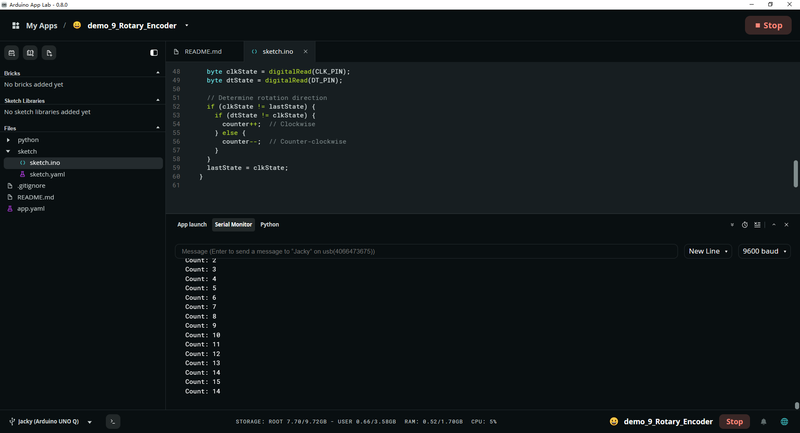
> *Figure 7-35: Demo 8 Rotary encoder serial monitor output* 

> 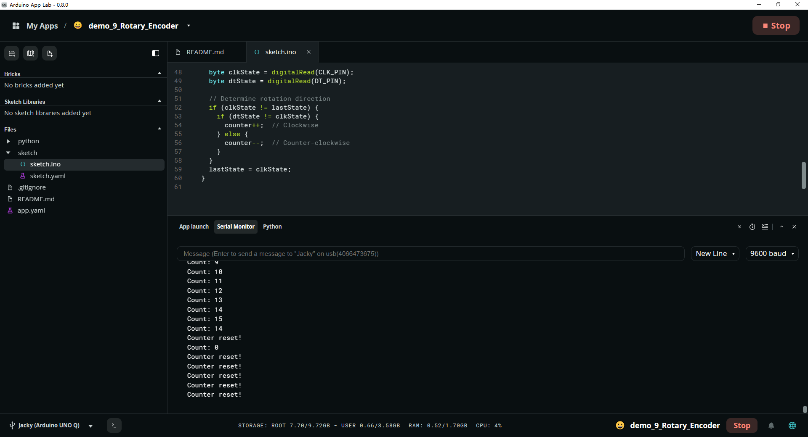
> *Figure 7-36: Demo 8 Rotary encoder serial monitor output* 

---

### Experiment 9: Stepper Motor

#### Objective
Learn stepper motor control with precise rotation.

#### Principle
The 28BYJ-48 stepper motor is a 4-phase 5-wire type. The ULN2003 driver board contains Darlington transistor arrays. Step angle 5.625°, gear ratio 1:64, actual step angle ~0.088°.

#### Wiring Diagram

| UNO Q / EP-0257 | Wire Color | ULN2003 Driver Board | Pin / Signal | Function |
|-----------------|------------|----------------------|--------------|----------|
| D8 | Blue | IN1 | Phase A | Stepper coil A control |
| D9 | Blue | IN2 | Phase B | Stepper coil B control |
| D10 | Blue | IN3 | Phase C | Stepper coil C control |
| D11 | Blue | IN4 | Phase D | Stepper coil D control |
| 5V | Red | + | VCC | Power supply (+5V) |
| GND | Black | - | GND | Ground (0V) |

> 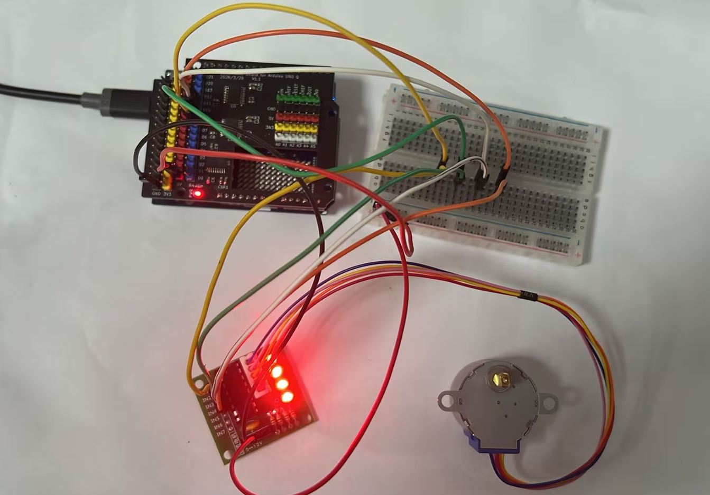
> *Figure 7-37: Stepper motor accurate rotation control*

#### Code

```cpp
/*
 * Experiment 9: Stepper Motor Control
 * Function: Forward, reverse, and stop control
 * Hardware: EP-0257 Shield + 28BYJ-48 + ULN2003
 */

#define IN1 8
#define IN2 9
#define IN3 10
#define IN4 11

// 4-phase 8-step sequence (half-step mode, higher precision)
const int stepSequence[8][4] = {
  {1, 0, 0, 0},
  {1, 1, 0, 0},
  {0, 1, 0, 0},
  {0, 1, 1, 0},
  {0, 0, 1, 0},
  {0, 0, 1, 1},
  {0, 0, 0, 1},
  {1, 0, 0, 1}
};

void setup() {
  pinMode(IN1, OUTPUT);
  pinMode(IN2, OUTPUT);
  pinMode(IN3, OUTPUT);
  pinMode(IN4, OUTPUT);
  Serial.begin(115200);
  Serial.println("Experiment 9: Stepper Motor");
  Serial.println("Commands: F=Forward, B=Backward, S=Stop");
}

void loop() {
  if (Serial.available()) {
    char cmd = Serial.read();
    if (cmd == 'F' || cmd == 'f') {
      Serial.println("Forward...");
      rotate(4096, true, 2);   // 4096 steps = ~1 rotation, 2ms per step
    }
    else if (cmd == 'B' || cmd == 'b') {
      Serial.println("Backward...");
      rotate(4096, false, 2);
    }
    else if (cmd == 'S' || cmd == 's') {
      stopMotor();
      Serial.println("Stopped");
    }
  }
}

void setStep(int w1, int w2, int w3, int w4) {
  digitalWrite(IN1, w1);
  digitalWrite(IN2, w2);
  digitalWrite(IN3, w3);
  digitalWrite(IN4, w4);
}

void rotate(int steps, bool clockwise, int delayMs) {
  for (int i = 0; i < steps; i++) {
    int idx = clockwise ? (i % 8) : (7 - (i % 8));
    setStep(stepSequence[idx][0], stepSequence[idx][1],
            stepSequence[idx][2], stepSequence[idx][3]);
    delay(delayMs);
  }
  stopMotor();
}

void stopMotor() {
  setStep(0, 0, 0, 0);
}
```

> 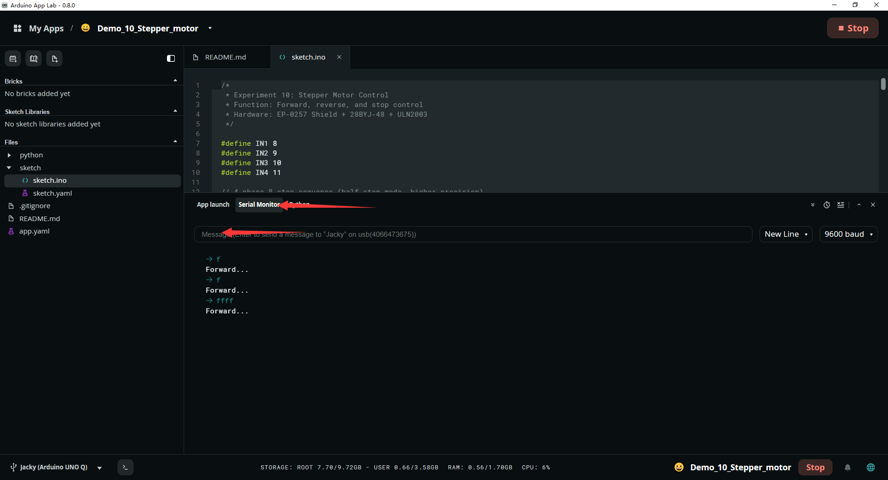
> *Figure 7-38: Serial monitor input for stepper motor control (F/B/S)*

#### Demo Result 

> 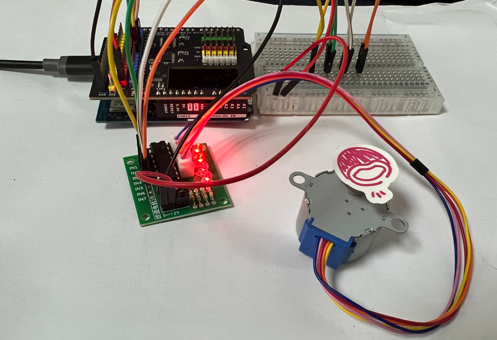
> *Figure 7-39: Stepper Motor Spinning Around*

---

## 8. Comprehensive Project

### Project: Smart Distance Detection Alarm System

#### Functional Description

Integrates ultrasonic distance measurement, LCD display, buzzer alarm, and LED matrix indication to implement a complete multi-level distance detection and alarm system.

> 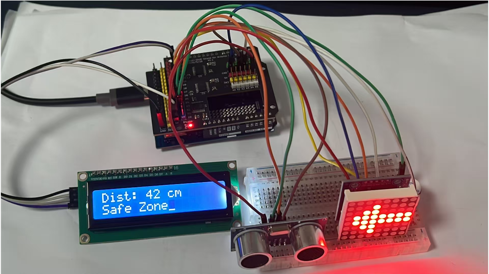
> *Figure 8-1: Smart distance detection alarm system — complete setup*

#### System Architecture

- **Input**: HC-SR04 Ultrasonic Sensor
- **Output**: LCD1602 displays distance, buzzer provides graded alarm, MAX7219 matrix shows arrow indicators
- **Logic**: Distance < 10cm = Emergency alarm, 10–30cm = Warning, > 30cm = Safe

#### Wiring Summary

| Module | Shield Pin | Description |
|--------|------------|-------------|
| HC-SR04 Trig | D2 | Trigger |
| HC-SR04 Echo | D3 | Echo |
| Buzzer | D4 | Active, HIGH-level trigger |
| MAX7219 CS | D10 | SPI Chip Select |
| MAX7219 DIN | D11 | SPI Data |
| MAX7219 CLK | D13 | SPI Clock |
| LCD1602 SDA | A4 | I2C Data |
| LCD1602 SCL | A5 | I2C Clock |

#### Required Libraries

- MD_MAX72xx
- Bonezegei LCD1602 I2C

> 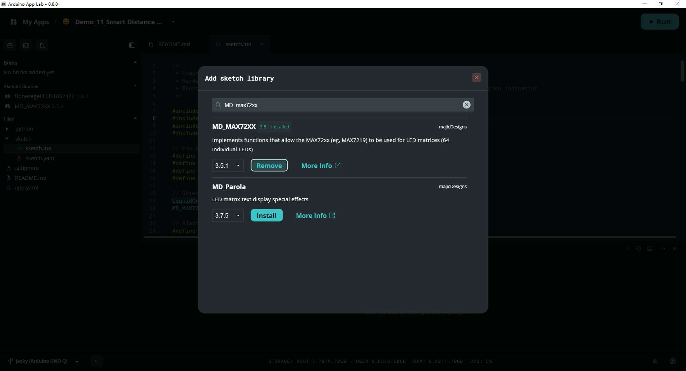
> *Figure 8-2: Library installation for comprehensive project*

> 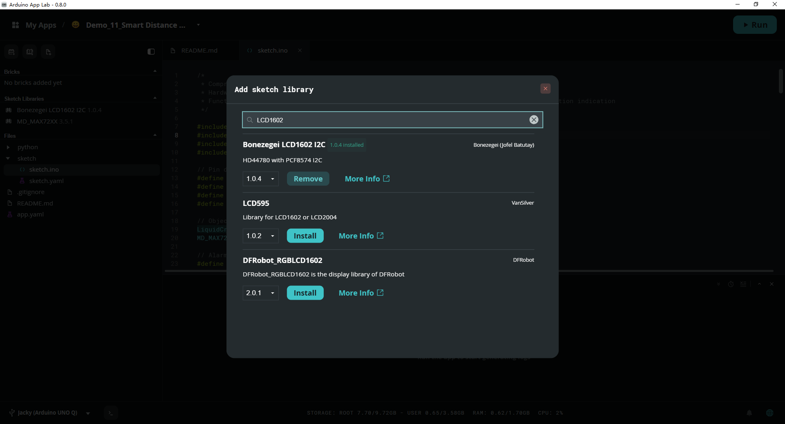
> *Figure 8-3: Library installation for comprehensive project*

#### Code

```cpp
/*
 * Comprehensive Project: Smart Distance Detection Alarm System
 * Hardware: UNO Q + EP-0257 + HC-SR04 + LCD1602 + MAX7219 + Buzzer
 * Function: Real-time distance measurement, LCD display, buzzer graded alarm, LED matrix direction indication
 */

#include <Wire.h>
#include <Bonezegei_LCD1602_I2C.h>
#include <MD_MAX72xx.h>
#include <SPI.h>

// Pin definitions
#define TRIG_PIN 2
#define ECHO_PIN 3
#define BUZZER_PIN 4
#define CS_PIN 10

// Object initialization
Bonezegei_LCD1602_I2C lcd(0x27);  // Only need I2C address
MD_MAX72XX mx = MD_MAX72XX(MD_MAX72XX::FC16_HW, CS_PIN, 1);

// Alarm thresholds (centimeters)
#define ALERT_CRITICAL 10   // Emergency
#define ALERT_WARNING  30   // Warning

// Arrow patterns (8x8)
const uint8_t arrowUp[8] = {
  0b00011000, 0b00111100, 0b01111110, 0b00011000,
  0b00011000, 0b00011000, 0b00011000, 0b00000000
};

const uint8_t arrowDown[8] = {
  0b00011000, 0b00011000, 0b00011000, 0b00011000,
  0b01111110, 0b00111100, 0b00011000, 0b00000000
};

const uint8_t alertIcon[8] = {
  0b00011000, 0b00111100, 0b01111110, 0b01111110,
  0b01111110, 0b00111100, 0b00011000, 0b00000000
};

void setup() {
  // Initialize pins
  pinMode(TRIG_PIN, OUTPUT);
  pinMode(ECHO_PIN, INPUT);
  pinMode(BUZZER_PIN, OUTPUT);

  // Initialize LCD
  lcd.begin();
  lcd.setPosition(0, 0);
  lcd.print("Distance System");
  delay(1000);

  // Initialize MAX7219
  mx.begin();
  mx.control(MD_MAX72XX::INTENSITY, 8);

  Serial.begin(115200);
  Serial.println("System startup...");
}

void loop() {
  long distance = measureDistance();

  // LCD display
  lcd.clear();
  lcd.setPosition(0, 0);
  lcd.print("Dist: ");
  if (distance < 0) {
    lcd.print("Error");
  } else {
    char buf[16];
    sprintf(buf, "%ld cm", distance);
    lcd.print(buf);
  }

  // Status judgment and response
  if (distance < 0) {
    lcd.setPosition(0, 1);
    lcd.print("Sensor Error");
    displayPattern(alertIcon);
    beep(100, 100, 3);  // Rapid error indication
  }
  else if (distance < ALERT_CRITICAL) {
    // Critical state
    lcd.setPosition(0, 1);
    lcd.print("!! CRITICAL !!");
    displayPattern(alertIcon);
    beep(200, 100, 5);  // Rapid urgent alarm
  }
  else if (distance < ALERT_WARNING) {
    // Warning state
    lcd.setPosition(0, 1);
    lcd.print("! WARNING !");
    displayPattern(arrowUp);
    beep(500, 500, 2);  // Slow warning
  }
  else {
    // Safe state
    lcd.setPosition(0, 1);
    lcd.print("Safe Zone");
    displayPattern(arrowDown);
    noTone(BUZZER_PIN);
    digitalWrite(BUZZER_PIN, LOW);
  }

  Serial.print("Distance: "); Serial.print(distance);
  Serial.println(" cm");
  delay(300);
}

// Distance measurement function
long measureDistance() {
  digitalWrite(TRIG_PIN, LOW);
  delayMicroseconds(2);
  digitalWrite(TRIG_PIN, HIGH);
  delayMicroseconds(10);
  digitalWrite(TRIG_PIN, LOW);

  long duration = pulseIn(ECHO_PIN, HIGH, 30000);
  if (duration == 0) return -1;

  long dist = duration * 0.017;
  return (dist > 400) ? -2 : dist;
}

// Matrix display
void displayPattern(const uint8_t *pattern) {
  for (uint8_t row = 0; row < 8; row++) {
    mx.setRow(0, row, pattern[row]);
  }
}

// Buzzer control (active buzzer version)
void beep(int onTime, int offTime, int count) {
  for (int i = 0; i < count; i++) {
    digitalWrite(BUZZER_PIN, HIGH);
    delay(onTime);
    digitalWrite(BUZZER_PIN, LOW);
    if (i < count - 1) delay(offTime);
  }
}
```

#### Expected Results

> 
> *Figure 8-4: Safe zone — Distance: 42 cm, "Safe Zone" displayed*

> 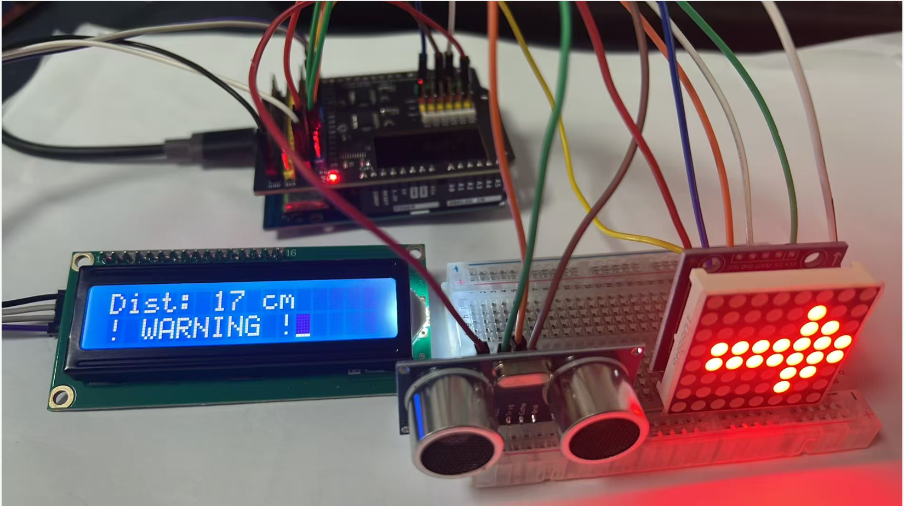
> *Figure 8-5: Warning zone — LED matrix shows arrow up, buzzer warning*

> 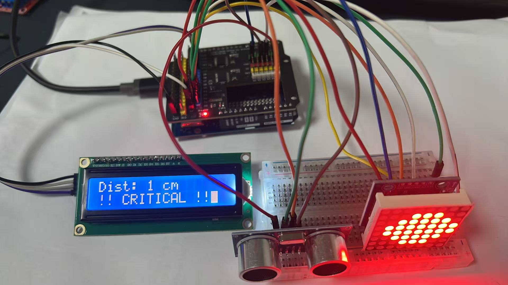
> *Figure 8-6: Critical zone — LED matrix shows alert icon, rapid buzzer alarm*

---

## 9. Troubleshooting

### 9.1 Common Issues

| Symptom | Possible Cause | Solution |
|---------|---------------|----------|
| Cannot upload after Shield installed | D0/D1 occupied | Disconnect devices on D0/D1 during upload, or use USB-to-serial workaround |
| I2C device not responding | Address conflict / wiring error | Run I2C scanner to confirm address; check if SDA/SCL reversed |
| Servo jitter or mainboard reset | Insufficient power current | **Must use external 5V power for servo**, common ground only |
| Analog reading always 1023 | Input voltage exceeds 3.3V | Add resistor voltage divider (10kΩ+20kΩ) to reduce 5V to 3.3V |
| Buzzer keeps sounding | Pin configuration error | Confirm active/passive type; active buzzer High-level trigger, passive needs PWM |
| LCD displays garbled text | Wrong I2C address or poor contact | Confirm address is 0x27 or 0x3F; check Dupont line contact |
| LED matrix not lighting | Wrong SPI pins or CS connection | Verify D10 (CS), D11 (MOSI), D13 (SCK) connections |
| Stepper motor not rotating | Wrong step sequence or insufficient current | Check ULN2003 power connection; verify step sequence in code |
| Encoder count erratic | Missing interrupt or debounce issue | Ensure CLK on D2 (interrupt pin); add software debounce |

### 9.2 Design Guidelines

1. **Current Budget**: UNO Q USB power total ~500mA, 3.3V regulator output ~150mA. High-power devices (servo, relay, motor) **must use external power**.

2. **Common Ground Principle**: External power supply and UNO Q must share ground (GND connected), otherwise signal reference level drifts causing malfunction.

3. **Green Pin Taboo**: VIN, AREF, IOREF, BOOT are pass-through pins, **never connect 5V signals**.

4. **Analog Input Voltage Division**: When A0–A5 are used as analog inputs, input voltage must not exceed 3.3V. Voltage divider required when using 5V sensors.

5. **Hot-swap Risk**: Inserting/removing Dupont lines while powered may cause surges; always power off before operation.

---

## 10. Appendix

### A.1 Quick Reference Card

#### Pin Function Quick Lookup

| Arduino Pin | Shield Color | Function | 5V Shifted |
|-------------|--------------|----------|------------|
| D0 | Blue | RX / GPIO | ✅ Yes |
| D1 | Blue | TX / GPIO | ✅ Yes |
| D2–D9 | Blue | PWM / GPIO | ✅ Yes |
| D10 | Blue | SS / GPIO | ✅ Yes |
| D11 | Blue | MOSI / GPIO | ✅ Yes |
| D12 | Blue | MISO / GPIO | ✅ Yes |
| D13 | Blue | SCK / GPIO | ✅ Yes |
| A0–A3 | White | Analog / Digital | ✅ Yes |
| A4 | White | SDA / Digital | ✅ Yes |
| A5 | White | SCL / Digital | ✅ Yes |
| 5V | Red | Power Output | — |
| 3.3V | Yellow | Power Output | — |
| GND | Black | Ground | — |
| VIN | Green | **Passthrough, DANGEROUS** | ❌ No |
| AREF | Green | **Passthrough, DANGEROUS** | ❌ No |
| IOREF | Green | **Passthrough, DANGEROUS** | ❌ No |
| BOOT | Green | **Passthrough, DANGEROUS** | ❌ No |

#### Library Dependency List

| Experiment | Required Library | Installation Method |
|------------|------------------|---------------------|
| LCD1602 | Bonezegei_LCD1602_I2C | Arduino IDE → Library Manager → Search & Install |
| MAX7219 | MD_MAX72xx | Same as above |
| Servo | Servo | Built into Arduino, no installation needed |
| I2C | Wire | Built into Arduino |
| SPI | SPI | Built into Arduino |

### A.2 Demo File Reference

The following demo files are available for quick reference:

| Demo File | Experiment | Size |
|-----------|------------|------|
| Demo_1_gpio-led-buzzer.zip | Experiment 1: GPIO LED + Buzzer | 2,169 KB |
| Demo_2_lcd1602-display.zip | Experiment 2: I2C LCD1602 Display | 3,291 KB |
| Demo_3_spi-max7219-led-matrix.zip | Experiment 3: SPI MAX7219 LED Matrix | 4,630 KB |
| Demo_4_hc-sr04-ultrasonic-distance-measure.zip | Experiment 4: Ultrasonic + Buzzer | 2,413 KB |
| Demo_5_push-button-lcd-menu-system.zip | Experiment 5: Button + LCD Menu | 3,321 KB |
| Demo_6_relay-control-for-low-voltage-loads.zip | Experiment 6: Relay Control | 2,324 KB |
| Demo_7_servo-control.zip | Experiment 7: Servo Control | 2,683 KB |
| Demo_8_rotary-encoder.zip | Experiment 8: Rotary Encoder | 2,179 KB |
| Demo_9_stepper-motor.zip | Experiment 9: Stepper Motor | 2,220 KB |
| Demo_10_smart-distance-detection-alarm-system.zip | Comprehensive Project | 5,585 KB |

> 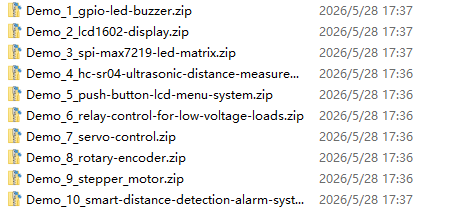
> *Figure A-1: Demo file list reference*

### A.3 Compatible Hardware

- **Main Board**: Arduino UNO Q (ABX00162 / ABX00173)
- **Shield**: 52Pi EP-0257 Level-Shift Shield
- **MCU**: STM32U585 Cortex-M33 @ 160MHz
- **Logic Level**: 3.3V (with 5V level-shifting via EP-0257)

### A.4 Technical Specifications

| Parameter | Value |
|-----------|-------|
| Level Shifter IC | TI TXS0108EPWR |
| Translation Type | Auto-direction-sensing bidirectional |
| Supported Voltage | 3.3V ↔ 5V |
| Digital I/O Channels | 21 (D0–D13, D20–D21, A0–A5) |
| Analog Channels | 6 (A0–A5, level-shifted) |
| I2C Support | Yes (A4/A5, level-shifted) |
| SPI Support | Yes (D10–D13, level-shifted) |
| Shield Form Factor | Arduino UNO R3 compatible |
| Onboard LED Matrix Window | Yes (preserves visibility) |

## 11.Download Demo Codes Zip Files

> *Click to download the zip file for the demo codes.* 

* [Demo 1](./DemoCodes/Demo_1_gpio-led-buzzer.zip)
* [Demo 2](./DemoCodes/Demo_2_lcd1602-display.zip)
* [Demo 3](./DemoCodes/Demo_3_spi-max7219-led-matrix.zip)
* [Demo 4](./DemoCodes/Demo_4_hc-sr04-ultrasonic-distance-measurement.zip)
* [Demo 5](./DemoCodes/Demo_5_push-button-lcd-menu-system.zip)
* [Demo 6](./DemoCodes/Demo_6_relay-control-for-low-voltage-loads.zip)
* [Demo 7](./DemoCodes/Demo_7_servo-control.zip)
* [Demo 8](./DemoCodes/Demo_8_rotary-encoder.zip)
* [Demo 9](./DemoCodes/Demo_9_stepper_motor.zip)
* [Demo10](./DemoCodes/Demo_10_smart-distance-detection-alarm-system.zip)

---

**Compatible Hardware**: Arduino UNO Q (ABX00162/ABX00173) + 52Pi EP-0257 Level-Shift Shield

**Last Updated**: 2026-06-23

**Document Version**: 1.0
